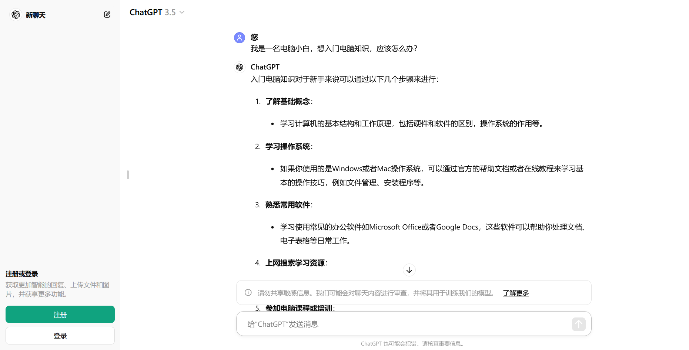
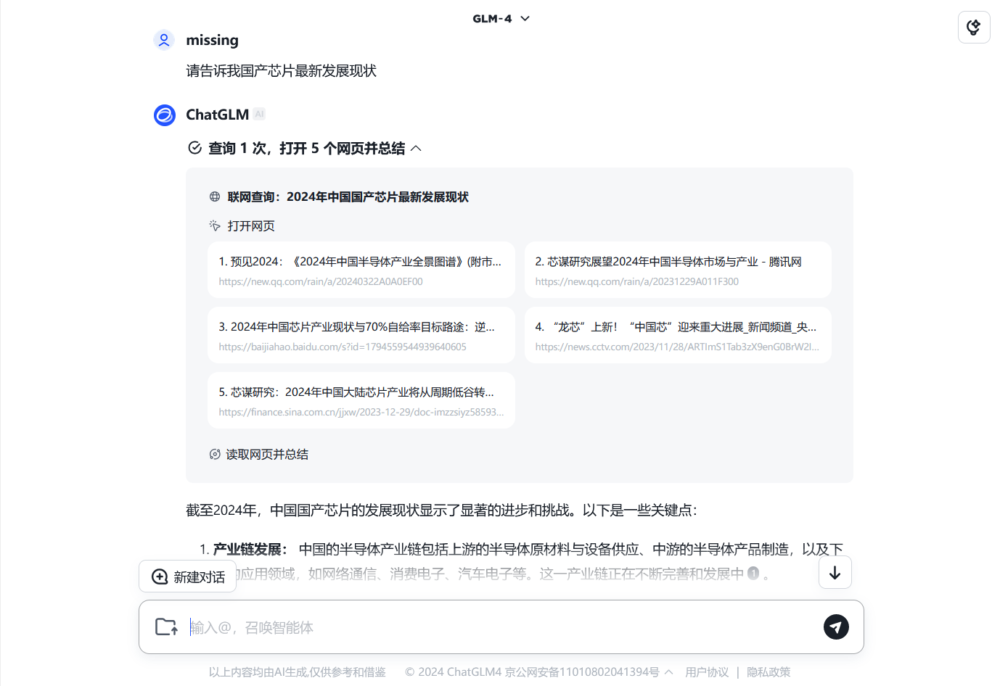
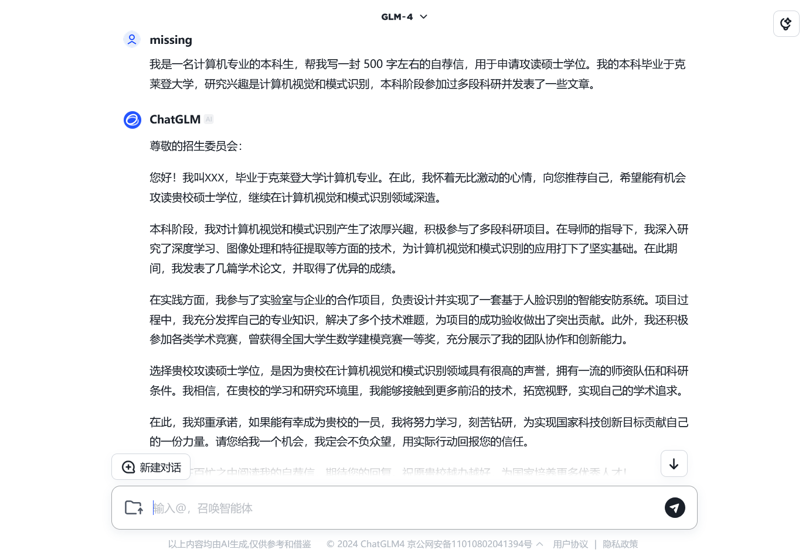
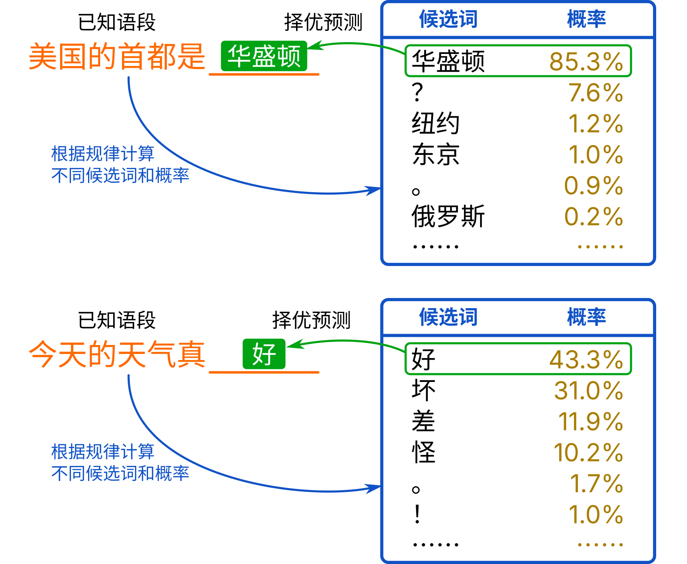

# 从加减乘除到 AI 对话


本文正在施工中……



欢迎来到《你缺失的那门计算机课》超越篇！在这一部分，我们将带领大家在了解「电脑最好怎么用」的基础上，探索无限的可能性——今天，人们利用电脑这一强大的工具，创造了一个璀璨斑斓的世界。人工智能、云计算、网络安全、大数据……这些词汇，或许你早已在各种各样的地方听说过，但你是否真正了解它们？我们将用通俗易懂的语言，带领大家走进这些新颖的领域，探索它们的奥秘。



这一章我们将介绍超越篇的第一个领域——人工智能，常常被人们简称为「AI」（Artificial Intelligence）。AI 技术让电脑不再是冷冰冰的机器，而拥有了一定模仿人类思维的能力。今天，诸如 AI 对话、AI 绘画、AI 写作等技术正在极大地提高人们的生产效率。阅读完这一章，你或许能找到下面这些问题的答案：

- 我想体验一下现在最新的 AI 技术！
- 到底是什么让 AI 能够模仿人类的思维，实现「智能」？
- 未来，AI 技术会如何发展？我们需要担心吗？我们应该怎么办？


## 体验 AIGC 的魅力

### 什么是 AIGC？「模型」又是什么？

谈到「人工智能」四个字，近年来非常火爆的「AI 绘画」「AI 聊天」等技术一定会浮现在你的脑海中。这些技术看似各不相同，但它们有着一个共同的特点：它们都是由机器来生成一些内容，例如绘画作品、聊天回复、文学小说等。机器生成的内容在质量和效果上与人类相差无几，甚至有时候还能达到超越常人的水平。这种技术称为「生成式人工智能」，简称「生成式 AI」，通常被缩写成英文 AIGC（Artificial Intelligence Generated Content）。AIGC 的出现具有里程碑意义，因为它让人们看到了人工智能技术的无限可能。

在 AI 领域中，「模型」（model）指的是用于完成特定任务的算法，或者可以理解为「程序」。例如，用于 AI 绘画的模型，输入你的文字描述，就能输出一幅符合描述的图画。而用于 AI 聊天的模型，输入你的问题，就能输出一个符合问题的回答。模型是人工智能技术的核心，它决定了 AI 的功能和效果。

模型的本质是复杂的数学运算，其中的大量参数并非人们直接设定，而是通过「学习」得来。这个「学习」的过程称为「训练」，它需要大量的数据和计算资源。例如，要训练一个能够实现 AI 对话的模型，人们需要准备大量的采集自现实生活的对话数据，模型能通过这些数据学习到对话的规律，从而逐渐具有对话的能力。

将模型加以包装，就能得到可供用户使用的 app 或网站产品，人们可以在 app 或网页上便捷地使用 AI 模型。2022 年末，美国人工智能技术公司 OpenAI 基于其所研发的「GPT」系列模型，上线了一款 AI 聊天机器人「ChatGPT」，引起了全球的轰动。ChatGPT 能够像人类一样写出比较通顺、自然的文章，并且能在许多领域针对提问作出清晰而详细的回答，因而在短时间内便获得了巨大的关注。自那时起，AIGC 技术仿佛在一夜间火遍了全球，成为了人们茶余饭后讨论的热门话题——人们开始畅想 AI 技术的无限潜能，亦开始担忧 AI 技术的潜在风险。

ChatGPT 的发布打开了 AIGC 大规模应用世界的大门。随后，谷歌、Meta、微软等行业巨头纷纷推出了自己的 AIGC 产品；与此同时，许多国内人工智能研究机构、高校和企业也不甘落后，各种国产模型如雨后春笋般出现。这些产品各自有着不同的特色和应用场景，琳琅满目，让人目不暇接。由智谱 AI 和清华大学 KEG 联合开发的 GLM/ChatGLM 模型则是其中的佼佼者，它在生成内容质量和速度上都有着相当不错的表现。「智谱清言」是智谱 AI 官方推出的体验平台，提供了包括 ChatGLM 在内的多种 AIGC 模型供用户使用。

下面，我们就借助「智谱清言」平台，来体验 AIGC 的魅力。

### 在「智谱清言」上使用 ChatGLM 模型

「智谱清言」是一个由智谱 AI 公司所推出的平台，在平台网站上可以使用 ChatGLM（用于 AI 对话）、CogView（用于 AI 绘画）等多种 AIGC 模型。

访问「智谱清言」官方网站（[https://chatglm.cn](https://chatglm.cn)），按提示注册账号并登录。登录后，你可以看到平台的主界面，如下图所示。

主界面最左方提供了不同的 AIGC 应用供我们选择，包括 ChatGLM 对话、AI 画图、数据分析等。默认情况下，我们会进入 ChatGLM 对话应用。界面右侧则是对话区域，我们可以在下方的文本框中向 AI「发送」消息，对话的历史则会在上方显示。我们试着向 ChatGLM 提出一些简单的问题，通常便可以得到一个详细而不失准确的回答。

一般来说，现今的对话模型都有一定的「记忆」能力，因此我们可以向它追问，或者提出一些与之前对话相关的问题，模型会根据之前的对话内容，给出更加详细的回答。当然，我们也可以询问它「我之前的问题是什么？」，来验证它的记忆能力。

有时，我们不希望模型的回答受到之前对话的影响，这时我们点击【新建对话】按钮，便可以开始一个全新的对话，不受之前对话记忆的影响。当然，在界面左方的【历史记录】面板上，我们也可以查看之前的对话记录，甚至继续之前的对话。

上面的例子中，我们提出的问题都比较偏向于「常识」，它们只涉及通用的原理或技术。由于模型是使用海量的数据训练的，因此对于这类问题，模型的回答通常比较准确的——可以理解为，在训练的阶段，模型就已经「见」过我们提出的问题或者类似问题了。但是，如果我们提出一些比较专业、具体，或者提出有关新兴事物的问题，由于训练数据中并没有相关的知识，凭借模型自己的能力是无法回答的。为了解决这一问题，ChatGLM 在面临此类问题时，会选择上网搜索相关知识，然后给出一个基于搜索结果的回答。

在上图中，我们向模型提问「国产芯片最新发展现状」。由于这个问题涉及到了最新的技术发展，模型并没有相关的知识，因此它会选择上网搜索相关的信息。从图中我们可以看到，模型一共阅读了 5 篇互联网的相关报告，将它们总结为答案。这种搜索能力，使得模型在回答问题时，能够给出更加详细、准确的答案。

除了让 AI 帮我们回答各种问题之外，我们还可以让 AI 帮我们「撰写」我们需要的文章。比如，我们可以让模型帮我们写一封长度在 500 字左右的申请读研的自荐信：

从上图中我们不难发现，这封 AI 撰写的自荐信在结构和格式上大致正确，包括了自我介绍、学术背景、科研经历、个人特长等部分；而在内容上，由于我们并没有提供给模型具体的撰写细节，因此每个部分的具体内容则由模型「自由发挥」而来。这也决定了我们利用 AI 的方式——我们可以将 AI 作为工具，让其帮我们生成基础的构架，然后我们再根据自己的需求进行修改和完善。

我们也可以选择在向模型「布置任务」时，提供给它更多的细节，这样模型就会选择性地按照我们的要求进行撰写。例如，我们可以在让模型帮我们写自荐信的基础上，提供给它一些具体的细节，比如我们的专业、研究方向和个人特长等。这样，模型就会尝试把这些信息融入到生成的文章中，使得文章更加符合我们的需求。

由于 ChatGLM 的训练数据中除了对话、文章语料外，还有着许多代码片段，因此我们还可以向模型询问一些关于编程的问题。例如，我们可以让模型帮我们写一个简单的 Python 程序，或者解释一些代码的含义。这对于一些编程初学者来说，是一个非常好的学习方式。

除了 ChatGLM 对话模型，「智谱清言」平台还提供了许多其他的 AIGC 模型供我们使用。例如，我们在网站左侧栏中选择「AI 画图」，然后在右方输入我们希望绘制的内容，还可以指定一些细节，比如画面的主题、颜色、风格等，模型会尝试根据这些信息生成一幅符合我们要求的图画。

### 让 AI 更好理解我们的意图

尽管今天各种 AI 模型的能力已经相当强大，但当我们尝试将它们实地应用到我们的工作和学习中时，有时也会发现 AI 难以理解我们的意图——有时 AI 生成的内容答非所问，有时 AI 忽略了我们的一些细节要求。为了尽量避免这种情况，我们可以对我们的「提示词」进行优化。

「提示词」（prompt）指的是我们向 AI 提出问题或者任务时所使用的文字，前文中诸如「请告诉我国产芯片发展现状」「我是……写一篇自荐信」等都是提示词。人们发现，对于相同的任务，提示词设计的好坏会直接影响到模型的表现。设计提示词是一项复杂的工作，不过，对于我们这样的简单应用来说，我们通常只需要注意以下几点：

- **准确、清晰、通顺**：在日常生活中与他人沟通时，准确、清晰、通顺的语言能够极大地提高我们的沟通效率，在设计与 AI 对话的提示词时亦是如此。比如，「请告诉我国产芯片最新发展现状」就要比「国产芯片怎么样」更加合适，而「请帮我设计一份《计算机系统》教案」往往也会取得比「写一份计算机系统教案」更好的效果。
- **构造具体的场景**：在设计提示词时，我们可以尽量构造一个具体的场景，将我们希望让模型注意到的信息逐项给出。在前文演示让 AI 写自荐信时，我们提到的「提供给模型更多的细节」，本质上便是在构造具体的场景，并在这个场景中提供更多的背景信息。我们还可以选择对 AI 进行角色引导，比如，如果我们希望让 AI 帮我们总结一些有关「金融」方面的文章，「你是一位金融方面的专家，请阅读下面的文章并帮我总结它们」便是一个不错的提示词开头。
- **给出样例**：对于一些比较复杂的任务，例如生成解决具体问题的代码，我们可以在提示词中给出样例，这样模型往往可以快速理解我们的意图。比如，如果我们需要让 AI 帮我们编写程序，将字符串中的数字提取出来并求和，我们可以在提示词中给出一个简单的样例：
  
  > 请帮我写一个 Python 程序，将字符串中的数字提取出来并求和
  > 
  > 示例输入：s194ab3cd12 
  > 示例输出：209 
  > 解释：字符串中的数字有 194、3 和 12，它们的和为 209
  >

  对于一些复杂的任务，相比于绕来绕去地描述任务要求，直接给出样例往往更加直接、有效。

对提示词进行优化是一门艺术，需要我们在实践中不断摸索。在使用 AI 模型时，我们可以尝试不同的提示词，观察模型的回答，然后根据回答的效果来调整我们的提示词。若你对提示词的设计还有兴趣，不妨上网搜索「提示词工程」，了解更多关于提示词设计的技巧。

## 从加减乘除到 AI 对话

体验过 AIGC 的魅力之后，你是否好奇过，这些神奇的技术究竟是如何实现的？从「加减乘除」的四则运算到人工智能的各种应用，之间到底经历了怎样的跨越？本节将带着你慢慢揭开 AI 那神秘的面纱，用通俗易懂的语言向你展现在人工智能背后的基本原理。

### AI 的本质——「预测」

我们可以简单地把人工智能的本质归纳为「预测」。「预测」指的是依据某种「经验」，根据已知的信息去推测未知的信息。例如，天气预报是一种预测，人们的「经验」来自于长期对天气的观察和气象学的发展，「已知的信息」则是人们收集到的各种气象数据。借助经验和已知信息，气象学家们可以预测未来的天气情况——这便是「未知的信息」。

上面我们看到的各种 AIGC 应用，其实亦是一系列的「预测」。以 AI 对话为例，在模型训练过程中，模型通过大量的语料数据，「学习」到了人类语言的统计规律——例如，「你好」之后通常会伴随另一句问候，「你是谁」之后通常会伴随一句自我介绍；「今天天气真」之后大概率是「好」「不好」等词汇，而「美国的首都」之后要么是「华盛顿」要么是一个问号。最终，借助这些统计规律，模型能够做到给定任意的一串文字，预测出接下来最可能的一个词汇。

在预测出第一个词汇之后，模型会将这个词汇作为「已知信息」，然后继续预测下一个词汇。这样，模型就可以不断地生成出一段连贯的文本。这种「逐词预测」的方式，便是模型生成长篇文本的基本原理。当然，这个过程中会有诸多的调整和优化，以生成更加符合人类语言习惯的连贯文本。不过，无论怎样的优化，模型的本质仍然是「预测」。

> 那么，请你自己想象一下，如果需要你设计一个 AI 绘画模型，它应当要学习到什么「经验」？它的「已知信息」又是什么？它是如何「预测」出一幅图画的呢？
>

建立在这样的看法上，我们不难明白，AI 模型的关键便是这套「预测」算法的设计、训练、验证和优化。还是以 AI 对话模型为例，如何设计出合理的「预测」方式，如何让模型从文字语料中学习到足够的「经验」，就是人们正在研究的重要问题。这些问题解决的好坏，直接决定了 AI 模型的表现。

### 线性回归、损失和梯度下降

诸如 AI 对话那样的模型，其内部的「预测」算法极为复杂，在这里我们不可能详细展开。相反地，我们选择一个最简单的「预测」问题——线性回归，来展示 AI 模型的基本原理。

#### 租金预测问题

假设我们现在有一个非常简单的任务——根据一间房屋的面积，预测它的租金。在这个问题中，「面积」就是「已知的信息」，房屋的租金则是对应的「未知的信息」。为了「经验」来解决这个预测问题，我们收集了该地区 20 套出租屋的面积和租金数据，如下表所示：

| 序号 | 面积（平方米） | 价格（元/月） | 序号 | 面积（平方米） | 价格（元/月） |
| ---- | -------------- | ---------- | ---- | -------------- | ---------- |
| 1    | 68.42          | 4112.29    | 11   | 85.42          | 4676.86    |
| 2    | 80.06          | 4622.83    | 12   | 67.02          | 3960.83    |
| 3    | 72.19          | 4094.26    | 13   | 69.76          | 3970.62    |
| 4    | 68.14          | 4019.30    | 14   | 94.79          | 5266.96    |
| 5    | 59.66          | 3330.10    | 15   | 34.97          | 2056.14    |
| 6    | 75.21          | 4316.60    | 16   | 36.10          | 2352.01    |
| 7    | 60.63          | 3388.90    | 17   | 31.42          | 2115.60    |
| 8    | 92.42          | 5299.07    | 18   | 88.28          | 4960.94    |
| 9    | 97.46          | 5381.56    | 19   | 84.47          | 4901.05    |
| 10   | 56.84          | 3307.91    | 20   | 90.90          | 5117.77    |

我们可以将这些数据绘制成散点图，横轴是房屋的面积（平方米），纵轴是房屋的租金（元/月）。如下图所示：

从图上我们可以直观地看见，我们可以尝试用一条直线来解释刻画和租金之间的关系。具体地说，如果把面积记作 x，把对应的租金记作 y，那么它们之间的关系就可以用方程

y = ax + b

来刻画。这个方程就是我们的「模型」，其中 a 和 b 是这个模型的「权重」。现在，我们的目标就是：对上面那 20 个房屋数据进行「学习」，来找到最合适的 a 和 b，这样我们的模型就可以胜任「预测租金」的任务了。由于模型直观表现在图像上，就是一条直线，因此这个问题称为「线性回归」问题。

#### 「损失」函数

要找到所谓「最合适」的 a 和 b，我们就得定义什么是「合适」。我们说我们的模型预测得「好」，就是指我们的模型预测的租金和实际租金尽可能接近。为了量化这种「接近」，我们可以把那 20 个房屋的面积 x_i 代入我们的模型，计算出预测的租金 \hat{y_i} = ax_i + b。显然，我们会希望所有的 \hat{y_i} 和对应的实际租金 y_i 之间的差 (\hat{y_i} - y_i) 都能越小越好。怀着这样的想法，我们可以把所有的差的平方加起来，得到一个「损失」值：

L = \sum_{i=1}^{20} (\hat{y_i} - y_i)^2 = \sum_{i=1}^{20} (ax_i + b - y_i)^2

至此，我们的任务就变成了：找到一对 a 和 b 的值，使上面的损失函数 L 最小。观察上面的式子，在那 20 个样本点给定，也就是说 x_i 和 y_i（i = 1, 2, \ldots, 20）都是定值的情况下，L 只和 a 与 b 有关——L 是一个关于 a 和 b 的函数，我们记作 L(a, b)。现在，「训练」的过程，就变成了找到这个函数的最小值的过程。

#### 梯度下降

那——如何找到这个函数的最小值呢？在这个例子中，我们的损失函数

L(a, b) = \sum_{i=1}^{20} (ax_i + b - y_i)^2

比较简单，我们可以直接通过求（偏）导数的方式找到最小值。计算得到

\left\{
\begin{aligned}
\frac{\partial L}{\partial a} &= 2 \sum_{i=1}^{20} x_i (ax_i + b - y_i)\text{，} \\
\frac{\partial L}{\partial b} &= 2 \sum_{i=1}^{20} (ax_i + b - y_i)\text{，}
\end{aligned}
\right.

令

\frac{\partial L}{\partial a} = \frac{\partial L}{\partial b} = 0\text{，}

则可以解出

\left\{
\begin{aligned}
a &= \frac{\sum_{i=1}^{20} x_i y_i - \frac{1}{20} \sum_{i=1}^{20} x_i \sum_{i=1}^{20} y_i}{\sum_{i=1}^{20} x_i^2 - \frac{1}{20} (\sum_{i=1}^{20} x_i)^2}\text{，} \\
b &= \frac{1}{20} \sum_{i=1}^{20} y_i - a \frac{1}{20} \sum_{i=1}^{20} x_i\text{。}
\end{aligned}
\right.

可以证明，这一组 a 和 b 的值，就是我们的模型的最优解。

但是，采用这种方法有一个非常重要的前提——损失函数简单，可以直接求出最小值。这种方法对于线性回归这个例子或许够用，但是当模型的参数量不是 2 而是 2000 甚至 2 千万时，当模型不再是线性的而是复杂函数构成时，用这样的方法直接「解」出最小值就不太可行了。我们需要寻找一个「不那么精确，但是能用」的方法，这就是「梯度下降」。

让我们先把刚刚的损失函数放到一边，考虑一个（可导，但是无法直接解出导数零点的）一元函数 f(x)，我们的目标是找它的最小值点。我们可以先随意挑一个 x_0 作为起点：

接着，我们计算 f(x) 在 x_0 处的导数值 f'(x_0)。导数值反映着图像的斜率，展示着图像在一点处向上向下的趋势，故我们可以逆着导数的方向「走」一步，即令 x_1 = x_0 - \alpha f'(x_0)：

不难发现，我们得到了一个比 x_0 更靠近函数（局部）最小值的 x_1。上面式子中的 \alpha 是一个「步长」参数，它影响着我们每次「走」的步长大小。不断这样「走」下去，我们就可以逐渐接近函数的（局部）最小值点：

事实上，如果函数局部的最小值点存在，选择好调整合适的步长参数 \alpha，不断地重复这个「走」的过程，就可以近似地找到这个局部最小值点。这个过程就称为「梯度下降」，而步长参数 \alpha 被称为「学习率」。每一次「走」被称为「训练一步」，而整个过程，就是 AI 模型开发过程中最为耗时的过程之一——「训练」。

对于有多个自变量的函数，它在某一点处对不同自变量的（偏）导数值共同构成了「梯度」。在上面的一元函数例子中，导数值反映着图像在一点处向上向下的趋势，而在多元函数中，梯度则反映着图像在一点处最快上升和下降的方向。因此，对于多元函数，我们可以用「梯度」来指导我们的「走」的方向——我们每次「走」的方向，都是梯度指向的函数值减小最快的方向。不断地重复训练，我们就能逐步接近函数的（局部）最小值点。

（这里要画个图，但是我不会画）

回到具体问题中的损失函数 L(a, b)，即使这个函数非常复杂，只要它可导（微），我们就可以从一个随机的起点开始，用梯度下降的方法逐步找到它的最小值点。模型训练的过程，核心就是这一梯度下降的过程。

当然，在实际的训练过程中，我们会用到许多优化的技巧，比如「随机梯度下降」、「Adam 优化器」等，以加速训练的过程。但是，无论怎样的优化技巧，它们的本质都是在「梯度下降」的基础上进行的。