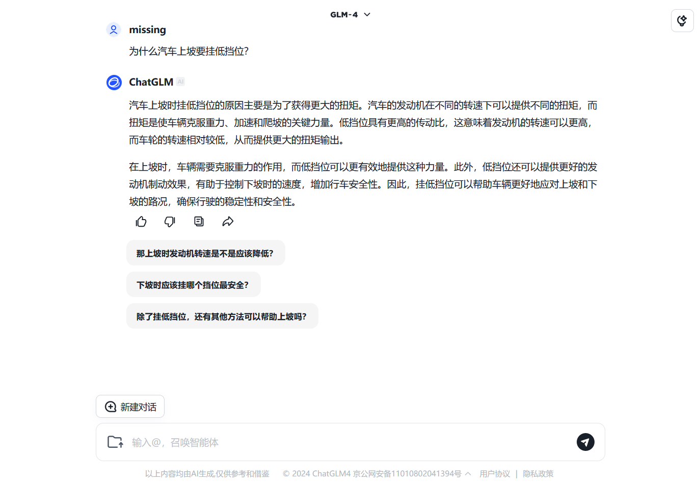
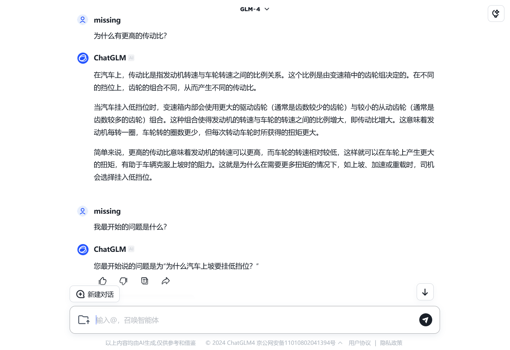
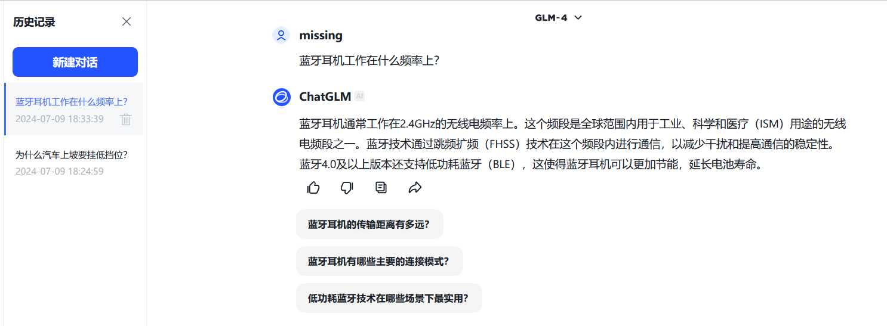

# 从加减乘除到 AI 对话


欢迎来到《你缺计课》超越篇！在这一部分，我们将带领大家在了解「电脑最好怎么用」的基础上，探索无限的可能性——今天，人们利用电脑这一强大的工具，创造了一个璀璨斑斓的世界。人工智能、网络安全、编程、大数据……这些词汇，或许你早已在各种各样的地方听说过，但你是否真正了解它们？我们将用轻松而生动的语言，带领大家走进这些新颖的领域，探索它们的奥秘。

超越篇与前面的部分不同，它更注重「科普」性质，文章的长度更长、信息量更大。不过，我们会尽力让文字变得浅显易懂。不必过于担忧，不要有任何压力。坐稳扶好，我们出发啦！



这一章，我们将介绍超越篇的第一个领域——人工智能，或简称「AI」（Artificial Intelligence）。AI 技术让电脑不再是冷冰冰的机器，而拥有了一定模仿人类思维的能力。今天，诸如 AI 对话、AI 绘画、AI 写作等技术正在为人们的生产生活提供别样的帮助。阅读完这一章，你或许能找到下面这些问题的答案：

- AI 在我们生活中真的无处不在吗？
- 我想体验一下现在最新的 AI 技术！
- 到底是什么让 AI 能够模仿人类的思维，实现「智能」？
- 未来，AI 技术会如何发展？我们需要担心吗？我们应该怎么办？


## 让机器像人一样思考

### 人工实现的「智能」，无处不在的 AI

「人工智能」这个词，由两部分构成：「人工」和「智能」。「智能」是人类的专利，我们的意识、思考、判断和情感等都是智能的表现。「人工」修饰「智能」，昭示着这种「智能」是由人工实现的。这么想来，人工智能技术的目标，就是由「人工」来实现一种类似人类的「智能」，并让机器能够模拟和呈现它，从而让机器也具有识别、决策、判断，甚至分析、学习和创造的能力。

几千年来，无论是东方还是西方，人们都不约而同地畅想着各式各样的「自动人偶」，或是单纯的机械，或是拥有人一样的意识与智慧。这也许是「人工智能」最早的概念先驱。近代，随着数学和逻辑学的发展，学者们开始研究如何把世间一切逻辑都用数学语言表达出来，真正的人工智能在此奠下基础。到了 20 世纪，电子计算机诞生，人们也开始使用它模拟人类的思维。随后短短几十年间，人工智能技术经历了几次高潮和低谷，而当下，我们恰好处于人工智能技术发展的一个新高峰。

不知不觉间，人工智能技术其实已经完完全全融入了我们生活的每一个角落。当我们「刷脸」步入小区大门时，人脸识别系统能像门卫一样辩认我们的身份；当我们上网购物时，智能客服像真人一样回答着我们的问题。手机里，操作系统如同私人助理，根据我们使用 app 的习惯调整性能；工厂中，机器人仿佛勤劳的工人，正在代替我们完成重复性劳动……这些我们早已认为理所当然、司空见惯的技术，其实都是人工智能技术的应用——计算机视觉、自然语言处理、智能推荐算法、工业机器人……这些领域的人工智能已经有了成熟的应用，称为「传统 AI」。

近年来，「AI 绘画」「AI 聊天」等技术再一次高调地让「AI」进入人们的视野。这些技术看似各不相同，但它们有着一个共同的特点：它们都是由 AI 来生成内容。这些 AI 生成的画作、文本和音频等的质量和效果与人类相差无几，甚至有时比人类的作品更令人惊艳。这种技术称为「生成式人工智能」，简称「生成式 AI」，通常缩写成英文 AIGC（Artificial Intelligence Generated Content）。如果说用于人脸识别、推荐系统等任务的的传统的 AI 技术是让 AI 去干活，那么 AIGC 技术则是让 AI 去创作。

AIGC 的诞生可谓一座里程碑。在 AIGC 技术铺开之前，人们通常认为「创作」是人类思维独有的能力，AI 技术只能是让机器代替人类做一些简单而枯燥的工作。然而，AIGC 技术的出现打破了这种观念。自此之后，人们对 AI 技术的未来充满了无限的憧憬，也让人们对 AI 技术的潜在风险产生了更多的担忧。

### 「模型」？「训练」模型？

在 AI 领域中，「模型」（model）指的是用于完成特定任务的算法，或者简单理解为一个「程序」。例如，用于 AI 绘画的模型，输入你的文字描述，就能输出一幅符合描述的图画。而用于 AI 聊天的模型，输入你的问题，就能输出一个符合问题的回答。

人们采用「机器学习」技术来构建各种各样的 AI 模型。模型的内部是复杂的运算，其中的大量参数并非人们直接设定，而是机器自行「学习」得来。这个「学习」的过程称为「训练」，它需要大量的数据和计算资源。例如，要训练一个能够实现 AI 对话的模型，人们需要准备大量的采集自现实生活的对话数据，模型能通过这些数据学习到对话的规律，从而逐渐具有类似人类对话的能力。

将模型加以包装，就能得到可供用户使用的 app 或网站产品，人们可以在 app 或网页上便捷地使用 AI 模型。2022 年末，美国人工智能技术公司 OpenAI 基于其所研发的「GPT」系列模型，上线了一款 AI 聊天机器人「ChatGPT」，引起全球轰动。随后，谷歌、Meta、微软等行业巨头纷纷推出了自己的 AIGC 模型；与此同时，许多国内人工智能研究机构、高校和企业也紧随其后，各种国产模型纷至沓来。这些产品各自有着不同的特色和应用场景，琳琅满目，让人目不暇接。下图展示的就是 ChatGPT 的界面。

而在一众国内的 AIGC 模型中，由 AI 公司「智谱」和清华大学联合开发的 GLM 模型表现较为突出，生成内容的质量和速度都相当不错。智谱推出的「智谱清言」平台，提供了包括 GLM 在内的多种 AIGC 模型供用户使用。下面，我们依托「智谱清言」平台，来一睹 AIGC 的魅力。

## 体验 AIGC 的魅力

### 试试 ChatGLM？

如前文所言，我们可以在「智谱清言」网站上可以使用 ChatGLM（用于 AI 对话）、CogView（用于 AI 绘画）等多种 AIGC 模型。

访问「智谱清言」官方网站（[https://chatglm.cn](https://chatglm.cn)），按提示注册账号并登录。登录后，你可以看到平台的主界面，如下图所示。

主界面最左方提供了不同的 AIGC 应用供我们选择，包括 ChatGLM 对话、AI 画图、数据分析等。默认情况下，我们会进入 ChatGLM 对话应用。界面右侧则是对话区域，我们可以在下方的文本框中向 AI 发送消息，对话的历史则会在上方显示。我们试着向它提出一些简单的问题，通常便可以得到一个详实的回答。

一般来说，现今的对话模型都有一定的「记忆」能力，可以记住我们刚刚聊过什么。因此我们可以向它追问，或者提出一些与之前对话相关的问题，模型会根据之前的对话内容，给出更加详细的回答。当然，我们也可以直接询问它「我之前的问题是什么？」，来验证它的记忆能力。

有时，我们不希望模型的回答受到之前对话的影响，这时点击【新建对话】按钮，便可以开始一个全新的对话，不再受之前对话记忆的影响。当然，在界面左方的【历史记录】面板上，我们也可以查看之前的对话记录，甚至继续之前的对话。

你可能已经注意到了，上面的例子中，我们提出的问题都比较偏向于「常识」，或者说只涉及通用的原理或技术。由于模型是使用海量的数据训练的，因此对于这类问题，模型的回答通常比较准确的——可以理解为，在训练的阶段，模型就已经见识过我们提出的问题或者类似问题了。但是，如果我们提出一些比较专业、具体，或者提出有关新兴事物的问题，由于训练数据中并没有相关的知识，凭借模型自己的能力是无法回答的。为了解决这一问题，AI 模型在面临此类问题时，会选择上网搜索相关知识，然后给出一个基于搜索结果的回答。

在上图中，我们向模型提问「国产芯片最新发展现状」。由于这个问题涉及到了最新的技术发展，模型并没有相关的知识，因此它会选择上网搜索相关的信息。从图中我们可以看到，模型一共阅读了 5 篇互联网的相关报告，将它们总结为答案。这种搜索能力，使得模型在回答问题时，能够给出更加详细、准确的答案。

除了让 AI 帮我们回答各种问题之外，我们还可以让 AI 帮我们撰写我们需要的文章。比如，我们可以让模型帮我们写一封长度在 500 字左右的申请读研的自荐信：

从上图中我们不难发现，这封 AI 撰写的自荐信在结构和格式上大致正确，包括了自我介绍、学术背景、科研经历、个人特长等部分；而在内容上，由于我们并没有提供给模型具体的撰写细节，每个部分的具体内容都是由模型自由发挥而来。这一特点，决定了我们利用 AI 的方式——我们可以将 AI 作为工具，让其帮我们生成基础的构架，再根据自己的需求进行修改和完善。

我们也可以选择在向模型「布置任务」时，提供给它更多的细节，如此一来，模型就会选择性地按我们的要求撰写。以上面的「写自荐信」为例，我们可以额外提供给它一些具体的细节，比如我们的专业、研究方向和个人特长等。这样，模型就会尝试把这些信息融入到生成的文章中，使得文章更加符合我们的需求。

像 ChatGLM 这样的模型，它们的训练数据中除了对话、文章语料外，还有着许多代码片段，所以我们还可以向模型询问一些关于编程的问题。例如，我们可以让模型帮我们写一个简单的 Python 程序，或者解释一些代码的含义。对于一些编程新手来说，这是一个非常不错的学习方式。

除了 ChatGLM 对话模型，「智谱清言」平台还提供了许多其他的 AIGC 模型供我们使用。例如，我们在网站左侧栏中选择「AI 画图」，然后在右方输入我们希望绘制的内容，还可以指定一些细节，比如画面的主题、色调、风格等，模型会尝试根据这些信息生成一幅符合我们要求的图画。

当然，在这个百花齐放的 AI 时代，除了智谱清言平台上的 ChatGLM 模型外，市面上还有诸如「豆包」「文心一言」「Kimi」等许多优秀的国产 AI 模型和平台供我们使用，它们的使用方式与上文介绍的智谱清言大同小异，如果你有兴趣，不妨自行上网搜索，一一体验。

### 让 AI 更容易理解我们的意图

尽管今天各种 AI 模型的能力已经相当强大，但当我们尝试将它们实际应用到工作和学习中时，可能会发现 AI 可能难以理解我们的意图——有时 AI 生成的内容答非所问，有时 AI 忽略了我们的一些细节要求。为了尽量避免这种情况，我们可以对我们的「提示词」进行优化。

「提示词」（prompt）指的是我们向 AI 提出问题或者任务时所使用的文字，前文中诸如「请告诉我国产芯片发展现状」「我是……写一篇自荐信」等都是提示词。人们发现，对于相同的任务，提示词设计的好坏会直接影响到模型的表现。设计提示词是一项复杂的工作，不过，对于我们这样的简单应用来说，我们通常只需要注意以下几点：

- **准确、清晰、通顺**：在日常生活中与他人沟通时，准确、清晰、通顺的语言能够极大地提高我们的沟通效率，在设计与 AI 对话的提示词时亦是如此。比如，「请告诉我国产芯片最新发展现状」就要比「国产芯片怎么样」更加合适，而「请帮我设计一份《计算机系统》教案，共 32 课时，主要集中介绍体系结构知识」往往也会取得比「写一份计算机系统教案」更好的效果。
- **构造具体场景**：在设计提示词时，我们可以尽量构造一个具体的场景，将我们希望让模型注意到的信息逐项给出。在前文「写自荐信」环节提到的「提供给模型更多的细节」，本质上便是在构造具体的场景，并在其中提供更多背景信息。此外，我们还可以选择对 AI 进行角色引导，比如，如果我们希望让 AI 帮我们总结一些有关「金融」方面的文章，「你是一位金融方面的专家，请阅读下面的文章并帮我总结它们」便是一个不错的提示词开头。~~或者做一些角色扮演之类的事，比如「你是一只猫娘……」。~~
- **给出样例**：有句话说得好：「举例是理解的试金石。」对于一些比较复杂的任务，例如生成解决具体问题的代码，我们可以在提示词中给出样例，这样模型往往可以快速理解我们的意图。比如，如果我们需要让 AI 帮我们编写程序，将字符串中的数字提取出来并求和，我们可以在提示词中给出一个简单的样例：
  
  > 请帮我写一个 Python 程序，将字符串中的数字提取出来并求和
  > 
  > 示例输入：s194ab3cd12 
  > 示例输出：209 
  > 解释：字符串中的数字有 194、3 和 12，它们的和为 209
  >

  对于一些复杂的任务，相比于绕来绕去地描述任务要求，给出样例往往更加直接、有效。

提示词优化是一门艺术，需要我们在实践中不断摸索。在使用 AI 模型时，我们可以尝试不同的提示词，观察模型的回答，然后根据回答的效果来调整我们的提示词。若你对提示词的设计还有兴趣，不妨上网搜索「提示词工程（prompt engineering）」，了解更多关于提示词设计的技巧。

## 从加减乘除到 AI 对话

体验过 AIGC 的魅力之后，你是否好奇，如此神奇的技术究竟是如何实现的？「计算机」的本质是「计算」，但从「加减乘除」的运算到人工智能的应用，其间到底经历过怎样的跨越？本节将带着你慢慢揭开 AI 那神秘的面纱，在通俗的语言中，人工智能背后的基本原理就此展现。

### AI 的本质——「预测」

人工智能的本质，一言以蔽之——「预测」。「预测」指的是依据某种「经验」，根据已知的信息去推测未知的信息。例如，天气预报是一种预测，人们的「经验」来自于长期对天气的观察和气象学的发展，「已知的信息」则是人们收集到的各种气象数据。借助经验和已知信息，气象学家们可以预测未来的天气情况——这便是「未知的信息」。

上面我们看到的各种 AI 应用，其实亦是一系列的「预测」。以 AI 对话为例，在模型训练过程中，模型通过大量的语料数据，「学习」人类语言的统计规律，这就是「经验」。这些经验让模型明白，「你好」之后通常会伴随另一句问候，「你是谁」之后通常会伴随一句自我介绍；「今天天气真」之后大概率是「好」「不好」等词汇，而「美国的首都」之后要么是「华盛顿」要么是一个问号。最终，借助这些统计规律，模型能够做到给定任意的一串文字，预测出最可能接在后面的一个词汇。

在预测出第一个词汇之后，模型会将这个词汇作为「已知信息」，然后继续预测下一个词汇。这样，模型就可以不断地生成出一段连贯的文本。这种「逐词预测」的方式，便是模型生成长篇文本的基本原理。当然，这个过程中会有诸多的调整和优化，以生成更加符合人类语言习惯的连贯文本。

> 那么，不妨自己想象一下，如果你需要设计一个 AI 绘画模型，它应当要学习什么「经验」？它的「已知信息」又是什么？它又是如何「预测」出一幅图画的呢？
>

从这样的视角来看，我们就不难明白，AI 模型的关键便是这套「预测」算法的设计、训练、验证和优化。还是以 AI 对话模型为例：我们如何设计这套「预测下一个词」的算法？我们用什么样的语句去训练它？如何训练？训练完成之后怎么验证它对话的效果？又如何进行优化？解决了这些问题，一个优秀的模型才能诞生。

### 简单的「预测」——租金预测

诸如 AI 对话那样的模型，其内部的结构和算法极为复杂，若用它来介绍 AI 的内部原理，这份教程就和专业教材一般令人头大了。那么，我们不妨选择一个简单得多的「预测」问题——「租金预测」来研究。在理解了租金预测问题之后，我们就能以小见大，举一反三地理解 AI 推理的过程。

#### 线性回归模型

租金预测说的是：假设我们现在要根据一间房屋的面积，预测它的租金。在这个问题中，「面积」就是「已知的信息」，房屋的租金则是对应的「未知的信息」。为了获取「经验」来解决这个预测问题，我们收集了该地区 20 套出租屋的面积和租金数据，如下表所示：

| 序号 | 面积（平方米） | 价格（元/月） | 序号 | 面积（平方米） | 价格（元/月） |
| ---- | -------------- | ---------- | ---- | -------------- | ---------- |
| 1    | 68.42          | 4112.29    | 11   | 85.42          | 4676.86    |
| 2    | 80.06          | 4622.83    | 12   | 67.02          | 3960.83    |
| 3    | 72.19          | 4094.26    | 13   | 69.76          | 3970.62    |
| 4    | 68.14          | 4019.30    | 14   | 94.79          | 5266.96    |
| 5    | 59.66          | 3330.10    | 15   | 34.97          | 2056.14    |
| 6    | 75.21          | 4316.60    | 16   | 36.10          | 2352.01    |
| 7    | 60.63          | 3388.90    | 17   | 31.42          | 2115.60    |
| 8    | 92.42          | 5299.07    | 18   | 88.28          | 4960.94    |
| 9    | 97.46          | 5381.56    | 19   | 84.47          | 4901.05    |
| 10   | 56.84          | 3307.91    | 20   | 90.90          | 5117.77    |

这些数据会用来「训练」我们的模型。我们可以将这些数据绘制成散点图，横轴是房屋的面积（平方米），纵轴是房屋的租金（元/月）。如下图所示：

从图上我们可以直观地看见，我们可以用一条直线来刻画和租金之间的关系——具体地说，如果把面积记作 x，把对应的租金记作 y，那么它们之间的关系就可以用方程

y = ax + b

来描述。这个方程就是我们的「模型」，其中 a 和 b 是这个模型的「参数」。a 和 b 的值决定了这条直线长什么样，也就决定了我们的模型对租金的预测效果。

现在，我们的目标就是：对上面那 20 个房屋数据进行「学习」，来找到**最合适**的 a 和 b，也就是参数，这样我们的模型就可以胜任租金预测任务了。这种模型称作「线性回归」模型，是一种极为常用的数学模型。

> 你可能会认为（或者听人说）「线性回归之所以叫线性回归，是因为它的图像是一条直线」，但其实不然，线性回归的「线性」，在于关于自变量的各个函数是线性组合的，或者说，各自乘一个参数再加起来。也就是说，y(x) = ax^3 + b \ln x + c \mathrm{e}^x 也是线性回归，而 y(x) = x^a + b 则不是。

#### 「损失」函数

要找到那最合适的 a 和 b，我们就得先定义什么是「合适」。

在我们的这个模型中，更「合适」的参数，能够使得某个面积下的**模型预测的租金**和**实际租金**之间尽可能接近。那么，我们先把那 20 个房屋的面积 x_i（i=1,2,\cdots,20）逐一代入我们的模型，预测出对应的租金 
\hat{y_i} = ax_i + b\text{。}

显然，我们会希望所有的 \hat{y_i} 和相应的实际租金 y_i 之间的距离（也就是差的绝对值）|\hat{y_i} - y_i| 都能越小越好。怀着这样的想法，我们可以把所有的距离的平方加起来，避免了麻烦的绝对值，得到了一个「差距平方和」，称之为「损失」L，即

L = \sum_{i=1}^{20} (\hat{y_i} - y_i)^2 = \sum_{i=1}^{20} (ax_i + b - y_i)^2

至此，我们的任务就变成了：找到一对 a 和 b 的值，使上面的损失 L 最小。

观察上面的式子，在那 20 个样本点给定，也就是说 x_i 和 y_i（i = 1, 2, \cdots, 20）都是定值的情况下，L 只和 a 与 b 有关——L 是一个关于 a 和 b 的函数，我们记作 L(a, b)。

现在，所谓「训练模型」，就是求这个函数 L(a, b) 的最小值点。

#### 梯度下降

我们如何找到这个函数的最小值点呢？在这个例子中，损失函数

L(a, b) = \sum_{i=1}^{20} (ax_i + b - y_i)^2

比较简单，所以我们可以直接通过求偏导数[^2]零点的方式找到最小值点。但是，当模型的参数量不是 2 而是 2000 甚至 2 千万时，当模型不再是线性回归而是由更复杂的函数构成时，直接解出最小值就不太现实了。我们需要寻找一个「通用」的方法，对于再复杂的损失函数，都可以有效地找到我们需要的最小值点——哪怕不十分精确，但是足够接近就可以。这个方法就是「梯度下降」。

[^2]: 对多元函数而言，我们一次只对一个变量求导数，谓之「偏导数」。

> 对于这个线性回归问题，直接求出最小损失值点的方法被称为「最小二乘法」。
> 

现在把刚刚的损失函数放到一边，考虑一个看起来坑坑洼洼的二元函数 f(x,y)，图中左侧是它的三维图像，右侧是图像从上往下看的样子，我们的目标是找它的最小值点。先随意挑一个点 \mathbf{P}_0 = (x_0, y_0) 作为起点：

接着，我们需要找出 f(x,y) 在 \mathbf{P}_0 处的梯度方向 \nabla f(x_0, y_0)。梯度方向，类似于一元函数的导数，指的是函数值在某一点上升最快的方向。把 f(x,y) 放进这个「倒三角」算符[^nabla] \nabla，结果会得到一个向量，它指向的方向正好就是我们需要的梯度方向。既然我们需要「梯度下降」，那此时，背朝梯度方向走一步，不就正好向着最快的方向下降了吗？于是我们令 \mathbf{P}_1 = \mathbf{P}_0 - \alpha \cdot \nabla f(x_0, y_0)：

[^nabla]: 对于想知道倒三角算符到底干了什么的朋友们，我们送给各位这个式子：

\nabla f(x,y) = \left( \frac{\partial f}{\partial x} , \frac{\partial f}{\partial y} \right),

所以它就只是求了两下偏导数，并将之作为向量的两个分量而已。

不难发现，我们得到了一个比 \mathbf{P}_0 更靠近函数最小值的 \mathbf{P}_1。上面那「走一步」式子中的 \alpha 是一个「步长」参数，它影响着我们每一步的大小。不断这样走下去，我们就可以逐渐接近函数的最小值点：

事实上，如果函数的某一局部存在最小值点，选择好调整合适的步长参数 \alpha，不断地「走」，就可以近似找到这个最小值点。这个过程即是「梯度下降」，而步长参数 \alpha 称为「学习率」，每走一步称为「训练一步」，而整个「寻找最小值」的过程，就是 AI 模型开发过程中最为耗时的过程之一——「训练」。

打个不恰当的比方，梯度下降的过程就像在一片山川中随机选一个点，放一个球，看着它在重力的作用下滚到山谷里的过程。再考虑一下那些具体问题中的损失函数 L(a, b)，即使这个函数非常复杂，只要它足够光滑（或者说「可导」），我们就可以从一个随机的起点开始，用梯度下降的方法逐步找到它的最小值点。模型训练过程的核心就是这样梯度下降的过程。

当然，实际的训练过程中还会对许多细节进行优化。譬如，上文中提到的学习率 \alpha 的取值，对训练的效率有着至关重要的影响。选择合理的 \alpha，或动态地调整 \alpha，就能有效地提升训练效果。此外，当样本点的数量不是 20 个而是 2000 甚至 200 万个时，对样本点的处理方式亦十分关键。又或者，一个损失函数有许多局部的最小值点，这些值有大有小，想要找到全局的最小值，可能还需要在不同的地方取初值，多次尝试……不过，万变不离其宗，这些优化的方法都是围绕着「梯度下降」这个核心展开的。

### 神经网络和深度学习

租金预测问题是一个非常简单的「预测」问题，它所使用的模型只有两个参数，模型的形式仅仅是一个一次方程。显然，这样的模型能力非常有限，无法应对现实生活中更为复杂的数据关系。为了解决这一问题，我们需要引入更为强大的模型结构——人工神经网络（往往直接简称为「神经网络」）。

神经网络是仿照人的神经系统所设计的一种模型结构。我们人类的神经系统由无数的「神经元」组成，每个神经元可以接收、处理来自其他多个神经元的输入信号，随后传递出去。神经元之间相互连接，织成一张巨网，令它能够高效地进行极为复杂和多样的信号处理，最终成就了我们的意识。

在神经网络中，「神经元」负责进行一些简单的计算，接收多个输入，产生一个输出。神经网络将大量不同种类的神经元逐层连接，形成一个非常巨大的计算网络。下图是一个非常简单的神经网络结构示意图，只有三层神经元，不过神经元本身和那些连接线都是可以调整的「参数」。尽管每个神经元都只进行简单计算，但大量的神经元构成的网络，会有非常强大的拟合能力，也同时有着巨大的参数量。这样的神经网络模型广泛应用于人工智能领域。由于现在应用的神经网络层数较多，「深度」较深，因此基于神经网络的相关技术又被称为「深度学习」。

无论是上文介绍的最简单的线性回归模型，还是复杂的神经网络，再到各种各样的 AIGC 模型，对它们的训练，本质上并没有区别。不管模型多么复杂，参数数量多大，训练模型仍然需要构造合适的「损失」函数，收集大量的训练数据，通过梯度下降或一些更好的方法，逐步调整模型参数，让损失函数的值逐渐减小。这一切未曾改变，只是在更加复杂的模型和更加庞大的数据集上进行罢了。

读完上文的介绍，你对 AI 模型从诞生到应用的过程应该有了一个大致的了解。下面我们总结一下这个过程：

- **需求分析与模型设计**：我们要根据实际的需求设计出合理的 AI 模型，确定模型的结构等技术细节。在上面租金预测的例子中，我们通过「观察」数据特征，选择了线性回归模型；而面对更加复杂的场景，更加复杂、能力更强的模型也会被设计出来。
- **数据采集与预处理**：我们需要收集大量用于训练的数据。对于租金预测，那 20 个样本就是我们全部的训练数据。现实中，我们不仅需要收集海量数据，还要对数据进行清洗、去噪、标注等处理。
- **模型训练**：将训练数据送入模型，梯度下降调整模型参数，再重复这个过程——就这。这一环节是整个 AI 模型开发中最为耗时的一个环节，但是它的本质，与我们上面讲的线性回归模型训练过程并没有太大的区别。
- **模型验证**：在训练结束后，我们还需要想办法验证我们模型的效果。常用的方法是再另外收集一些数据，将数据送入模型进行预测并与实际值进行比较。如果模型的预测效果不好，我们还需要回到「模型训练」环节，调整模型的结构、参数等。

这个过程中，每一步都需要大量的实验和探索。从「加减乘除」到现在的 AI 对话，AI 技术的发展是人们不断努力的结果。在未来，AI 技术还会继续发展，为人们的生活和工作带来更多的便利。

## 大模型、GPU 和 AI 芯片

### 大模型的烦恼

人们已经发现，不断增大 AI 模型的规模，增加参数的数量，就能显著地提升模型的效果。现在，人们把模型参数量特别大的模型称为「大模型」[^1]。例如前文大家体验的 GLM 模型，其开源版本 GLM-4-9b 的参数量就能达到 90 亿个。一些大模型的参数量能达到上百亿甚至更多。下表展示了目前一些流行大语言模型的参数量。

| 模型名称 | 参数量 | 开发机构 |
| -------- | ------ | -------- |
| GPT-3    | 175 亿 | OpenAI   |
| GPT-4    | 未知，据称达 1.8 万亿  | OpenAI   |
| GLM-3-6b    | 60 亿  | 智谱 AI 和清华大学     |
| GLM-4-9b    | 90 亿  | 智谱 AI 和清华大学   |
| 通义千问 1.5 | 5 亿至 1100 亿 | 阿里云 |
| 通义千问 2.5 | 5 亿至 720 亿 | 阿里云 |
| Llama 2 | 70 亿至 650 亿 | Meta |
| Llama 3    | 80 亿至 4 千亿  | Meta  |

在上一节中我们已经知道，对模型进行训练，本质是对它的参数进行调整优化。然而，对于这些参数量轻松破亿的大模型来说，训练它们是一件非常困难的事情——巨大的参数量，意味着巨大的计算量。试想，按上一节的思路，如果我们对这些参数逐个地求导来进行梯度下降，就算我们的 CPU 速度再快，也不知道得算到何年何月才能完成一轮训练。寻找高效的训练方法，就成为了一个重要的问题。

### GPU 的「副业」

我们仔细分析模型训练的过程，可以发现它的两个特征：

- **可并行**：在模型训练的过程中，我们需要在大量的数据上进行计算。这些数据之间的计算是相互独立的，因此我们可以同时对多个数据进行计算，提高计算效率。同时，许多模型在设计时也引入了可并行的结构。这些特点使得模型训练过程可以被很好地并行化，即将一个任务分拆成多个小任务同时进行。
  
  > 神经网络正是可并行的，想想为什么？

- **以矩阵运算为主**：在具体的模型训练实现中，诸如求解梯度、梯度下降等操作，通常都化为了矩阵运算。因此，模型训练的实质是大量的矩阵运算，包括矩阵的乘法、求逆、分解等。同时，大量的数据和参数以矩阵的方式存储，因此也会使用针对矩阵的高效存储和读取方法。

这两个特点使得模型训练的过程 **无法在 CPU 高效进行**——我们的 CPU 通常只有几个核心，能够同时进行的计算任务有限；同时，CPU 是一种通用计算芯片，它主打的是「会得多」，而不是「算得快」，针对矩阵运算这一种特定的计算任务，CPU 并没有进行过多的优化。自然而然地，我们需要寻找一个更加适合模型训练的计算设备，而用来处理图形的显卡（GPU）就进入了我们的视野。

GPU 作为一种专门用来进行图形处理的设备，其设计上有着与 CPU 不同的特点。首先，为了满足图形处理需要的极高同步率，GPU 拥有大量的计算单元，它们可以同时进行大量计算任务，这样我们在用 GPU 打游戏、看视频时，才不会出现卡顿和画面撕裂。其次，由于图形最终以像素点组成的图像在屏幕上展现，而图像的本质是矩阵，因此 GPU 在设计上就针对各种矩阵运算做了大量的优化。GPU 的这两个特性给我们带来了更好的视觉体验，也让它成为了训练模型的理想设备——让 GPU 干点儿训练模型的「副业」，可能会有意想不到的效果。

2007 年，GPU 巨头英伟达（NVIDIA）推出了 CUDA 平台，让人们可以利用这一平台在英伟达的 GPU 上进行各种计算任务。随后的 2009 年，由 AMD 和苹果等联合推出的 OpenCL 平台则在更多品牌的 GPU 上带来了类似的功能。与这些平台相对应的各种机器学习框架也应运而生，极大地方便了 AI 模型的设计、训练和应用的过程。时过境迁，CUDA 技术伴随着英伟达的迅速发展不断占据着市场，最终，英伟达 GPU 成为了 AI 模型训练的「标配」。

### AI 芯片的崛起

虽然 GPU 在 AI 模型训练中具有较好的性能，但它的本职工作仍然是图形处理，训练 AI 模型终究是一种「副业」。于是，人们开始在 GPU 的基础之上，设计一种专门用来进行 AI 模型训练的芯片，这就是「AI 芯片」。与 GPU 相比，AI 芯片不再带着图形处理的「包袱」，也就无需考虑与图形处理相关的部分，而可以把更多的资源投入到优化 AI 模型训练上。从 GPU 到 AI 芯片，副业转正。

作为老牌 GPU 厂商的英伟达，早在 2016 年就推出了专门用来进行 AI 计算的 GPU 系列——Tesla P100，专门针对 AI 计算进行了优化，性能大幅提升。此后，英伟达又推出了一系列专门用来进行 AI 计算的 GPU，如 Tesla V100、A100 等。这些 GPU 采用了更加先进的架构，性能更加强大，成为了 AI 训练的「标杆」。这些芯片虽然也时常被称为「GPU」，就连操作系统也把它作为 GPU 处理，但是已经没有了视频输出等图形处理的功能，而是完全的 AI 芯片。类比于「显卡」一词，大家把这样的产品称为「计算卡」。下图展示的便是英伟达有关 A100 计算卡的宣传页。

与此同时，其他厂商，尤其是我国的科技公司亦不甘落后。谷歌、华为、阿里巴巴等公司都推出了自己的 AI 芯片，如谷歌的 TPU、华为的昇腾系列、阿里巴巴的 Ali-NPU 等。它们的出现不仅为 AI 计算提供了更多的选择，为市场注入了更多的活力，同时也推动着 AI 技术整体的发展。

> 可以想象，在 AI 越来越重要的时代，GPU 和计算卡这种「算力」设备的重要性与日具增——事实上，它们已经成为了大国之间政治博弈的筹码。2023 年 10 月 17 日，美国商务部工业和安全局（BIS）公布新的先进计算芯片、半导体制造设备出口管制规则，禁止向我国出口具有较强计算能力的计算设备，包括顶级游戏显卡 RTX 4090、上文提到的计算卡 A100 等。这更加凸显了在 AI 芯片领域实现自主可控的重要性。

## 展望人与 AI 的未来

谈到「人工智能」四个字，你会感到什么？是未来已至，抑或是脊背发凉？无论如何，时代的车轮滚滚向前，我们不必，更无法拒绝 AI 走入我们的生活；展望一个与 AI 共处的未来，则是当下我们需要思考的问题。

### 是敌还是友？

对于我们来说，AI 到底是我们的助手、我们的朋友，还是我们的敌人、我们的末日呢？

相信通过阅读这一章，你会逐渐开始对 AI 袪魅。就如我们一直强调的那样，看似再神奇的 AI 技术，本质都只不过是基于从海量学习中得到的统计规律进行的某种「预测」而已。一个老生常谈的话题——人类距离真正的人工智能还有多远？这个话题下的「人工智能」，指的是「通用人工智能」（general artificial intelligence，简称 GAI），在预言中，它就像我们人类一样，会思考、有情感、能学习，可以胜任各种精巧的任务……然而，无论是今天已经遍地开花的传统 AI 技术——譬如人脸识别、图像处理——还是那些生成式大模型，它们的本质都是一种「专用人工智能」（narrow artificial intelligence，简称 NAI），也就是说，它们只能干一种活。或许 AIGC 的出现，让这些 NAI 看起来也具有了人类的情感与思维，但其「预测」的本质仍未改变，仍然只是在海量数据支撑下的一种拟合；而当下人工智能技术的发展，本质亦只是改进这种拟合的方式和引入更多的数据罢了。

<!-- 此段与《密码网安》的「完整才是硬道理」一节联动 -->
显然，「意识」作为我们人类独有的特质，是这样的「预测机」难以望其项背的。我们能够在思考的基础上创新，而 AI 只能将文字排列组合，生成一些看似合理的内容；我们具有复杂的语言和情感，但 AI 从未将它们真正理解，遑论给出心心相惜的回馈。更实际一点来说，我们能说着话的同时也顺便唱两句歌，但 AI 还要在各个模型之间切来切去。即使是今天最先进的大语言模型，错误的回答与偏颇的判断仍屡见不鲜；而人类无穷无尽的想象力、领导力和逻辑能力，是人工智能技术永远也无法完全实现的。

虽然 AI 无法真正拥有意识，不会成为人类的「敌人」，但可以预见的是，AI 的发展会让许多工作职位消失。正如两百年前，蒸汽机带起了工业革命的滚滚烟尘，纺织机的出现变革了人类劳动力的结构，AI 应用的快速普及同样对社会结构、经济模式乃至人们的文化生活都会有显著影响。今天的我们处于这席卷全球的技术洪流之中，更要顺应时代，革新自我——学会将各种各样的 AI 技术用在我们的生活中。让 AI 成为我们的助手，已经成为了我们智能时代之下的一门「必修课」。

### 争议与危险，掩于智能的面纱

人类天生就会倾向于信任他们认为比自身厉害的人，并就自己不懂的问题向这些「高人」请教。幼时我们信任我们的家长与老师，从他们那里我们能得到关于未知的答案；长大后我们信任书本与比我们优秀的人们，书本带给我们广阔的知识，优秀的朋友带给我们崭新的视角……但当一个知无不言又似乎学富五车的「谈话对象」出现在我们眼前时，我们自然地就会倾向于「万事先问他」，这就是当下人们面对 AI 对话模型时的感受。但我们一直在强调——**AI 大模型的本质是「预测」**，这也意味着，**AI 很可能犯错**。

虽然 AI 会犯错，但有些错误不是我们能够及时发现的——尤其是在询问我们知识领域外的内容时。下图展示了询问某一 AI「请找出所有满足『其二次剩余为 3』的素数 p」时它返回的结果，这个过程中，我们质疑了它的回答两次，而它总计返回了 3 个生成结果。你可能在想：「这里面只要有对的不就行了吗？」但问题显而易见：你会做这题吗？所以，在询问我们知识领域外的内容时，由于无法判断结果正误，拿到 AI 错误结果的风险大幅上升。

这个例子中，AI 给出的三个结果都不一样，而且更搞笑的是，其中第二个是正确答案，第三次生成反而把正确的改成错误的了。（顺便说一下，答案是满足 p = 12k \pm 1 的所有素数，其中 k 是正整数。）可见，一般的数学问题 AI 都无法完美搞定，更不用说让它做「为我们设计一个发动机，给出一套能投产的图纸」这样的工作了。所以，**AI 生成的内容，最终还需要人类来验证是否正确、是否有效**。

但是，反过来说，有些别有用心的人更希望 AI「犯错」，或者让它生成一些社会公序良俗所不容的东西。曾在社会上引起轩然大波的 Deepfake，虽然不算生成式 AI，但也是一种 AI 加持的「换脸」技术，普罗大众一般会使用它来娱乐，譬如把自己的脸换到影视片段中等等。但凡事均有两面性，不法分子利用它来生成一些名人的影像，影像之中的名人做着他们从来没有，更不可能会去做的事。更有甚者，用它来伪造视频，从而散布谣言、敲诈勒索，进行各种犯罪。

又如一些图像生成 AI，例如 Midjourney、DALL-E 等，可以根据用户的提示词去生成各种类似画作，甚至照片的图像。一方面，这些图像生成 AI 让普通人体验了一把「快速画画」的感觉，用来生成一些有趣的图像，为生活增添不少乐子；另一方面，总有好事之徒想让它们生成一些有争议的图像，例如什么「特朗普被一群警察围捕」。值得一提的是，2024 年 2 月，发表在国际学术杂志《细胞与发育生物学前沿》上的一篇论文中，作者通篇使用了 Midjourney 生成的图像作为插图 ~~（他们甚至懒得把 AI 生成出来的「古神文字」改成正常的英语）~~，下图就是他们论文中的插图之一。不过，这篇文章已经撤稿，看来学术不端行为又有了新的类别。

而谈到 AI 生成图像，我们不难想到：既然 AI 的本质是「预测」，那这些 AI 所用模型的训练数据又从何而来呢？这个问题会将我们导向一个有些可怕的想法：这些 AI 的训练者们随意地从网上获取图片用于训练模型，无所谓「版权」二字。从道德上来说，自己的作品未经自己允许被人拿去训练 AI，然后用来仿冒自己的风格，任谁都感到愤怒；从法律上而言，这种无视著作权的行为正是当今世界各国的著作权法都不容的行为。如今，许多创作者都明确声明「禁止将我的作品用作 AI 训练」，可这种声明还是防君子不防小人，AI 行业的伦理规范，仍然需要自我约束、自我鞭策。

### 未来，与 AI 同在

虽然 AI 技术奇点距离我们似乎还非常遥远，但我们已经可以逐渐在生活的方方面面切实感受到 AI 带来的变化与革新。从简单的加减乘除，到庞大的神经元矩阵，再到百花齐放的 AIGC 模型——已经不再神秘的 AIGC，是否在你的眼中有了不同的形象？在 AI 的强力辅助下，我们能够减少许多重复而枯燥的工作，也能在与它对谈中激发一些新的灵感。但我们仍然要记住，现在的 AIGC 并不完全可靠，它送出的内容，一定要经过人的检验，才能够进一步为人所用。

与 AI 共处，是生在这个时代的人们迫在眉睫的目标，更是我们需要调整自身，与时俱进的动力。适时思考 AI 与人类的关系，虽然不会立马让生活变得更快乐，但说不定能让你在辩论赛中崭露头角，以及为身处将来 AI 遍及大地的社会中增添一些信心。愿 AI 真正成为人类的助手与朋友。

[^1]: 不过现在「大模型」一词其实往往被用来特指「大语言模型」（Large Language Model，简称 LLM），即我们文中所谓的「AI 对话模型」。