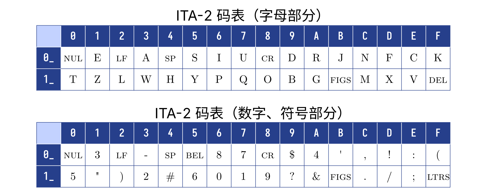
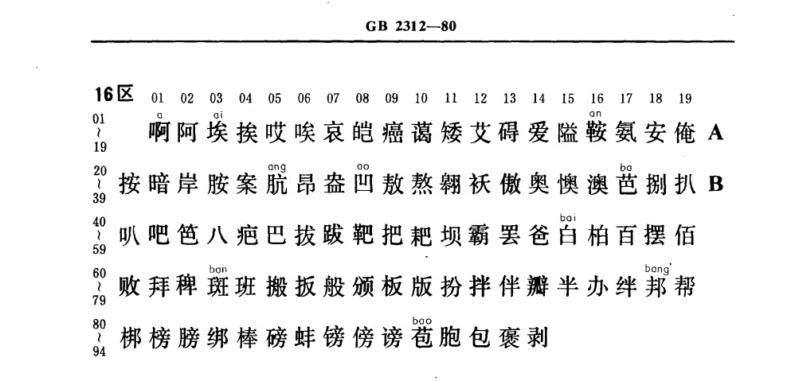
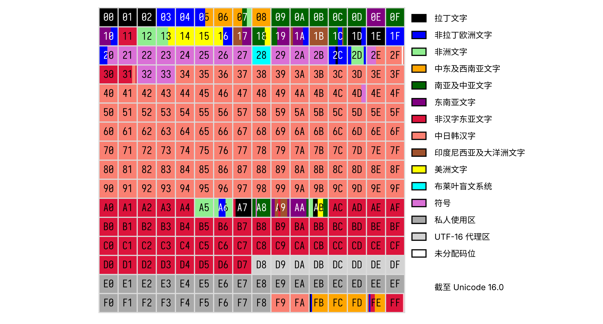
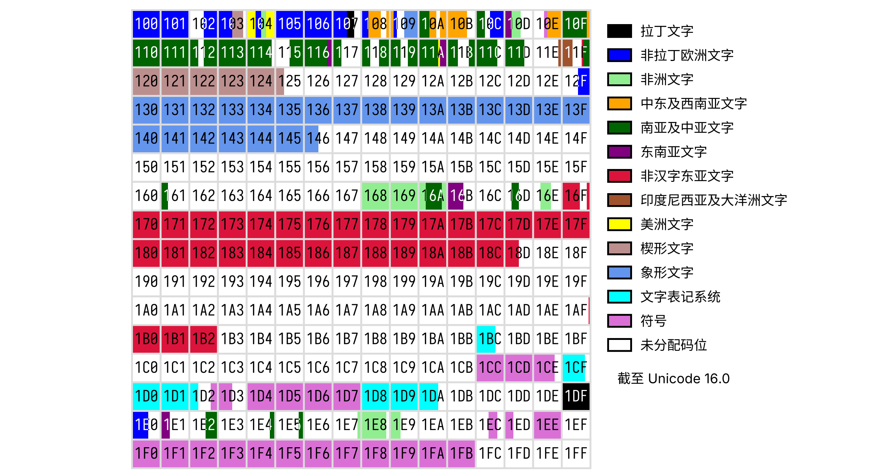
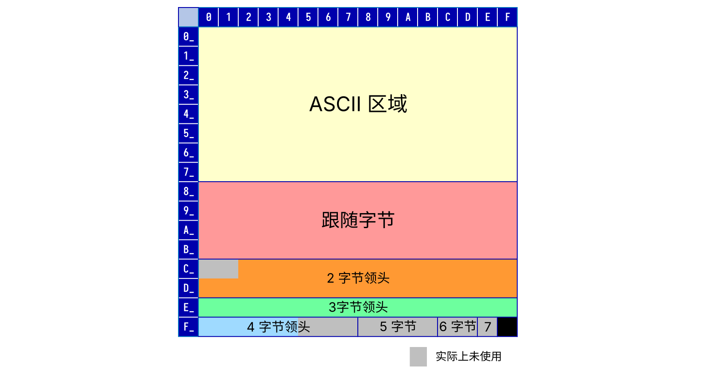
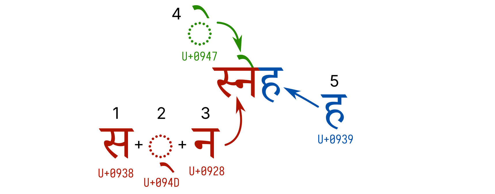
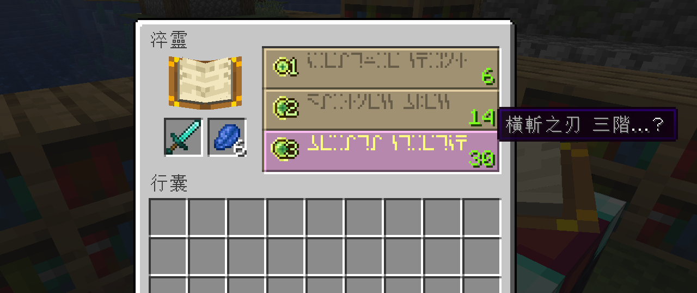
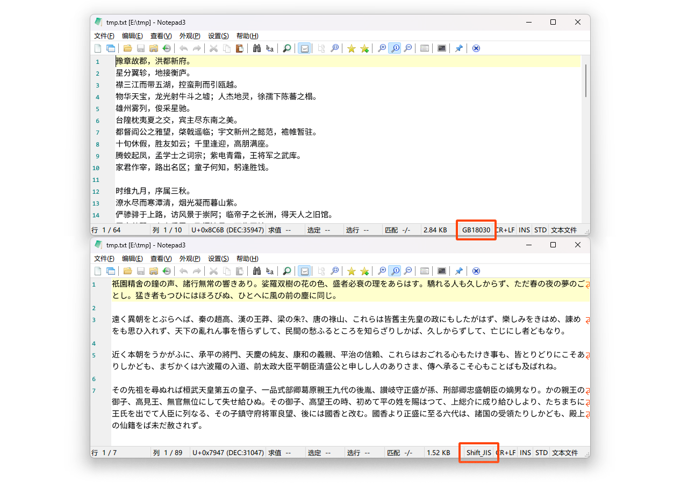
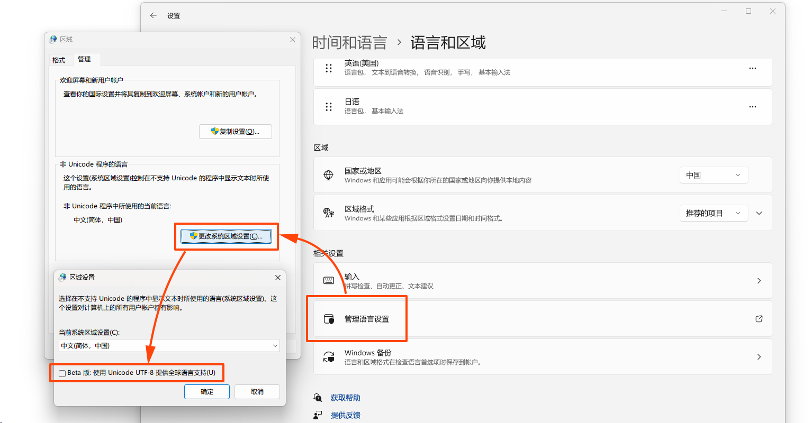

# 万言皆数：字符与编码规则


这一章让我们来一探「字符」在电脑世界中的奥秘。或许曾经有人告诉你，在数字世界中，一切不过是由 `0` 和 `1` 交替组合而成的数据罢了。那么，这些看似毫无规律的「数」，是如何和人类的万千语言对应上的呢？「编码」就是解决这一切问题的答案。看完这一章，也许你就能找到这些问题的答案：

- 二进制、十进制都是什么？「字节」又是什么？
- 世界上那么多种文字，为什么计算机能完整地表示它们？
- 为什么我在网上或一些 app 中，有时会看见各种各样的乱码？例如：
  - 浣犵己澶辩殑閭ｉ棬璁＄畻鏈鸿
  - <span style="word-break: break-all">你缺失的那门计算机课</span>
- 在使用电脑的过程中，我们如何避免这样的乱码的产生呢？


语言文字是文化的基础要素和鲜明标志，是推动人类进步的重要力量。文字作为语言的载体，在进入信息时代后，「如何把文字在计算机系统中表示」就成为了至关重要的问题。将目光投向电脑的屏幕，这一章，我们会来看看我们使用电脑时必然会见到，却又不太明白个中奥秘的内容——屏幕上显示的文字与它背后的「数字」。

## 机器中数的表示

在了解文字与数之间的关系之前，我们有必要先简单学习一下，计算机中如何表示数字。

### 进制

所谓「进制」，本质上说的是<ruby>数<rp>（</rp><rt>shǔ<rp>）</rp></ruby><ruby>数<rp>（</rp><rt>shù<rp>）</rp></ruby>的方式。小时候的数学第一课就是教导我们怎么数数，掰着手指，借助 0 到 9 这 10 个阿拉伯数字，我们学到了一种「逢十进一」的数数方式：

0\rightarrow 1\rightarrow\cdots\rightarrow 9\xrightarrow{\text{进位}}10\rightarrow 11\rightarrow\cdots

逢十进一就是说，我们每数十个数，就要进一位，然后重新开始数十个数。如此一来，借助十个数字，我们就能将所有自然数都表示出来，这种数数方式就是人尽皆知的「十进制」。

但如果允许使用更多数字会怎么样？例如，假定使用 0 到 9 以及 A 到 F 一共 16 个符号作为「数字」，我们就可以设计这样一种数数方式，逢十六进一：

\begin{aligned}
0\rightarrow &1\rightarrow\cdots\rightarrow 9\rightarrow \mathrm{A}\rightarrow \mathrm{B}\rightarrow\cdots\rightarrow \mathrm{F}\xrightarrow{\text{进位}}10\rightarrow \\
&11\rightarrow\cdots\rightarrow19\rightarrow1\mathrm{A}\rightarrow\cdots\rightarrow 1\mathrm{F}\xrightarrow{\text{进位}}20\rightarrow 21\rightarrow\cdots
\end{aligned}

这就产生了一种更高的进制——「十六进制」。

另一方面，限制我们能使用的数字个数，也可以设计出更低的进制——极限情况下，让可用的数字只留下 0 和 1，自然而然就产生了这样「逢二进一」的数数方式：

0\rightarrow 1\xrightarrow{\text{进位}}10\rightarrow11\xrightarrow{\text{进位}}100\rightarrow 101\rightarrow\cdots

这就是「二进制」。

> 那有没有「一进制」呢？（笑）

把数字按上面不同的数数方式并排列出，一一对应，我们就能得到进制之间的转换关系，这就是同一个自然数在不同进制下的表示方式。

| 十进制 |    0 |    1 |    2 |  ... |    9 |   10 |   11 |  ... |   15 |   16 |   17 |  ... |   43 |  ... |  255 |  ... |
|----------|-----:|-----:|-----:|-----:|-----:|-----:|-----:|-----:|-----:|-----:|-----:|-----:|-----:|-----:|-----:|-----:|
| <span style="white-space: nowrap;">十六进制 |    0 |    1 |    2 |  ... |    9 |    A |    B |  ... |    F |   10 |   11 |  ... |   2B |  ... |   FF |  ... |
| 二进制   |    0 |    1 |   10 |  ... | 1001 | 1010 | 1011 |  ... | 1111 |10000 |10001 |  ... |101011|  ... |11111111|  ... |

当然，为了计算一个数在某种进制中的表现，我们没必要用这个表从零开始数，而可以直接计算——例如，将十进制数转换为对应的k进制数，可以采用「除k取余法」，你可以自行上网搜索。

值得一提的是，在高进制下（例如十六进制），依然有些数是不包含字母的，此时如果不加额外说明，没人看得出它到底该是几进制：例如，十六进制的 43 和十进制的 43 显然不是同一个数。为了避免混淆，除了在上下文中特别说明之外，我们还可以选择在表示非十进制数时加上一些特殊标记：十六进制数可以在前面加上一个 `0x`（一个数字零和一个字母 x）或在尾部加上「ʜ」的后缀（hexadecimal 的首字母）；二进制数在前面加 `0b`（数字零和字母 b）或在尾部加上「ʙ」的后缀（binary 的首字母）。另外，本章中，除非特别说明，像 `114514` 这种框起来样式的数字，默认是十六进制。

### 计算机与二进制

在计算机内部，信息由电信号承载，而一根导线上的电信号总是只能处在「<span style="color: #11CD08;">有电</span>」「<span style="color: #114514;">无电</span>」[^pinstate]两种状态中的一种。如果我们把「<span style="color: #11CD08;">有电</span>」记成 1，「<span style="color: #114514;">无电</span>」记成 0，那么计算机内的一组电信号就自然而然地对应到一个二进制数上了，这样传输的一个数字称为一「比特」或一「位」（bit）。假设机器内部某处，使用 8 根并排的导线来传递数据，我们就称这个数据的「宽度」为 8 位或 8 比特。如果这 8 根导线上的电信号，在某一时刻的状态是：

[^pinstate]: 严格来说是「<span style="color: #11CD08;">高电平</span>」与「<span style="color: #114514;">低电平</span>」。除此之外，电路可能处在类似悬空的「高阻态」。

| 电路 | 最高位 |      |      |      |      |      |      | 最低位 |
| ---- | :----: | ---- | ---- | ---- | ---- | ---- | ---- | :----: |
| 状态 |  <span style="color: #114514;">无电</span>  | <span style="color: #11CD08;">有电</span> | <span style="color: #11CD08;">有电</span> | <span style="color: #114514;">无电</span> | <span style="color: #114514;">无电</span> | <span style="color: #114514;">无电</span> | <span style="color: #11CD08;">有电</span> |  <span style="color: #114514;">无电</span>  |

它传递的数据就是二进制数 `01100010`，转换成十进制就是 98。人们把这样的**一个 8 位数据称为一个「字节」（byte）**。一个字节能存储的最小二进制数是 `00000000`，也就是十进制和十六进制的 0；而能存储的最大二进制数是 `11111111`，转换成十进制为 255，而转换成十六进制则是 FF。这意味着，**用两个十六进制数字，刚好可以表示一个字节的内容**。

> 其实，一个十六进制数字刚好可以表示 4 位的内容，这是因为 2^4=16。

## 万言皆数

「万物皆数。」这是古希腊数学家毕达哥拉斯的信条，也是他创建的学派的信条，他们为万事万物赋予数字，而为数字赋予意义。在今天看来，这想法神秘而虚无缥缈；但在电脑的世界中，所有的事物的的确确是内存、硬盘等等硬件中的一个个 0 与 1，「万物皆数」的观点在这里得到了淋漓尽致的展现。文字——人类为记录语言而创造的工具，在这「数」的世界中亦不可避免成为庞大数据的一部分。那么，电脑是如何令文字化为数字存储在其中，又如何令数字化为文字得以展现在我们眼前的呢？

### 编码——让字符有代号

古时人们传递信息，大多用文字写下，使用信件传递。但在一些特殊场合，人们只能使用「代号」来通信：例如，海事通信和收发电报。如何设计出能涵盖各种各样的文字的代号呢？「编码」的概念就此诞生。

在信息时代到来之前，人们就已经设计出了多种多样的编码，例如旗语——使用特定的旗帜朝向组合来代表一个个字母；或者著名的摩尔斯电码——利用线与点的组合代表长短信号的序列，进而表示字母；又或者直到 20 世纪 80 年代还在广泛使用的中文电码——将汉字用四个数字或三个字母表示，再利用摩尔斯电码化为长短不一的信号……下图分别展示了国际摩尔斯电码与你可以在 1986 年用六毛钱买到的《标准电码本》中的某一页。


而接受编码的对象，可以是一个汉字、一个字母、一个标点，甚至一个「接到这个信号就表示信息发完了」的「虚拟字」。我们将这样**接受编码的对象称为「字符」（character）**。

随着信息时代到来，0 与 1 的波浪占据了信息传递的方方面面，「编码」的含义也随之变成了「将每一个字符用数字表示，以便于在计算机中处理」。然而，此前使用的各种编码方式，在应用到计算机系统中时，都存在这样或那样的不足。例如，在 20 世纪 60 年代初的美国，通行「国际电报字母第 2 号」（ITA-2）的编码规则。但这 ITA-2 编码非常抽象，它不仅没有规律，还只有大写，要想输入数字和标点还需要特定的「虚拟字」来转换码表。后来的 TSS 编码虽然加入了小写，可其他问题一个没改。天下苦乱糟糟编码久矣。为了让计算机能更「优雅」地表示各种字符，ASCII 编码就此诞生，一个将文字数字化的时代从此开始。



### ASCII——故事真正的开始

ASCII，全名「美国信息交换标准代码」（American Standard Code for Information Interchange），是美国国家标准协会（ANSI）的前身——美国标准组织（ASA）在 1963 年为改进电报编码而制定的编码规则。

> ASCII 的「II」不是罗马数字 2，也不能读成 ASK-二，而应该读作 ASS-key。

ASCII 使用 7 位二进制数来编码字符，可以表示的数据范围是 0—127，也就意味着它能包揽英文字母（2\times26=52 个）、阿拉伯数字（10 个）、常用标点符号（二三十个），甚至还有空余。ASA 也没闲着，往这些剩下的空位里面塞进了许多「控制字符」，也就是上文所述的「虚拟字」。下表是 1967 年版的 ASCII 编码标准，共 7 列 16 行，「0」列与「1」列都是控制字符，用来控制通信设备；数字在「3」列，可见 `30` 就是 0，`31` 就是 1……挺方便；「4」列、「5」列有按字母表排列的大写字母，隔壁的「6」列、「7」列中相同的位置有小写字母；剩下的地方全是标点符号了。

|行\列 |0|1|2|3|4|5|6|7|
|:-----:|:-:|:-:|:-:|:-:|:-:|:-:|:-:|:-:|
|**0**|NUL|DLE|SP|`0`|`@`|`P`|<code>&#96;</code>|`p`|
|**1**|SOH|DC1|`!`|`1`|`A`|`Q`|`a`|`q`|
|**2**|STX|DC2|`"`|`2`|`B`|`R`|`b`|`r`|
|**3**|ETX|DC3|`#`|`3`|`C`|`S`|`c`|`s`|
|**4**|EOT|DC4|`$`|`4`|`D`|`T`|`d`|`t`|
|**5**|ENQ|NAK|`%`|`5`|`E`|`U`|`e`|`u`|
|**6**|ACK|SYN|`&`|`6`|`F`|`V`|`f`|`v`|
|**7**|BEL|ETB|`'`|`7`|`G`|`W`|`g`|`w`|
|**8**|BS|CAN|`(`|`8`|`H`|`X`|`h`|`x`|
|**9**|HT|EM|`)`|`9`|`I`|`Y`|`i`|`y`|
|**A**|LF|SUB|`*`|`:`|`J`|`Z`|`j`|`z`|
|**B**|VT|ESC|`+`|`;`|`K`|`[`|`k`|`{`|
|**C**|FF|FS|`,`|`<`|`L`|`\`|`l`|<code>&#124;</code>|
|**D**|CR|GS|`-`|`=`|`M`|`]`|`m`|`}`|
|**E**|SO|RS|`.`|`>`|`N`|`^`|`n`|`~`|
|**F**|SI|US|`/`|`?`|`O`|`_`|`o`|DEL|

按照这这张表，一个字符可以用两个十六进制数字表示，第一个是列数，第二个是行数。例如「Missing!」编码出来，用十六进制数表示就是 `4D 69 73 73 69 6E 67 21`，每两位十六进制数对应一个字符。当机器读取到这串数字时，只需要按行列查表即可解码。值得一提的是，1963 年的初版 ASCII 并没有加入小写字母，而是把那一块空出来了，后来人们发现不妥，于是在初版发布的几个月后就立马加上了小写字母。如此一来，英文的文字通信需求就被这一张表完美涵盖了。

1968 年 3 月 11 日，当时的美国总统林登·约翰逊要求美国政府购买的所有电脑都必须支持 ASCII 编码，自此，ASCII 成为了事实上的编码标准，也成为了众多其他编码规则的祖先。

### 百花齐放的代码页

我们已经知道，1 个字节由 8 位二进制数组成。「字节」一词的含义，其实就是「用于编码单个字符的位数」。但 ASCII 诞生的那个年代，人们对于「一个字节到底多大」这件事各执一词：例如，ASCII 使用了 7 位编码，而有一些计算机科学家认为 6 位编码亦已足够。然而，随着计算机技术的发展，信息的复杂度不断提升，到了 20 世纪 70 年代，一个字节等于 8 位二进制数已经成为了事实上的标准。随后，英特尔发布了 16 位的 8086 处理器并大为成功，16 正好是 8 的两倍，也进一步让「1 字节 = 8 位二进制数」的概念深入人心。

将 7 位的 ASCII 移植到 8 位几乎不费吹灰之力——只需在前面加个 0 即可。然而，自 20 世纪 80 年代以来，伴随着科技革命的浪潮，计算机迅速普及到世界的各个角落。而与此同时，一个新的难题也随之而来：不同语言的文字需求。

比如，法语有「é」，德语有「üß」，俄语有「иящ」，日语有「あいう」，汉语则有「天地人」……每个国家和地区都希望能够在计算机上显示和处理自己的文字。然而，一个字节只有 256 个空位。对于法语、德语等语言，所需的额外字符数量有限，还可以勉强（和 ASCII 一起）挤入这 256 个空位之中。但像中文这样的语言，其字符数量动辄成千上万，256 个位置显然不足。如何让不同的文字都能在计算机中有「一席之地」呢？

一个简单的想法是，把大伙用到的字符全收集起来，然后统一编码即可。可惜想法很美好，技术与钱包不同意。1985 年，普通个人电脑的硬盘大约只有 10 MB 的容量，却要花高达 250 美元才能买到，寸土寸金的硬盘空间让人们只能寻求替代方案。为了解决这些问题，IBM 与微软一起，在 DOS 3.3 版本时推出了全新的全球化功能——代码页（code page）。

代码页的思想是：**对每种不同的文字系统使用不同的编码方式，并为每种编码方式赋予一个数字代号，称为「代码页」**。只要知道一段内容使用的代码页，就知道它是哪种语言、使用什么编码方式。IBM 与微软主要负责为各种文字系统指定代号，而为文字编码，则交给各个国家与地区的机构完成。下表是最初的部分代码页/语言/编码规范对应表。


| 代码页 |     语言     |                             编码规范                             |
| :----: | :----------: | :--------------------------------------------------------------: |
|   38   |   美国英语   |                             US-ASCII                             |
|  819   | 英语、法语等 |     ISO 8859-1:1998 8 位单字节编码字符集——拉丁字母：第 1 号      |
|  932   |     日语     | JIS X 0208 7 位及 8 位双字节信息交换用符号化汉字集合[^shift-jis] |
|  936   |   简体中文   |          GB/T 2312-1980 信息交换用汉字编码字符集 基本集          |
|  950   |   繁体中文   |                              大五码                              |
|  1252[^codepage]  | 英语、法语等 |                         WHATWG 编码规范                          |

[^codepage]: 虽然 819 和 1252 是不一样的代码页，但网页显示会把 819 视作 1252 来解析。
[^shift-jis]: 又称 Shift-JIS。

这样，世界各地的计算机可以通过代码页来确定应采用的编码规范。例如，对于英语内容，它们使用代码页 38，并通过 ASCII 解码；而对于简体中文内容，则采用代码页 936，对应国家标准《GB/T 2312-1980 信息交换用汉字编码字符集 基本集》（简称「GB2312」）。由于每个地区的计算机通常只需处理本地语言内容，操作系统会设置一个「默认代码页」。当内容未明确标注其代码页时，系统会默认使用该默认代码页进行解码。

我们再来看 GB2312 编码。它最初发布于 1980 年，为了解决「一个字节放不下的问题」，GB2312 采用了「双字节编码」——使用两个字节来表示字符。它收录了 6763 个最常用的汉字，同时额外收录了希腊字母、西里尔字母、注音符号、日文假名等内容。GB2312 将所有的字符编入 94 个「区」，每个区中又有 94「位」，这样总共94 \times 94 = 8836个位置——或者说「码位」，足够容纳下这么多字符了。整个标准中，1~9 区放字母与符号，16~87 区放汉字，剩下的没用到。下图展示了第 16 区容纳的内容。



采用「区位码」方案的的好处是：我们恰好可以用两个字节分别标识区和位。在实际实现中，为了不和 ASCII 打架，区码就使用了 `A1`~`F7` 的 87 个十六进制数，位码使用了 `A1`~`FE` 的 94 个十六进制数。例如上图中的「凹」字，位于 16 区 28 位，那么它的编码就是 `B0BC`。这样，整个编码体系就建立完成了。

> 什么是「为了不和 ASCII 打架」呢？由于在中文里，我们通常会不可避免地夹杂使用英文，人们希望这些英文能正常地以 ASCII 编码和解码来保持兼容性。而 ASCII 所占用的范围是 `00`~`7F`，如果 GB2312 亦使用了这个区域，就会导致机器无法区分该内容是「2 个 ASCII 编码的英文字母」还是「1 个 GB2312 编码的字符」。

目前看来一切都还不错，直到人们发现 GB2312 漏掉了一些经常使用的字，例如在「啰嗦」这个常用词中的「啰」，以及许多人名字中的生僻字，例如「镕」。一方面，人们为了能够显示出这些字，使用了一系列替代方案，比如拼字或者换专用字体：


「少<span style="display: inline-block; transform: scaleX(.5) translateX(-.51em); width: 1em; white-space: nowrap;">口罗</span>嗦！」方<span style="font-family: simsun, serif;">镕</span>打断道。


另一方面，人们也在推动更多字符被收进编码体系中。1995 年，《汉字内码扩展规范》发布，通称「GBK」，意为「国标扩」，收录汉字的总量达到了 21003，代替了 GB2312 在代码页 936 中的位置。它在双字节中没有用上的很大一部分都塞上了汉字，如下图「GBK」部分所示，其中「GBK/1」「GBK/2」部分就是 GB2312。还是为了避免与 ASCII 相冲突，GBK 仅使用 `80` 以上的值作为双字节编码开头——这差不多切着 ASCII `7F` 的上限了。


然而 GBK 并不是一个纸面上的国家标准，而只是一个被人们广泛采用而造就的「事实标准」。于是又过了几年，在 GBK 的基础上，国家标准委员会推出了《GB 18030-2000 信息技术 信息交换用汉字编码字符集 基本集的扩充》（简称「GB18030」），占据了 GBK 在代码页中的位置。它收录了 27533 个汉字，其中包括许多繁体字与生僻字。为了收录这么多汉字，它增加了四字节编码的部分：四字节由两个特定的双字节构成，如上图绿色部分所示，那一块一共 1260 个码位，可以表示1260^2 = 1\,587\,600个字符。~~（根本用不完，哈！）~~ 自此，更多的中文字符被官方标准的编码体系所囊括，除了极为生僻的古文用字，几乎不会有「缺字」的情况出现了。

后来，该标准被不断修订，目前最新版是《GB 18030-2022 信息技术 中文编码字符集》，不仅收录了 87887 个汉字，更收录了朝鲜文、蒙古文、藏文等我国许多少数民族使用的文字，成为了我国各民族都可使用的通用标准。以下是一些文字在 GB18030 最新版中的编码对应关系。

| 文字  | 编码       |
| :---: | :--------- |
|  绝   | `BE F8`     |
|  𪩘   | `98 36 CF 34` |
|  랓   | `82 39 FB 38` |
|   དྷ   | `81 32 F0 36` |

> 为什么要有这么多汉字呢？因为在我国源远流长的文化中，汉字经历了几千年的发展与演化，出现了大量的变体。尽管这些「生僻字」在日常生活中鲜有使用，但在人名处理、古籍数字化等场景中，它们仍然会出现，故有必要给它们在编码中留下位置。

通过对中文编码的一瞥，我们已经领会了如何给拥有巨大文字量的文字系统编码。其他文字系统的代码页也是相似的思想。同时，所有的代码页都不约而同实现了对 ASCII 的兼容，令 ASCII 编码的内容无论以何种代码页解析都能得到正确的结果，这也就是为什么我们说「ASCII 是众多其他编码规则的祖先」。不同的代码页服务着世界各地讲不同语言、使用不同文字的电脑用户，让所有人都能享受到信息时代带来的便利与乐趣。

然而，代码页是一种「治标不治本」的方案——如果要排版一本《八国语言速通教程》，就得为其中不同语言的部分来回切换代码页。这不仅操作繁琐，而且许多软件并不支持这样的复杂处理。直到属于 Unicode 的时代来临，这个问题才得到彻底解决。

### Unicode 与 UTF 的大一统时代

虽然上文说过「把大伙用到的字符全收集起来，然后统一编码……技术与钱包不同意」，但早在 1987 年，仍然有人开始尝试这项工作。那一年，造打印机的施乐（Xerox）的员工乔·贝克尔（Joe Becker）开始尝试创建一种「通用字符集」，并在许多人的帮助下，于次年发布了一份「国际化/多语言的字符编码系统」草案，名为 *Unicode 88*。这就是「Unicode」（统一码）这个名字的起源，它代表了一种为全球每一种语言所用文字制作统一而通用的编码方案的美好愿景。


显然，若想为全球每一种语言的文字编码，必定需要大于 1 字节的方案。在 *Unicode 88* 中，贝克尔设想了一种「宽体 ASCII」——使用两字节来编码字符的方案。贝克尔认为「在合理的设计下，每个字符 16 位（二进制）编码已经绰绰有余」，然而上文我们已经看到，在三十多年后，仅仅汉字一项，就已经达到了八万多字符之巨，这样的编码方案显然是不能满足长期使用的。

*Unicode 88* 发布后的几年，Unicode 工作小组仍在不断改进这个草案，对编码的字符各种重排，以求更好的效果。1991 年 1 月 3 日，Unicode 联盟成立，右图是它现在的徽标（之前的徽标是暗红色的）。同年十月，《Unicode 规范》第一版发布，这标志着字符集的制定进入了新时代——全球化的大一统时代。

与此同时，国际标准化组织（ISO）也在干差不多的活，但是两拨人互相不知道。~~（这就是缺乏调研与沟通的后果。）~~ 1990 年，《ISO 10646 通用多八位编码字符集（草案）》发布，规定了一种有「128 组，每组 256 面，每面 256 行，每行 128 单元」的字符集。虽然算下来它能包含2^{32}个字符，但说实话……这有点复杂了。大伙都不看好这种编码方案，于是 ISO 终于找到了 Unicode 工作组，并协商让两个标准统一，Unicode 有了 ISO 的支持，成为了国际标准的一份子。

为了实现对所有文字统一编码这样的宏伟大业，Unicode 将编码工作分成了两步：首先，确定我们需要的字符一共有哪些，构成一个「字符集」，并为这里面的每个字符编号（称为「分配码位」，通常以 `U+` 后面跟十六进制数构成）。随后，设计一些「Unicode 转换格式」（Unicode Transformation Format，简称 UTF），将字符码转换为实际存储在计算机里的，由一个或多个字节组成的编码。例如，「M」「α」「あ」「缺」「🤣」和「𰻝」[^biang] 六个字符占据的码位，以及使用 UTF-8 转换的编码分别是：

|              |    M     |    α     |     あ     |     缺     |      🤣      |       𰻝      |
| :----------: | :------: | :------: | :--------: | :--------: | :-----------: | :-----------: |
|     码位     | `U+004D` | `U+03B1` |  `U+3042`  |  `U+7F3A`  |   `U+1F923`   |   `U+30EDD`   |
| UTF-8 转换后的字节数 |    1     |    2     |     3      |     3      |       4       |       4       |
|   UTF-8 转换后的实际编码   |   `4D`   | `CE B1`  | `E3 81 82` | `E7 BC BA` | `F0 9F A4 A3` | `F0 B0 BB 9D` |

[^biang]: 这个是陕西名吃「biángbiáng 面」的 biáng 字。

UTF-8 目前使用 1 至 4 字节的可变编码方案，字节之间不会冲突（即任何一个字符的编码，都不会是另一个字符的编码的前缀），同时在只有 1 字节时与 ASCII 相兼容，已经成为了最常见的 Unicode 转换格式。下面，我们会简要介绍「码位」和「UTF」的细节。虽说「简要」，但这两部分内容还是有些复杂，因此你可以选择性阅读，或者 [点击这里]() 跳过。

#### Unicode 与文字码位 *

Unicode 收录一种文字的基本流程大概是：
1. 当地机构先收集这种文字可能用到的所有字符，将它们提交给 Unicode 联盟；
2. Unicode 联盟开会，各成员投票决定收录不收这些文字，过半数则同意；
3. 若同意收录，则按字符数量在 Unicode 码表中划一块区域放进去，等到下一版正式发布时就会成为不变的标准。

当今的 Unicode 收录了各式各样很多字符，除今天世界各地的人们都在使用的文字以外，还包括各种表情符号、音乐符号、棋牌符号，甚至埃及圣书体、楔形文字等等古代文字。

但是原本 Unicode 设计的是「每个字符 16 位二进制码」，也就是 65536 个字符，我们早已知道这不够用。Unicode 联盟意识到这个问题之后，引入了类似 ISO 当初设想的「平面」（plane）概念，但远没有 ISO 方案那么复杂。他们将 Unicode 的字符范围分为 0~16 号总共 17 个平面，每个平面正好 16 位二进制码，65536 个字符，这样算下来就有17 \times 65536 = 1\,114\,112 = \mathrm{110000}_\mathrm{H}个码位，于是，Unicode 的字符码范围就是 0ʜ~10FFFFʜ，这下够用了。

16 位二进制码，用十六进制数字表示就正好是 4 位，再加上所属平面的号码，就构成了 Unicode 码位的十六进制表示。为了特意说明这是 Unicode 码位，人们通常令码位至少有四个数字（即前面补 0），并在码位前面加上 `U+` 的前缀。在上文中提到的六个字符，它们的平面和码位如下表所示。

| 字符  | 平面  | 码位      |
| :---: | :---: | --------- |
|   M   |   0   | `U+004D`  |
|   α   |   0   | `U+03B1`  |
|  あ   |   0   | `U+3042`  |
|  缺   |   0   | `U+7F3A`  |
|   🤣   |   1   | `U+1F923` |
|   𰻝   |   3   | `U+30EDD` |


截至 2024 年 10 月，最新的 Unicode 标准版本是 16.0，共收录约 15.5 万个字符，但是这些字符仅仅占了寥寥部分平面而已，我们来看看它们的分布。

Unicode 的第 0 平面叫「基本多文种平面」，又称「基本区」，下图是该平面内的大致字符分布，每格有 256 个码位。顾名思义，这个平面是最基本，也是最重要的平面，它包含了世界上大多数主要语言的文字。一眼望去，占大头的是汉字，不过这也无可厚非，谁叫中华文化圈需要这么多字才能满足基本使用呢。此外，这里面还有一块是「私用区」，意思就是用户可以自定义这一块的内容，标准不做规定。值得注意的是，第 0 平面还有一块叫「UTF-16 代理区」，这是什么？我们下节再说。



> 所谓「私用区」（Private Use Area，简称 PUA）是指码表中专门保留的一段码位，这些码位不会被分配给具体的字符。如果你需要「自造字」，就可以将这些码位分配给你自己创造的文字，从而**在你自己的系统中**使用这些字符。在早期中文编码少有生僻字的情况下，我国公安系统曾利用 PUA 为未编码的姓名生僻字分配码位，使这些字能够录入系统。然而，随着 GB18030 和 Unicode 标准的不断发展，越来越多的生僻字获得了正式的编码，这导致了「一字多码」的现象：某个字既有公安系统使用的 PUA 码位，又有正式编码。这引发了一些问题，比如有人的身份证无法通过实名验证，原因是身份证内的生僻字使用的是 PUA 编码，但该字已经有了通行的正式编码，计算机因为二者不一致而判定为不同的字。为解决这一问题，目前 [我国官方和社会各界正在积极推动相关措施](https://name.vurls.cn/ui/index/index/)。

接着是第 1 平面，叫「多文种补充平面」，下图是该平面内的大致字符分布。这个平面主要收录符号，以及一些冷门语言、历史语言所使用的文字。你可以在这个平面内见到埃及圣书体、楔形文字、西夏文等等文字，以及象棋、扑克、麻将之类的符号，还有人们喜闻乐见的表情符号（😉）。可以看到，这个平面内还有许多空白没有分配，再一次证明这么多码位肯定足够我们使用了。



剩下的平面……其实没什么好看的。第 2 平面叫「表意文字补充平面」，第 3 平面叫「表意文字第三平面」，这两个平面里面分配好的全是汉字，总计 70670 个。第 4 至 13 平面还未启用。第 14 平面叫「特殊用途补充平面」，里面塞了一些控制字符。第 15、16 平面全是私用区，真是大手笔啊！

这就是 Unicode，统一全球字符的字符集。如果你想了解字符集的更多细节，可以去 Unicode 官网获取最新版的字符表——一个几千页的 PDF 文件[^Unicode]!

[^Unicode]: 网址是 [https://www.unicode.org/versions/latest/](https://www.unicode.org/versions/latest/)，在第 I 小节「List of Components」可以找到字符表（Code Charts）的 PDF 链接。

#### UTF 编码方案 *

「为 Unicode 字符集编码」这个事情，需要一点创造力。像 GB18030 一样直接用字符码是不行的，因为 Unicode 字符集的字符码覆盖了 0ʜ~10FFFFʜ 的每个自然数，直接用会引起歧义。不妨以「U 盘」这个词为例，把它每个字符的字符码写出来连在一起，就是 `55 76 D8`，但是要想还原回去就难了。我们无法知道哪里是字符的开始，哪里又该是这个字符的结束：


那不如……把编码弄成定长的，而且长度要能容下最大的字符码吧？这就是 UTF-32。UTF-32 使用 32 位二进制数（4 字节）来编码字符，要知道，最大的 Unicode 码位 10FFFFʜ 也才 21 位二进制数，这显然绰绰有余，能做到一字符一编码。在 UTF-32 下，「U 盘」一词的编码就是 `00 00 00 55 00 00 76 D8`，真长啊。相信你也看出来了，UTF-32 的弊端就是占空间，存储大多数文本的时候，数据有一半多会是 `0`，多浪费啊。所以，这种编码方式并没有推广开来。

另一种编码方案源自早期 Unicode 设想中的「宽体 ASCII」方案，使用 16 位二进制码来编码，这就是 UTF-16。对于基本区的字符，它们的字符码在 `U+0000` 至 `U+FFFF`，刚好可以直接写进 16 位，例如「U 盘」一词的 UTF-16 编码就是 `00 55 76 D8`。但剩下的平面，16 位二进制不够用，怎么办呢？这就是 UTF-16 代理区的用武之地了。

UTF-16 代理区占据了 `U+D800`~`U+DFFF` 的区域，一共 2048 个码位，其中 `U+D800`~`U+DBFF` 的 1024 个是「高位代理」，剩下 1024 个是「低位代理」，这些都是虚拟字符。不在基本区的字符，将它的字符码拆成高、低两截，利用高位、低位代理字符各一个组成一个「代理对」，以两个 2 字节「代理」原本的字符。以「俨骖𬴂于上路，访风景于崇阿。」[^滕王阁序]中的 `U+2CD02`「𬴂」为例，我们来看看代理对是如何工作的。

[^滕王阁序]: 出自唐代文学家王勃的《滕王阁序》。

稍微看一看高位代理的码位范围，不难发现，如果利用二进制表示，高位代理会长下面这个样子，其中 `X` 是可变的位置。
```
1101 10XX XXXX XXXX
```
也就是说，只要以 `1101 10` 开头的 UTF-16 编码，就是一个高位代理。相应地，低位代理就长下面这样，相比高位代理的特征就差一位。
```
1101 11XX XXXX XXXX
```

想必你应该不难想到这些「可变的位置」的作用了吧。接下来，我们想表示「𬴂」，要分两步走：
1. 在表示基本区外的字符时，要将它的 Unicode 字符码减去 10000ʜ；
2. 把得到的结果填进代理对的可变位置就行了，前面没有用到的位置补 0 即可，像这样：


于是 `U+2CD02`「𬴂」的 UTF-16 编码就是 `D8 73 DD 02`。

> UTF-16 代理区的字符只有「一高一低」的序列才是有效的，其他情况都不行，实际解析出来大概率会是「�」。

一个代理字符有 10 位二进制的可变位，所以利用代理对可以表示的字符总共有2^{20} = 1\,048\,576 = \mathrm{100000}_\mathrm{H}个。再加上无需代理的基本区的 10000ʜ（= 65536）个，正好是 Unicode 字符集的 110000ʜ 个码位。而 20 位二进制数，代表的数值范围是 0ʜ~FFFFFʜ，对应着不属于基本区的 `U+10000`~`U+10FFFF`，这就是为什么代理对表示法的第一步是「减去 10000ʜ」。同时这也是为什么 Unicode 字符集一共 110000ʜ 个码位——正是为了兼容 UTF-16 作出的限制。

相比于 UTF-32，UTF-16 的编码长度要短许多，对基本区的常用字符能省下一半的空间。即便是存储不再寸土寸金的今天，省下一半的空间也意味着巨大的优势。如今的 Windows 系统内部与 Java 编程语言都在使用 UTF-16 作为 Unicode 文本编码。但是 **UTF-16 也有弊端：它不兼容 ASCII**。有没有一种既能表示 Unicode 这么多字符，又兼容 ASCII 的编码呢？还真有，而且是一个颇具想象力的方案。

UTF-8 是一种彻彻底底的变长编码方案，它的单字符编码码长不像之前的两个 UTF 限制在 2 字节与 4 字节，而是 1 到 7 字节都可行（实际上只用 1 到 4）。

首先，UTF-8 兼容 ASCII，所以单字节编码 `00`~`7F` 就是 ASCII 范围了。但这些也是 UTF-8 仅有的单字节编码，剩下的都是多字节。为了标记多字节编码的字节数量，UTF-8 把剩下的字节值分成了「领头字节」与「跟随字节」两种。领头字节的形式是 `110XXXXXʙ`、`1110XXXXʙ`……`11111110ʙ`，它的意思是：第一个 `0` 前面有几个 `1`，那么这个编码就是几字节。跟随字节的形式是 `10XXXXXXʙ`，它跟在领头字节后面，共同组成整个多字节的字符编码。显然，n\;(n>1)字节的编码就有 1 个领头字节和(n-1)个跟随字节。这么规定下来，不同字节值在 UTF-8 编码中的职能可以总结成一张图：



稍微做一点点计算，我们可以列出一张表，把 UTF-8 编码与其可表示的 Unicode 字符码范围对应起来（假定表示的是 `U+UVWXYZ` 的字符码）：

| 字符码范围           | 码长  | UTF-8 编码二进制值                    |
| -------------------- | :---: | ------------------------------------- |
| `U+0000`~`U+007F`    |   1   | `0YYYZZZZ`                            |
| `U+0080`~`U+07FF`    |   2   | `110XXXYY 10YYZZZZ`                   |
| `U+0800`~`U+FFFF`    |   3   | `1110WWWW 10XXXXYY 10YYZZZZ`          |
| `U+10000`~`U+10FFFF` |   4   | `11110UVV 10VVWWWW 10XXXXYY 10YYZZZZ` |

要确定一个字符的 UTF-8 编码，只要先查表确定它是几字节，然后像 UTF-16 填代理对一样，把字符码填进对应编码的可变位置就可以了。还是「U 盘」一词，转换为 UTF-8 编码 `55 E7 9B 98` 的过程是这样的：


诚然，UTF-8 很好，但它也存在不足——譬如，常用汉字无论在 UTF-16 还是 GB18030 里面，都是 2 字节编码，但到 UTF-8 就要 3 字节，空间消耗多了一半。所以我国仍有不少系统在使用 GB18030 编码。

> 其实 GB18030 定义了编码到整个 Unicode 字符集的映射关系，所以严格来说，它也算一种 UTF。

以上三种 UTF 编码方案，正是 Unicode 标准中规定的三种编码方案，而其中以 UTF-8 最为广泛使用。自互联网诞生以来的很长一段时间，全球的网络内容中大多数都是以 ASCII 为编码的，但 2008 年，UTF-8 超越了 ASCII，成为网络内容使用率排名第一的编码方案。之后，UTF-8 一路高歌猛进，到 2024 年，它已占据了网络内容 98% 的份额，逐渐成为了人们的共识。

> 为了保证兼容性，三种 UTF 编码也有自己的代码页编号，你可以上网搜一搜相关内容。

#### 字体——所见不一定是所得

理论上，文字和 Unicode 字符码是一一对应的关系，当字符码确定后，文字应该就能唯一确定了。然而，一种文字可能在不同的地区使用，这使得同一个字符会有不同的写法。不妨从我们最熟悉的汉字开始。众所周知，东亚所属中华文化圈的几个地方，或多或少在使用汉字。由于汉字会在传播与使用中持续演化，各地人们的书写习惯、官方颁布的规范都有所不同。就拿中国大陆、中国台湾、日本、韩国这几个地区为例吧，这几个地区都会向 Unicode 联盟提交汉字，难免会提交同一个字。但就算是同一个字，在各自字形写法规范下也会多少有些不同：


每一排看起来或多或少有些差别，但它们却对应着同一个 Unicode 码位。这也向我们解释了一件事：为什么玩一些外国游戏的时候，里面的字看起来有点怪，尤其是「门」字总看起来像「冂」上挂一竖？实际上就是在做本地化工作的时候默认使用了适合日本标准的字体。

但反过来，就算是看起来差不多，甚至一模一样的字，其对应的 Unicode 字符码也可能天差地别。下图就展示了 Unicode 浩如烟海的字符中一些看起来差不多的字，每一排都长得差不多，但每一个都是不同的字符。如果有人故意将长得一样的不常用字符放进网络文章的标题，那么正常搜索的人们可能永远都搜不到这样的文章，也算一种「网络世界的掩人耳目」了。


> 比起这些，我们更常遇到的是长相类似但字符码不同的标点。中文使用的标点一般占一个汉字宽，称「全角」或「全宽」，例如 `U+FF1F`「？」、 `U+FF0C`「，」；英文等西方文字使用的标点一般就占它看起来那么宽，称「半角」或「半宽」，例如 `U+003F`「?」、 `U+002C`「,」。很多时候，我们正常输入标点却反倒遭遇问题，很可能是程序只识别半角标点，而我们输入了全角的。

放眼全球，世界上的其他书写系统不一定像我们的汉字，或者欧美的拉丁字母，从左到右一路排过去就完事了。来看看天城文吧，印度次大陆上的书写系统，古时使用梵文的佛教经典与现在的印地语都由它写就。天城文有一个特点：当某些字母放在一起时，写在纸面的样子和它们各自独立出现时的样子几乎是两码事。此之谓「连字」，让我们来看看梵文的「爱」一词：



按 1 到 5 的顺序输入的 5 个字符，拼在一起却成了另一番模样，若是不熟悉这种文字，想必很难想象看起来连在一起的文字居然是由 5 个字符组成的。拉丁字母有时也有连字，但那大多数是为了好看，而天城文这样的书写系统，连字是它们表达方式的一部分。除天城文外，阿拉伯文，我国藏族的藏文，以及中南半岛上诸国的文字，例如高棉文、孟加拉文、缅文等，都有这样的连字。

实际上，《Unicode 核心规范》声明道，「实际字体可能会有相当大的差异」，什么是「相当大」呢？如果我们激进一点，完全不参考字符表中的字形，而是另立门户，我们就可以创造出一种看起来完全不像世界上任何一种文字的全新书写系统。游戏《我的世界》中，附魔台上显示的，或者飘出来的文字就是一个例子。



这种文字名叫「标准银河字母」（Standard Galactic Alphabet，简称 SGA），原本是《指挥官基恩》（*Commander Keen*）系列游戏中使用的文字，《我的世界》的开发者看它充满神秘感，于是将它添加到了同样充满神秘色彩的附魔台上。但实际上，SGA 只是重做了英文字母表而已，这些符号与英文字母都是一一对应的，不过，如果不知道对应关系，一般人想要破译也还是有点难度的。

> 「重做英文字母表」恰好也是古典密码的一种——字母替换密码。欲了解更多有关密码的话题，可以前去 [以密码之剑护网安之盾]() 一章。

如果不会设计字形，还有一种办法获得一个「加密字体」——把字形和 Unicode 字符码之间的对应关系打乱，例如本来 `U+4E00` 是汉字「一」，但你让它对应「霸」这个字……这样一来，使用这个字体的时候，按平常一样输入「一」，显示出来的却是「霸」，多有意思啊。不过我们不建议把这样的字体用于正式用途。

说了这么些，如果你真的想自己试试水，做一个字体，可以上网搜索「字体制作教程」之类的关键词，祝你好运！

## 赛博世界的鸡同鸭讲


注意：接下来你看到的奇怪文字均是**有意为之**，不是你的设备出问题了哦！


现实生活中，我们遇到说我们听不懂的语言的人，彼此之间往往都是大眼瞪小眼，最多通过肢体动作来交流。但上文之前说到，由于早年那「寸土寸金」的限制，全球各地都制定了适合自己的代码页，于是，赛博世界的「鸡同鸭讲」就这么埋下了种子，让人们同样大眼瞪小眼。

### 恼人的乱码

「乱码」这个东西，想必你多多少少都见过。无论是打开一个文本文件时里面充斥着的「��ȱʧ�����ż������」，还是在游玩某些舶来游戏时看到的「婱曽偺寚偗偰偄傞僐儞僺儏乕僞偺庼嬈」，又或者是打开网页时看到了下图这样的情况……这些都是乱码。


乱码的成因其实很简单——**用错误的编码体系读取文本**。举个例子，对于句子「与时俱进！」，如果它使用 UTF-8 进行编码，就会得到字节序列 `E4 B8 8E E6 97 B6 E4 BF B1 E8 BF 9B EF BC 81`：

| 字符  |     与     |     时     |     俱     |     进     |     ！     |
| :---: | :--------: | :--------: | :--------: | :--------: | :--------: |
| 编码  | `E4 B8 8E` | `E6 97 B6` | `E4 BF B1` | `E8 BF 9B` | `EF BC 81` |

不巧的是，接收方可能不知道这个字节串是使用 UTF-8 编码的。假如接收方错误地用 GB18030 为这字节序列进行解码，就会得到「涓庢椂淇辫繘锛�」：

| 编码  | `E4 B8` | `8E E6` | `97 B6` | `E4 BF` | `B1 E8` | `BF 9B` | `EF BC` | `81`  |
| :---: | :-----: | :-----: | :-----: | :-----: | :-----: | :-----: | :-----: | :---: |
| 字符  |   涓    |   庢    |   椂    |   淇    |   辫    |   繘    |   锛    | （无此编码）   |

或者错误地使用西文文本常用的编码 Windows-1252 来解码，Windows-1252 是一种单字节编码，会得到「与时俱进！」：

| <span style="white-space: nowrap;">编码  | `E4` | `B8` | `8E` | `E6` | `97` | `B6` | `E4` | `BF` | `B1` | `E8` | `BF` | `9B` | `EF` | `BC` | `81`  |
| :---: | :--: | :--: | :--: | :--: | :--: | :--: | :--: | :--: | :-: | :---: | :--: | :--: | :---: | :-: | :---: |
| 字符  |  ä|¸|Ž|æ|—|¶|ä|¿|±|è|¿|›|ï|¼|

可我们之前已经说过，Unicode 是为全球每一种文字编码的全球化统一字符集，而随之配套的 UTF-8 编码方案也早已广泛使用，但为什么我们还是会见到乱码呢？这是因为，尽管 Windows 在系统内部已经大量使用 Unicode，但是 Windows 系统的许多子组件，以及 Windows 上的许多应用程序，仍然在使用代码页体系来为各地的用户提供服务。各种代码页和 Unicode 混用在一起，给 Windows 上的文字编码留下了巨大的挑战。例如，Windows 自带的「记事本」app，就是一个典型的例子：

用记事本保存文件时，保存窗口一个不起眼的小角落里有【编码】的选项，如果你用的是较早版本的 Windows，这个地方的默认选项是「ANSI」，然而这个「ANSI」跟之前在聊 ASCII 时的那个美国国家标准协会，不能说相隔甚远，只能说毫无关联。这个「ANSI」，是微软瞎用词的结果，借了美国国家标准协会的「脸面」，真正表达的却是「当前语言的默认代码页」的意思。我们使用简体中文，那就是 GB18030；使用美国英语，那就是 Windows-1252；使用繁体中文，那就是大五码……

于是有一天，你拿到了不知道从哪里飘洋过海而来的一份文本，满心欢喜地用记事本打开它，迎接你的却是一堆看不懂的乱码——操作系统用「你的 ANSI」去解析本来用「别人的 ANSI」保存的文件，那自然而然就会是乱码啦。

### 拯救乱码，更要预防乱码

所以现在你手头那份飘洋过海而来的文本显然不能直接打开来看了，还是先把它关掉，不要动它，再来思考：「有没有什么办法能够正常阅读它呢？」稍微想一想，既然乱码的成因是使用错误的编码体系读取了文本，那么我们只要用当初编码这份文本的编码体系去解码，不就好了吗？然而，这就意味着我们得猜测文本的正确编码方式。

我们日常使用的编码不外乎 UTF-8 与 GB18030 两种，不妨来看看其他一些编码的文本强制用这两个编码解读会变成什么样吧。

|    原编码    | 原文                                   | UTF-8 解码结果                 | GB18030 解码结果                       |
| :----------: | -------------------------------------- | ------------------------------ | -------------------------------------- |
|   GB18030    | 一去二三里，烟村四五家。[^shancunyonghuai]               | <p style="overflow-wrap: anywhere">һȥ������̴�����ҡ�<p>| 一去二三里，烟村四五家。               |
|    UTF-8     | 山光悦鸟性，潭影空人心。[^tipo]                | 山光悦鸟性，潭影空人心。        | 灞卞厜鎮﹂笩鎬э紝娼奖绌轰汉蹇冦��    |
|    大五码    | 斯是陋室，唯吾德馨。[^loushiming]                  | <p style="overflow-wrap: anywhere">���O���ǡA�ߧ^�w�ɡC</p>| 吹琌斑紈纳                        |
|  Shift-JIS   | 祇園精舍の鐘の声、諸行無常の響きあり。[^heike] | <p style="overflow-wrap: anywhere">�_�����q�̏��̐��A���s����̋�������B</p> | 媉墍惛鋛偺忇偺惡丄彅峴柍忢偺嬁偒偁傝丅 |
| Windows-1252 | Gud är min säkra borg.[^god]                 | Gud �r min s�kra borg.         | Gud 鋜 min s鋕ra borg.                 |

[^shancunyonghuai]: 出自宋代诗人邵雍的《山村咏怀》。
[^tipo]: 出自唐代诗人常建的《题破山寺后禅院》。
[^loushiming]: 出自唐代诗人刘禹锡的《陋室铭》。
[^heike]: 出自日本古代文学著作《平家物语》，大意：祇园精舍钟声响，诉说世事本无常（周作人、申非译，人民文学出版社 1984 年版）。
[^god]: 曾为瑞典皇室格言的一部分，出自《旧约圣经·诗篇》第 59 篇 17 节瑞典语译本，大意：上帝是我的庇护所（《新旧约全书－和合本修订版》，香港圣经公会 2010 年版）。

似乎以 UTF-8 与 GB18030 解码的文本都有一些明显的特征。UTF-8 解出来的文本，除了它自己编码的以外，基本上或多或少有一些「�」。「�」是 `U+FFFD`，用来代替那些不合法的编码字节。当文本出现大量「�」时，想复制出来到别处解析是不行的，因为「�」代表着「字符丢失」，再也找不回来了。

这么说来，UTF-8 显得有点「独领风骚」，许多编码那里正常的编码字节，在 UTF-8 这里却有相当一部分不合其法，只得以「�」代替。GB18030 解出来的文本就好看一些 ~~（什么五十步笑百步）~~，一般都会有些汉字，而其中由 Shift-JIS 编码的内容解码而来的文本，全部都是汉字。其他的就多多少少带点别的符号了。

现在我们来玩一玩，如果把一堆「�」用 UTF-8 编码再用 GB18030 解码会怎么样？一堆「�」的 UTF-8 编码是 `EF BF BD EF BF BD ……`，塞进 GB18030，正好两字节一组，`EF BF` 是锟、`BD EF` 是斤、`BF BD` 是拷，于是，「锟斤拷……」就这么诞生了。

除了「用 UTF-8 与 GB18030 解码」以外，我们可能还会遇到相反的情况——用 Windows-1252 解码本来该是 UTF-8 或 GB18030 的内容。但这种情况你其实已经见过了，正是本节开头时的那张网页图片——用 Windows-1252 解码《你缺计课》首页时的情景。

再回到那份飘洋过海而来的文本的问题。就算我们知道了正确的编码，那又如何使文本阅读工具以特定的编码方式打开文件呢？记事本肯定是不能用了，但是我们在[工具类软件推荐]()里已经推荐过一款「更好的记事本」——Notepad3，它正是我们所需的工具。



用 Notepad3 打开一份文本，它会自动识别内容可能是什么编码，并用对应的编码来解码文本，同时在界面的右下角可以看到当前使用的编码体系。但如果要手动操作编码，可以转到 Notepad3 的【设置】→【文档】选项，其下有两个子项：

- 【设置文档为】：可以使用其他编码保存当前文件；
- 【从文件恢复为】：可以选择想要的编码打开当前文件。

那么，我们怎样选择合适的编码体系保存文档，才能尽量避免乱码出现呢？身处国际化的时代，为了文档无论在全球的哪个角落都能顺利打开，我们特别建议**选择 UTF-8 编码保存**，它支持整个 Unicode，在全球广泛使用，这样能避免绝大多数情况下的乱码。另一个选项是 GB18030 编码，它也能支持整个 Unicode，但没那么流行。其他编码，只在必须保证兼容性的时候选择。

可惜，许多时候我们并没有「选择使用什么编码体系」的权利，这时就只能选择去「适应环境」了。你或许在阅读一些软件的教程时，看见过「不要使用中文路径」「不要使用中文用户名」这样的说法。这么做也是为了防止编码不同造成的软件出错：在 Windows 平台上，一些软件（尤其是老旧的未汉化的外国软件）在开发时，默认用户使用的是 Windows-1252 等欧美地区常用的编码。当这些软件运行在采用 GB18030 的中文 Windows 上时，依然会采用 Windows-1252 来错误地处理文件路径，从而造成软件找不到文件，甚至直接崩溃。如果只使用英文路径，由于几乎所有编码都对 ASCII 兼容，我们就可以避免这样的问题。

> 相比于 Windows，Linux 和 macOS 就没有这样的顾虑。自 2000 年开始，UTF-8 被各 Linux 发行版采用为系统级的默认编码；而 macOS 自 2005 年的 Mac OS X 10.4 Tiger 开始，亦全面在系统级采用 UTF-8。相比之下，Windows 或许是为了保持对旧版本系统和软件的兼容性，迟迟未能全面实现向 Unicode 和 UTF-8 的转移。
>

既然 UTF-8 可以保证几乎无论在哪都不会出现乱码，那能不能让 Windows 系统抛掉代码页，彻底拥抱 UTF-8 呢？诶，Windows 的确提供了这样的选项，但是藏得比较深。如下图所示，你得转到系统设置的「语言与区域」，然后点【管理语言设置】→【更改系统区域设置】才能找到。但是、然而、可惜，如你所见，微软宣称这个选项只是「Beta 版」，也就是处于「不怎么能用」的状态。开启这个选项后，所有软件都会默认使用 UTF-8 编码，但不支持 UTF-8 的应用（例如一些较老的应用程序）会乱码甚至无法使用。所以我们在此处只是展示「有这么个选项」，如果遇到编码问题，除非别无他法，否则不要启用。~~（看来有时历史包袱过重也会阻碍新事物发展呢。）~~



## 练习

1. 将十进制数 114 转换为二进制和十六进制；
2. 写出「@3D」的 ASCII 编码；
3. 试试用自己的话简单说说「Unicode」「UTF」之间的关系；
4. 尝试借助 Notepad3 修正这些乱码：
   - 浣犵己澶辩殑閭ｉ棬璁＄畻鏈鸿
   - 你缺失的那门计算机课
   - ǧɽӳ˪ѩ ĺȴȾͮױ