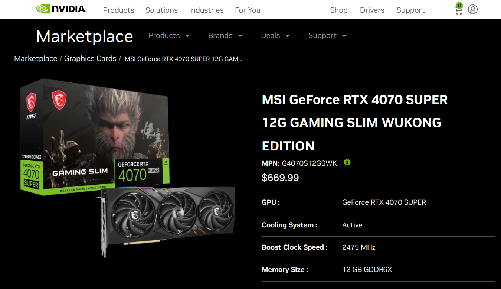

# 认识你的电脑


本章我们将对「电脑」这种神奇的黑箱做一个简要的、整体的介绍。看完这一部分，你将可以找到这些问题的答案：

- 什么是「CPU」？他们说的「i5」「i7」都是什么？「双核」「四核」又是什么？
- 为什么说「内存」和「硬盘」不一样？存储东西的到底是内存还是硬盘？电脑特别卡，到底是内存不够还是硬盘不够？
- 我想玩游戏，选购电脑时应该关注什么方面？
- 什么是「Windows」？那「Windows 10」又是什么？为什么那些用苹果笔记本的同学电脑界面看起来和我不一样？
  


也许你曾经打开或看别人打开过家里台式机的机箱，又也许你曾经拆过或请别人拆过自己笔记本电脑的底壳。在几乎「无所不能」的电脑内部，是各种各样的电子电路和元器件，它们是人类智慧的结晶。这些电子电路和元器件构成了一台电脑的「硬件」部分。而在冷冰冰的硬件之上，「软件」为它们赋予了功能——在今天，我们有各种各样的 app 来进行工作、学习和生活。「硬件」好比你的身体，「软件」如同你的思维，它们共同构成了「电脑」这个有机体。

本章将带领大家认识自己的「电脑」——从构成「电脑」的关键硬件开始，逐一简要地介绍它们的功能，并为大家分析它们对「性能」的影响。然后，我们会介绍在硬件之上的一层层「软件」，讲述它们与硬件的统一和配合，让大家对「电脑」有更加清楚的认识。

## 电脑内部的硬件

这一节我们来介绍一台电脑内部的那些关键硬件。也许你并没有亲眼见过这些芯片和设备长什么样，但通过这一节的介绍，你应该能对它们有一个基本的了解。

### 想象一个场景……

我们假设这样一个场景：老师收了一个班的一摞作业，现在需要批改这些作业。

1. 老师将这一摞作业堆在办公桌的一边，腾出办公桌的中央和另一边。
2. 现在，老师取下这一摞作业中的一小叠，放在办公桌中央，开始伏案批改。
3. 老师批改完了这一小叠作业，然后将它们放在办公桌的另一边，摞成新的一沓。
4. 重复步骤 2 和步骤 3，最终老师完成了全部作业的批改，这时批改完的作业全部在办公桌的另一边。

我们会借助这个例子来更好地理解电脑硬件上的各个结构。

### 处理器 / CPU

中央处理器，简称「处理器」，英文简写「CPU」，是电脑内部最重要的一枚芯片，可以想象成是电脑的「大脑」。在上面的例子中，「老师」就相当于电脑中的处理器：「老师」的作用是对「作业」进行批改，从而完成教学任务；处理器的作用是进行各种的运算，从而实现电脑不同的功能。

你一定注意到过，电脑会发热——热到需要用一个风扇给它降温，这热量中有很大一部分就是处理器发出来的。如果你有关注过时事和新闻，中美贸易战之中关键的一环，正是处理器芯片。下图中，左边是一枚台式机的 CPU，右边是一枚笔记本电脑的 CPU。

处理器是电脑工作的核心芯片，因此，**处理器的性能就很大程度上决定了电脑的性能，决定了我们使用这台电脑流不流畅、玩游戏卡不卡、工作效率高不高**。在今天，全世界电脑芯片基本上是由两家美国公司设计[^1]的，其中一家叫做「英特尔」（Intel），另一家叫做「AMD」。

- 英特尔公司现在主要的 CPU 产品线称作「酷睿」（Core），而「酷睿」系列又分成了多个子系列。
  - 传统的酷睿系列有「i3」「i5」「i7」和「i9」四档产品。对于同一代产品来说，它们的性能依次增强。
  - 在 2024 年初，英特尔推出了一个称为「酷睿 Ultra」的新系列，主要应用在高端笔记本电脑产品上，有「Ultra 3」「Ultra 5」「Ultra 7」和「Ultra 9」四档产品。它们与对应的 i 系列相比，主要是增加了针对 AI 应用的优化。
  - 也是在 2024 年初，英特尔还推出了一组由「酷睿 3」「酷睿 5」「酷睿 7」三个档次组成的新系列，针对笔记本电脑产品进行了能耗方面的优化。
  
  如果你现在在用笔记本电脑，不妨瞄一眼键盘下方是否有这样一个蓝色（也有可能是灰色）的贴纸：

- AMD 公司现在主要的 CPU 产品线称作「锐龙」（Ryzen），而「锐龙」系列也分成了 3 个档次——「R5」「R7」和「R9」[^2]。如果你现在用笔记本电脑，不妨瞄一眼键盘下方是否有这样一个红色的贴纸：

我们常常说一台电脑是「双核」「四核」的，这里的「双核」「四核」也是处理器中的概念。这些处理器在一片芯片放了多个「核心」，相当于一个个协同起来的独立的小处理器。例如，「双核」意味着在一枚处理器芯片上集成了两个核心，相当于两个大脑协同工作，当我们需要用电脑同时做很多事情的时候就有所裨益。同理，「四核」「八核」就是在一个芯片上集成了四个甚至是八个核心。

需要强调的是，**并不是说核心数越多的处理器性能一定越好**，更**不是说 i7 处理器就一定比 i5 更好**，也**不是说英特尔和 AMD 有孰优孰劣之分**。我们应该这样辩证地理解这些概念：每个品牌都会随着时间推移一代代地更新，每一代都有着的不同系列，有的系列高端，有的系列低端；每个系列也都有自己的不同型号，有的型号性能强，有的型号性能弱。CPU 的性能并不与某一个因素呈线性的关系，而是多个因素综合的结果。

### 内存 / RAM

紧接着，我们介绍能直接与处理器交流的部件——内存，英文简写「RAM」。上一小节提到，处理器相当于大脑，但与大脑不同的是，处理器只能**处理**数据，而这些待处理的数据，需要依赖外部的元件来临时存放。内存就是用来临时存放数据的。

内存本质也是一组芯片。生产内存这种芯片和生产处理器那种芯片所用的工艺有一些不同，目前生产内存这种芯片的厂商集中在韩国和中国台湾。一般这些芯片被排在条形的电路板上，这样的整体叫做「内存条」。下图中，上方的内存条是台式电脑使用的，下方的内存条是笔记本电脑使用的。

前文说，内存直接与处理器进行数据交流。与处理器那极快的运算速度相匹配，内存的读取与写入速度也是极快的。但内存有一个特点——**断电即丢失数据**。也就是说，当你电脑关机，内存中的数据便不复存在，又回到白纸一块。这种特性决定着，内存只能用来在电脑工作时临时存储信息。

回到前面老师批改作业的场景。办公桌的中央区域可以理解为「内存」：老师将作业放在办公桌中央批改，是因为这里改起来最方便；处理器将数据放在内存中处理，是因为这里读取和写入速度最快。办公桌中央不能总是放着东西，不然会弄乱、弄丢；内存中的数据一旦断电就会消失，因此总是临时的。

在 21 世纪初技术不是很发达的时候，内存的容量也不是很大，有 512 MB 已经不得了了。但随着科技发展，现如今大容量内存已经司空见惯。要想让现今的普通电脑基本流畅运行，内存容量应当至少有 8 GB。当然这东西倒是多多益善，就像更大的桌子能摆更多东西一样，**更多的内存意味着更多的空间来让处理器存放数据，也就意味着电脑能同时处理更多的任务，基本意味着电脑更加流畅**。据我们的经验，在目前（2024 年），16 GB 的内存对于大多数人都已经够用了；但如果你有大型游戏、三维建模、大型软件开发等需求，选择 32 GB 乃至以上的内存会更加合适。

> 对应到手机中，内存有时会被手机厂商称为「运行内存」，不过我们不推荐如此称呼。原因请参见下面「硬盘」一节。
> 

### 硬盘

内存是用来临时存储数据的，而硬盘则是用来长久保存数据的。与内存相比，硬盘的读写速度要慢得多，但存在硬盘中的数据不会因为断电而轻易消失，因此，硬盘是数据的最初的起点和最终的归宿：处理器在一开始，从硬盘中取出数据放入内存，在内存中处理数据，处理完成之后，再将新的数据放回硬盘。

除了各种各样的「数据」——例如，各种文档、图片、音乐——之外，电脑上各种各样的 app（或者说软件、程序）本身，也是存放在硬盘里面的。相信大家在手机上都有过这样的经验——手机的「存储空间」不够用，除了删掉一些不需要的照片、视频外，卸载不常用的 app 也是一个快捷的办法。这里释放的其实就是硬盘上的空间。

在前面老师批改作业的场景当中，办公桌两侧堆作业的地方可以理解为「硬盘」：大量的作业被堆在那里，整齐摆放，不会弄散、弄丢，但老师总是要把作业取到趁手的地方（办公桌中央）来批改；大量的数据被存在硬盘里，不会因为断电就丢失，但处理器总是要把数据放在快速的地方（内存）来处理。

简单来说，硬盘现在分为两种，一种叫「机械硬盘」（英文简称「HDD」）如下图左侧所示，一种叫「固态硬盘」（英文简称「SSD」）如下图右侧所示。前者容量大、价格低、速度更慢，后者容量小、价格高、速度较快（但远远没有内存那么快）。前者是利用电磁原理存储数据，后者是芯片存储数据，但这种芯片和内存的那种又不一样——内存那种断电数据就消失了，固态硬盘的芯片断电还能保持数据。不过，不管是哪种硬盘，如果硬盘许久不用（不给它通电），那里面的数据也会慢慢消失，固态硬盘大约是 3 至 5 年，而机械硬盘最多 20 年——所以，对于存了东西但没有装入电脑的备用硬盘，要定期拿出来通电运转一下。

在今天（2024 年），标称容量 1 TB 的固态硬盘大约 500 元，机械硬盘大约 300 元；标称容量 2 TB 的固态硬盘大约 800 元，机械硬盘大约 400 元。因此，如今很多电脑会用一块小容量（比如 512 GB）的固态硬盘，搭配一块大容量（比如 1 TB）的机械硬盘来实现各自功能的互补。但也有许多的电脑会选用一整块更大容量（比如 1 TB 甚至 2 TB）的固态硬盘而不再使用机械硬盘。

一块硬盘的空间可以被划分成不同的「盘」（学名叫「分区」）来更好地利用。打开桌面上的【此电脑】，你看到的所谓「C 盘」「D 盘」，就是各个分区。

> 如果你的桌面上没有看到【此电脑】图标，你也可以按下 `Windows` + `E` 组合键来打开资源管理器，然后在左侧的导航栏中找到【此电脑】。
>
> 如果你想在桌面上显示【此电脑】图标，可以参考下面的操作速查卡。



对于 Windows 10 和 Windows 11，若想在桌面上显示【此电脑】，请先打开系统设置，然后选择【个性化】，找到【主题】。

然后，在界面下方找到【桌面图标设置】（Windows 10 可能显示在界面右方），勾选【计算机】（即【此电脑】），再点击【应用】。你也可以把其他几个常用的图标勾选上，比如【用户文件】、【回收站】等。

这样，你的桌面上就会显示那些对应的图标了。



**硬盘对电脑使用体验的影响，主要是「打开软件的速度」，包括「开机的速度」**。这是很容易理解的，因为数据和软件本身原先都是存在硬盘里的，处理器从硬盘里「拿」数据的速度就直接影响着软件启动或者说加载的时间。

> 手机中用类似固态硬盘一样的芯片来存储数据，有些手机厂商称之为「内置存储」「存储内存」等，但它 **完全不是** 内存。这是为什么有人会弄混「内存」和「硬盘」的根源之一。大家常说的「手机内存不够」，指的往往是存储空间（可以称「手机的硬盘」）不够，而不是真正的「内存」不够。
> 

### 显卡 / GPU

对于喜欢玩游戏的同学来说，「显卡」是他们在选购电脑时会着重考虑的一个因素。

以前，「显卡」就是电脑里面的一个独立的模块，像一张「卡」一样插接在主板上。这个模块的功能是专门进行画面的绘制和图像的处理，因而得名「显卡」。所有显示在屏幕上的画面，都是由显卡「绘制」的。因而，**显卡的性能主要是对游戏以及一些图形相关的工作（比如三维制图、视频编辑）有较大影响**。下图展示了一块老旧的电脑显卡，其中 ➊ 是用于连接显示器的端口，➋ 处则是与电脑主板连接的触点。➌ 为这块显卡的散热风扇，而在其下方压着的，就是显卡的核心芯片（➍）。

为什么上面那段要加上「以前」两个字呢？因为随着半导体技术的发展，人们后来发现，显卡可以被「集成」到处理器[^3]中，换言之，就像多核处理器把几个核心放在一个芯片上一样，显卡芯片也可以和处理器放在一个芯片上。容易想到，这样集成到一起之后，显卡就不能做得很大了（受限于芯片整体的大小），也不能做得性能很强了（因为处理器核就在它边上，大家一起发热，一起分享能量），但可以缩小硬件的体积，也能降低功耗。因而，发展到今天，显卡在电脑中的形态有了以下两种：

- **集成显卡**，英特尔称「核芯显卡」，AMD 则将集成显卡和处理器一同称为「APU」。显卡被安排在处理器的同一片芯片上，性能相对较差，能应付大多数工作，但游戏、制图等特定工作就不太行了。集成显卡功耗很低，而且省去了用户单独购买显卡的麻烦。
- **独立显卡**，简称「独显」。显卡芯片仍然是一片独立的芯片，以一个独立模块的形式安装在主板上。这样的显卡性能比较强，但换来的是更高的功耗、更大的体积和更多的发热等。

> 事实上，追根溯源而言，「GPU」一词本来指的是「图形处理器」（Graphic Processing Unit），也就是显卡上那一块核心芯片，又称「显示核心」。不过，追究这些实在是有点古板学究气了，毕竟在大多数时候，「GPU」就是「显卡」的代名词。

今天，全世界生产**独立显卡**的厂商主要有两家，一家叫「英伟达」（NVIDIA），它生产的显卡俗称「N 卡」；另一家是前文提到过造处理器的「AMD」，它生产的显卡俗称「A 卡」。如果你有涉足过游戏交流圈，玩家所说的「RTX 4090」「GTX 1080 Ti」等都是英伟达显卡的型号，而「RX 6800 XT」「RX 580」等都是 AMD 显卡的型号。下图是英伟达网站上出售的 ~~《黑神话·悟空》联名款的~~ RTX 4070 Super 高端显卡，可以看到显卡上有三个大尺寸的散热风扇，这从侧面说明其功耗之大、发热之多。

> 是不是有人会问，那生产**集成显卡**的厂商有哪些呢？这个问题这里不回答，因为这不构成一个问题。
>

一般来说，对于笔记本，轻薄本大都没有独立显卡而是使用集成显卡，游戏本大都装配有独立显卡。显然，这是由它们的使用场景和目标人群不同所决定的。

我们可以把显卡的任务理解成「根据 CPU 的命令，画出图形并输出到显示器上」。为了完成这个任务，显卡拥有属于自己的「内存」，称为「显存」。GPU 使用显存空间来暂时存放它正在「绘制」的画面，同时还要存放大量与图形有关的其他内容，比如要绘出的场景内部各部分之间的受力关系，以及材质、光学方面的特性等等。这使得显存的大小成为了决定（独立）显卡性能和价格的一个重要因素。目前，高端显卡拥有 10 GB 甚至 20 GB 以上的显存，这使得它们得以从容应对各种复杂的游戏画面。而至于集成显卡，它们则需要从电脑内存中「借」一部分空间充当显存，因此更难以应付大量的图形工作。

值得注意的是，近些年来，随着人工智能（AI）技术的发展，显卡的功能已经不再局限于「打游戏」「制图」等图形工作上了——在 AI 模型的训练和推理过程中，显卡的并行计算能力能提供比处理器更好的性能，同时独立显卡的显存还能提供比电脑内存更快的访问速度。如果你了解过 AI 绘画或 AI 作曲等技术，在它们的说明文档中，你一定会看到对显卡的需求。若你对这方面有兴趣，那么显卡的性能，尤其是显存的大小，就成了你选购电脑时的重要考虑因素。

> 想了解和 AI 有关的更多知识？没问题！请看超越篇的 [从加减乘除到 AI 对话]()。
>

## 与我们「打交道」的软件

### 软件与操作系统

下面我们简单介绍「软件」和「操作系统」的概念。

由处理器、内存、硬盘以及各种各样的外围电子元件，共同构成了一台电脑的「硬件」部分。「硬件」就是电脑中电子电路的部分。而在「硬件」之上，硬件的具体工作任务是由「软件」来决定的。

我们用大家更熟悉的手机来做一个解释。**手机上，你自己安装的「QQ」「微信」「网易云音乐」，以及手机预置的「电话」「短信」等 app 都属于「软件」**。「QQ」「微信」指导硬件去利用网络收发信息，利用屏幕展示数据，「网易云音乐」指导硬件去播放声音，同时在屏幕上展示评论，「电话」「短信」指导硬件利用无线电模块发送和接收信号……同样一部手机，硬件还是那个硬件，但能通过不同的软件行使不同的具体功能。

而在「QQ」「微信」「电话」等 app 之下，在纯粹的硬件之上，有**一个更大，而且更「底层」的大软件，这个软件叫「操作系统」**。简单地说，操作系统「夹」在各个 app 和硬件之间，为 app 具体行使功能提供了一系列方便的「接口」。有了操作系统，网易云音乐的开发者不再需要真正地去学习「怎么让喇叭发声」，而只需要学习「怎么告诉操作系统让喇叭发声」。「让喇叭发声」是一个带一些物理复杂知识的过程，但「告诉操作系统让喇叭发声」则相对简单得多。

由于上层的软件（也就是 app）需要依赖操作系统来实现功能，而每个操作系统留给 app 的接口细节上也有所不同，因此，针对不同操作系统开发的软件是**不能直接**通用的。App 厂商一般会为不同的操作系统开发同一款 app，这样就能照顾到使用不同系统的用户。

今天主流的手机操作系统有「安卓」（Android）、「iOS」以及国产的「鸿蒙」（Harmony OS）。Android 系统被各个手机厂商广泛使用，而 iOS 只能用在 Apple 的设备上，鸿蒙目前则只用在华为的设备上。

而到了电脑上，「Windows」「Linux」及「macOS」是最常见的三种操作系统。Windows 最为常见，几乎所有的个人电脑都运行着 Windows 系统；Linux 则是一种开源的操作系统，主要在服务器上使用，一些专业人士也会在日常使用；macOS 则是苹果公司的操作系统，只能用在苹果的设备上。下图从左到右分别是 Windows 11、Linux（使用 KDE Plasma 桌面环境）和 macOS Monterey 的桌面界面。

### Windows 操作系统

我们绝大多数人都在使用 Windows 操作系统，《你缺计课》亦是一套基于 Windows 的电脑教程。所谓「Windows XP」「Windows 7」和「Windows 10」则是 Windows 操作系统的不同版本。

Windows 由美国的微软公司（Microsoft）所开发，诞生于 1985 年。到今天（2024 年），Windows 已经经历了数个大版本的更新[^4]。Windows 可以运行在搭载英特尔或者 AMD 处理器的电脑上——事实上，今天除了苹果以外几乎所有品牌的个人电脑都运行着 Windows 系统。

目前最新的 Windows 版本是「Windows 11」（发布于 2021 年 10 月 5 日），它与「Windows 10」一同占领了大部分电脑。在有些地方，一些稍旧的计算机运行着「Windows 7」。更老的 Windows 版本，例如「Windows XP」，除去一些特定的老旧设备需要它们，日常已经鲜有使用。不同版本 Windows 系统之间会有操作细节、使用体验上的不同，不过往往最直观的不同是它们的「外观」。

通过右键桌面上的【此电脑】并点选【属性】，或打开系统设置，选择【系统】→【系统信息】（Windows 10 则是【关于】），你可以看到自己电脑 Windows 系统的版本。

本教程假定读者使用的系统是 Windows 10 或者 Windows 11，其中所有的操作都是基于 Windows 10 或者 Windows 11 简体中文版系统来描述的。如果你使用的是 Windows 7、Windows 8 或者 Windows 8.1，其中大多数操作也都能正常使用。一些明确仅能用于 Windows 10 和 / 或 Windows 11 的操作和技巧一般会特别标注。

## 练习

1. 在之前打开的【此电脑】→【属性】，你除了能看到自己电脑的 Windows 版本之外，也能找到自己电脑的处理器型号和内存容量信息。尝试去查找这个信息，并自行上网搜索你的处理器型号，辨认它的品牌、系列，判断它是几核处理器，「主频」有多高。（「主频」是描述 CPU 性能的一个指标。）
2. 你使用的是游戏本还是轻薄本？亦或是介于二者之间的所谓「全能本」？尝试翻到笔记本的底面，上网搜索它底面所写的型号，了解关于你自己机器的更多信息。
3. 在 Windows 10 / 11 中，打开「任务管理器」，切换到【性能】选项卡，可以看到一个更详细的硬件运行状态，其中【磁盘】相关栏目展示了你设备的硬盘数量和类型（机械硬盘 HDD、固态硬盘 SSD）。尝试查看你电脑的硬盘容量和类型。

    
    
你可以通过按 `Ctrl` + `Shift` + `Esc` 来打开「任务管理器」。也可以右击【开始按钮】，选择【任务管理器】来打开它。

    
    
    
    
1. 你对「电路」的认知有多少？你是否好奇 CPU 是怎么运作的？从开关、导线、电池、灯泡组成的最简单「电路」到几乎无所不能「电脑」之间到底发生了什么奇妙的变化？在本作品超越篇的 「程序」是怎样炼成的 一章中，我们会简要向你进一步介绍这些问题。但限于《你缺计课》篇幅，我们是没法告诉你这些的。但是，你若有兴趣，可以去学习「电路电子技术」「计算机体系结构」「计算光刻」「纳米测量技术」等相关内容。近年来，国际形势风云变幻，我国在芯片领域仍然存在许多短板。我们希望越来越多的有志青年能投身于包括但不限于体系结构、硬件组成、数字电路乃至微电子、集成电路制造、半导体材料等领域，为我国芯片行业「补上短板」贡献自己的力量。

[^1]: 事实上，芯片的「设计」和「制造」两件事是不一样的，就像能设计出房屋的建筑师不一定会到工地上去砌墙。英特尔能够自行完成从设计到制造整条流水线，而 AMD 只能完成设计，它的处理器是由专门负责制造芯片的厂商（例如台积电）生产的。
[^2]: 其实还有 R3，但是很少在消费市场见到。
[^3]: 一开始，集成显卡并不是集成到处理器中的，而是集成在主板上的一个芯片之中（称为「北桥」），后来才集成到了处理器里面。
[^4]: 关于 Windows 的一点点更新历史，可以参见[蓝屏与解决蓝屏]()一章。