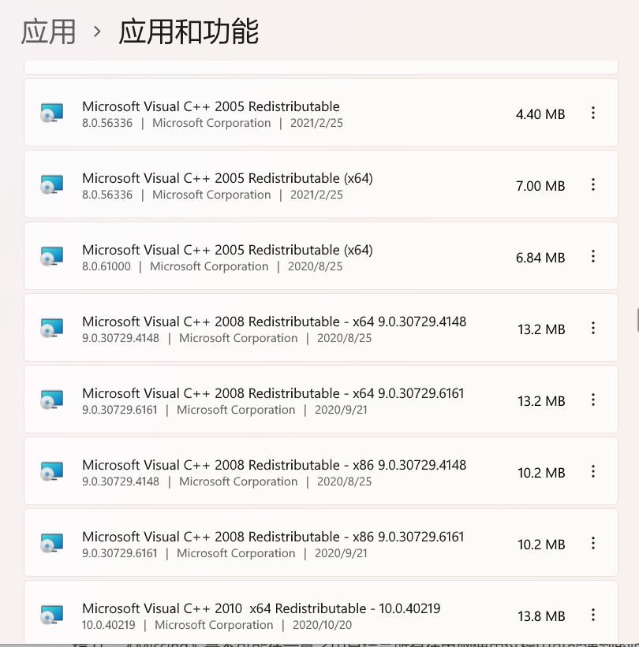
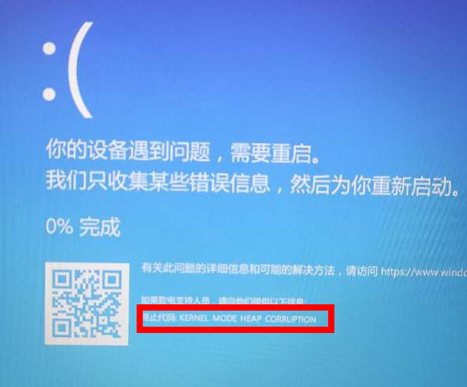

# 遇到问题怎么办


在日常使用电脑的过程中，我们会遇到各种各样的问题。这里的「问题」，指的是电脑并没有按照我们的想法工作，有时还伴随着意料之外的提示语句。学会借助互联网等工具解决问题，是帮助我们更好地使用电脑的重要一环。看完这一部分，你将能找到下面这些问题的答案：

- 问题是怎么产生的？
- 遇到问题想找别人帮助，怎么样有效地向别人提问？
- 找不到人提问，怎样有效地上网查找解决方案？



软件的 bug、运行环境和方式不对、操作的不当等都会导致「问题」，都可能让我们无法正常地使用软件来完成我们的需求。在这一部分，我们介绍「问题」和「提问」。

## 为什么会遇到问题

所谓遇到问题，就是指软件（包括 Windows 系统本身和系统之上的 app）没有按我们所设想的方式工作——例如，打不开、闪退、功能不正常、特定功能无法使用、电脑蓝屏等。遇到问题的原因是十分多样的，大体来说，可以分成以下三种：

### 软件自己的问题

不是我们的问题，而是「软件的问题」，也就是所谓的 bug。具体来说，由于软件设计者考虑不周全，而这些考虑不周全的地方被我们给碰上了，从而产生未定义的行为，造成各种问题。

在 [文件与文件管理]() 中我们介绍「更改用户文件夹的位置」时，我们特别强调了「千万不要把一个用户文件夹的路径设置成某个盘的根目录」。如果不小心你这么做了，会变得非常难改回去，并且会造成一系列奇怪的后果。这某种程度上就是 Windows 系统的问题——Windows 系统在设计的时候没有考虑到这种特殊情况，但这种情况被我们误打误撞给触发了，从而造成了一系列不可预知的结果。

### 运行环境的问题

这种情况下，软件没有问题，我们也没有问题，问题出在「在不合适的环境里运行」。例如，某个软件 A 可能需要系统版本至少是 B 但不能太新（不能高过 C），而且需要电脑上安装了 D 和 E。一旦这一串条件中有一个不满足，软件 A 可能就不能正常工作。

特别地，在电脑中存在一种特殊的软件，我们称它为「运行库」。这种软件自身并没有任何实际功能，但许多别的软件需要依赖「运行库」的辅助才能工作。如果电脑缺少运行库，很多软件就不能正常打开，而会在运行时报错。

运行库是一种「你平常感知不到，但它们非常重要」的存在。不妨现在查看一下你电脑的应用列表（方法请参见 [基本维护和安全防护]() 一章），你或许能找到名为「Microsoft Visual C++」的一个或一群软件：

这就是「Visual C++」运行库（有时简称「VC++」或「VC」）。你也许会纳闷自己从来没有手动安装过它们，这是因为它们可能是在一些其他软件安装时被「顺带」安装上的。

在本章的练习中，有一题的错误产生的原因就是缺少某个运行库。

### 操作不当

这种情况下，软件没有问题，而我们操作不当。例如，我们在进行软件设置的时候遗漏了某些关键的步骤，从而造成了问题的产生。

问题本身是多样的，产生问题的原因是复杂的，解决问题的方法也是不唯一的。受限于篇幅和我们的精力，本教程是不可能在一章之中总结完所有在电脑使用过程中可能遇到的问题的。相反的，我们在这一章介绍「提问」的方法——在今天的互联网时代，我们应当动用自己的人脉和互联网，充分利用这些资源来帮助我们解决问题。而「提问」正是我们利用这些资源的手段。

## 向他人提问的艺术

如果我们决定就自己遇到的问题向他人提问，如何提问就成了一个值得思考的问题。「提问」至少要让对方知道下面几件事：

- 「我」遇到了什么？
- 「我」是如何让这种状况产生的？
- 「我」想要什么？

具体地：

- **反映现场**。例如，通过截屏截取问题对应的提示。如果不能截屏（例如蓝屏或死机），就使用手机拍屏幕上的提示。截屏应该范围足够大且足够清晰，这样对方才能一次性从一张图上获取尽量多的信息——问题发生时你在做什么、软件在做什么、系统是什么情况……等。
- **复现操作**。复述问题产生的过程——「我」在哪几个操作之后导致这样的问题产生。问题是突然产生的，还是在「我」操作之后立即产生的？在问题发生之前的一段时间有没有什么值得注意的现象？「我」在问题发生之前干了什么？
- **表达需求**。表达自己的需求——「我」使用这个软件是要干什么？考虑到有些问题是软件的 bug 造成而并非我们自身的问题，通过告知被提问者我们的目的，对方可以针对性地给我们提出建议——是去解决这个问题，还是仅仅不予理会。毕竟很多问题并不阻碍我们工作。

当然，在请求他人帮助时应该遵循基本的社交礼仪。这些东西我们不再赘述。

## 上网查找问题的解决方案

在生活中，我们自己上网搜索答案的情况远远多于向他人提问的情况。因而，掌握如何有效地上网查找问题的解决方案，比上文讲述的提问技巧或许更加实用。

搜索引擎与提问不同，我们不能直接在百度搜索框中粘贴图片，也不能在搜索框写太多东西。使用搜索引擎查找答案，我们需要使用「关键词」代替成段的语句来表征自己遇到的问题。对于我们常常见到的软件出错，一般都会有一个「错误代码」以及相应的错误文本。这个 **错误代码和错误文本就是最最重要的关键词之一**。它可能是这样（`KERNEL_MODE_HEAP_CORRUPTION`，关于蓝屏的处理详见 [蓝屏与解决蓝屏]()）：

可能是这样（`0x80070490`）：

也可能是这样（`126 - 找不到指定的模块`）：

**另一个重要的关键词是发生问题的软件**。仅凭一个错误代码，你可能会找到有同一个错误代码的来自不同软件的不同问题。因此，搜索时我们务必要带上「什么软件发生的这个错误」。对于蓝屏错误，软件就是「Windows 10」之类的具体版本；对于其他软件错误，尽量用简短的语句表示具体的软件，比如「CAD 2022」「Word 2019」等。

一般来说，通过上面两个关键词一起搜索，我们已经能够通过搜索引擎定位到问题和相对应的答案了。例如：

在这些教程类的文章中细细寻找，一般我们都可以解决遇到的问题。但在多如牛毛的搜索结果中筛选我们所需要的东西，也并非一件很容易的事情。一般来说，在搜索结果的时候我们可以注意下面几个方面：

- **关注「更新时间」。** 很多网站都会显示一篇文章是于什么时候发布的。当我们搜索解决问题的教程的时候，遵循「越新越好」的原则。例如，对于同样一类错误，一篇 2016 年的文章和一篇 2021 年的文章都给出了解决方法，那我们就优先选择 2021 年的那篇文章。
- **警惕洗稿文。** 一些网站上广泛存在大量洗稿、抄袭而来的教程文章。这些文章最大的问题是东拼西凑，内容不完整，有些还混有不少机翻的内容。在寻找教程的时候，尽量不要选择这样的文章。

## ……或者问问 AI？

近几年，生成式 AI 大行其道，它为我们提供类似与人谈话一般的体验，而不少人也将其作为自己的「得力助手」，无论是遇到了问题，还是想寻找灵感，又或是不想自己动手，都可以请 AI 助手来「帮忙」。久而久之，许多人面对问题的第一想法渐渐变成了「问问 AI 吧」。

但是，普通用户可能有所不知，虽然这「AI 助手」看起来手眼通天，无所不晓，可它的背后，是由人们日常产生的超大量语料作为原料而训练出的「大语言模型」。大语言模型工作的本质是「预测」，以我们对它说的话作为输入，根据训练结果，来预测给出什么样回答的几率是最高的。欲了解更多关于生成式 AI 的话题，可以读一读超越篇的 [从加减乘除到 AI 对话]()。

所以，**记住「它只是一个语言模型」**，再来看看我们能向它求助哪些问题。

### 问问题

「问问题」是指「询问一些存在具体答案的问题」，譬如生活常识、数学题等等。例如我们问：「2 + 3 = ？」根据语料，大模型预测人们给出类似「2 + 3 = 5」的回答的几率最大，所以它也会给出这样类似的回答。

所以说，**如果你问出来的是人们早已找到准确答案的问题，AI 会有更多的可能预测出包含正确答案的语句**，因为答案已经包含在训练用的语料库中。但如果我们问奇葩点的问题呢？

此时我们就要对它给出的结果持怀疑态度了。用一些专门计算圆周率的软件算一算，你会发现，圆周率的第 1 919 810 位小数是 9。所以，**稍微复杂或刁钻一些的问题，它很可能给出错误的答案**。这也再一次向我们揭示「它是一个语言模型」的本质，它做的只是预测，而非真正在思考、计算。

### 找方法

「找方法」则是说「寻求达到一个目的的途径」，譬如「怎么学一门语言」「如何解决软件出现的错误」这样的疑问，而模型的回复往往是达成这些事的一些方法。如果说「问问题」得到的解答，我们限于自己的知识水平无法轻易验证，那么**这里得到的方法，则「试试便知」**。当然了，**AI 给出的方法不一定有效**，如果你发现真的没用，不妨去咨询目标领域内的专业人士寻求帮助。

### 搜集信息

另一种「问 AI」的情形，是获取一些信息，例如「地球上人口最多的前十个国家」「嫦娥五号的任务持续时间」等等这样的信息。但是，由于 AI 训练时的语料所限，它能给我们提供的信息只到训练时语料所涵盖的时间为止。所以问它时事新闻，它很可能会给出与事实大相径庭的回复。

而为了解决这个问题，目前公开给大众使用的 AI 对话工具，基本上联动了搜索引擎。**当检测到用户要求的输入可能是时事新闻时，对话工具会自动调用搜索引擎搜索相关关键词**，并由模型整理结果，给出输出。如果你询问的 AI 对话工具没有，或者不确定有没有，联动搜索引擎，那最好还是手动搜索求证为好。

## 练习

1. 如果你准备使用「Premiere」软件制作一个视频，但在导出时弹出了下面的窗口，你应该用什么样的搜索语句上网检索？
    
    
    
2. 如果你准备打开一个小工具程序时，弹出了这样的窗口，你应该怎么办？
    
    
    
3. 如果你准备打开一个应用时，弹出了这样的窗口，你应该怎么办？
    
    