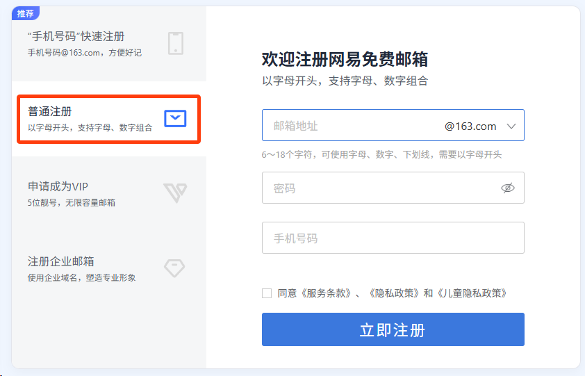
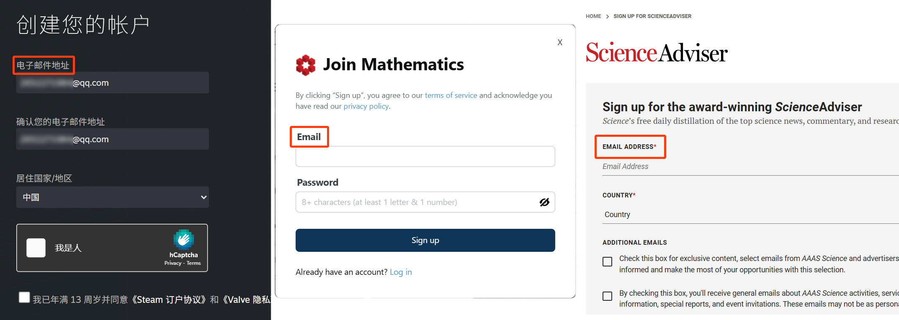

# 电子邮件与即时通信


互联网将地球上的每个角落连接在了一起，而这种连接在人们身上最直观的表现，或许就是让相隔千里的人得以互通有无。从最早期的「电子邮件」，到今天以微信、QQ、飞书为代表的「即时通信」，互联网的发展，反映在了通信技术的演进之中。看完这一章，你将能找到这些问题的答案：

- 什么是电子邮件？为什么今天还在用电子邮件？
- 如何注册电子邮箱？如何使用它？教育邮箱又是什么？
- 什么是「即时通信软件」？QQ、微信这些软件都有什么特点？
- 在中国，人们一般用 QQ 和微信聊天，那外国人一般用什么呢？


上一章里，我们已经了解了如何借助浏览器遨游于网络世界，浏览万千色彩、琳琅满目的信息。这一章，我们来考虑一点不一样的事情——在网上与他人通信交流。当下，我们常听到的通信方式，无外乎「发邮件」与「发消息」两种，分别对应「**电子邮件**」（email）技术和诸如 QQ、微信那样的「**即时通信**」（instant messaging，简称 IM）软件。两者一同，构成了「现代版天涯若比邻」。

## 天涯真正若比邻

早在唐朝，诗人王勃感叹道：「海内存知己，天涯若比邻。」只要四海之内有与我交心的知己，哪怕远在天涯海角都像邻居一样。但这样的感叹终究只是送别密友之后的感伤而已，要是真的与远在天涯的知己交流，按照古代的寄信速度，十天半个月能送到对方手里已经很快很快了。一直以来，「天涯若比邻」都是人们对通信速度的美好幻想。直到第二次工业革命之后，高效的通信技术诞生，才让它一步步走向了现实。

1839 年，美国和英国分别架起了北美洲和欧洲的第一条电报线路，人们得以突破古时的信件邮递模式。电报很快，一天之内，消息就能通过埋设的电缆传递到对方所在的电报站，并送达收报人手中；但电报很贵，由于发信能力有限，发电报都按字或按词收费。1957 年，美国的电报收费 10 美分/词，而当时一张邮票只要 3 美分。1958 年，我国的电报收费约为每字三分，按照当时的物价水平，三四个字的电报资费就相当于一斤大米的钱[^1958rmbprice]。另一方面，电报仍然不算「实时」，要收发电报，人们需要前往邮局或电报局，这显然距离「天涯若比邻」还有着相当的距离。

[^1958rmbprice]: 按一斤大米卖一角钱计算。当然，在那个年代，买大米还得要 [粮票](https://baike.baidu.com/item/%E7%B2%AE%E7%A5%A8/108072)。

相较于电报的纯文字通信，电话的普及则让人们的通信体验迈上了一个新台阶——即便远隔千里，只要一个电话拨过去，就能与对方谈天说地。而 20 世纪末互联网的兴起，让「人人互联」从理论上成为了可能；智能手机的普及，则为这美好愿景补齐了最后的拼图。从邮政的信件服务获取到灵感，人们在网络上架设了电子邮件服务，为大众提供「电子邮箱」来收发电子邮件。这电子邮件，不仅能传递文字，还可以在其中附赠电脑上的任何文件。而各种各样的即时通信工具——又称为「聊天软件」，比如 QQ、微信——让天涯「真正若比邻」。今天，在一部小小的手机上，人们可以随时随地将各种各样的信息，瞬间发送给地球另一端的好友。

> 再往后，人们正在拥抱「万物互联」的时代。这个时代里，互联网将升级为「物联网」，连接目光所及的所有物品，进一步延展网络的边界。欲了解更多有关「万物互联」的话题，不妨前往超越篇的 [云上世界，万物互联]()。

在今天，我们已经离不开电子邮件和即时通信工具。前者相对正式，通常在各种严肃的场合使用——例如，传递重要文件、发送通知、提交申请。而后者则完全融入了我们的生活中，成为了日常生活的一部分。下面，就让我们简要地介绍这两种通信技术，了解它们的历史，并亲自上手操作。

## 电子邮件

### 依托网络的「邮递服务」

既然「电子邮件」仍冠以「邮件」之名，那想必它与现实生活中的邮件与信件有相似的工作过程，不妨先来看看现实中的邮件寄送过程。假定现在 Hans 要寄一封信给 Windy，那么在 Hans 决定写信到 Windy 收到信件之间，一共会经历这么几个环节：

1. Hans 在纸上写好信，找出一个信封，贴上邮票，写上收信人、收信地址、邮编，然后把信放进去封好；
2. Hans 把信投递到附近的邮筒或直接送到当地邮局；
3. 邮局根据信封上的邮编与收信地址，将信封放到邮递系统中发往目的地的车辆上；
4. 信封送到目的地的邮局，邮局安排邮递员联系 Windy，将信送到 Windy 手中。

整个过程就像下图这样，而我们今天网购送货的快递系统也是在邮递系统上发展而来的，只是相比信件而言，送的东西更多样化了。有了这样高效的邮递系统，把信送往全国大部分地区的人手里都只需要不过数天的时间。

> 事实上，邮递过程的第 3 步中，邮件会经历「先集中再发出」的过程——邮局会先将一个小地区的邮件集中到一个「集散地」，再根据地址与时效要求分配运输工具，发往不同目的地附近的集散地，再送到目的小地区内的对应邮局。

从上面的邮递过程我们可以看到，除了需要强大的邮递系统以外，一封信想要准确无误地送到收信人手中，离不开准确无误地填写收信人信息（名字与收信地址）。在电子邮件的世界中，收信人信息就是收信人的「**电子邮箱地址**」，或简称「**邮箱地址**」。

1971 年，互联网的鼻祖——阿帕网（APARNET，全称是「美国高级计划研究局网络」）中，诞生了一套在电脑与电脑之间传送信息的系统，这就是最早的电子邮件系统。当时的电脑，仍处于「多用户时代」[^Multiusers]，一台电脑可能被许多人共用。为了区分送到一台电脑上不同用户的邮件，阿帕网邮件系统在收信人信息中使用了 `@` 符号。例如，你想发邮件给使用名叫「MISSING」电脑的 Windy，就往 `Windy@MISSING` 发邮件即可。

[^Multiusers]: 关于「多用户」的一点内容，可以前往 [用户与微软账号]() 了解。

这种表示方法一直沿用到了如今基于互联网的电子邮件系统的电子邮箱名字上。今天的电子邮箱名字则由三个部分组成：

- 一个用户名，通常可以由收件人自己设置，比如 `hans`；
- 一个 `@` 符号，读作「at」，意思是「在」；
- 收件人所在的邮件服务商的域名，比如 `163.com`。

例如，Hans 在网易 163 邮箱（域名是 `163.com`）上注册的电子邮箱地址就可以是 `hans@163.com`[^MailExample]；而 Windy 在 Tom 邮箱（域名是 `tom.com`，不过该平台已停运免费邮箱服务）注册的邮箱地址就可以是 `windy@tom.com`[^MailExample]。《你缺计课》则在自己的网站上搭建了自己的邮件服务，并使用邮箱地址 `missing@criwits.top` 来接收读者的反馈邮件。

全世界有无数正在运营的电子邮件服务商，每个服务商都有自己的用户，它们之间使用「互联网电子邮件协议」来传输用户的邮件。以上面的邮箱地址为例，假定 Hans（`hans@163.com`） 要给 Windy 发邮件，他知道 Windy 的邮箱是 `windy@tom.com`，于是他写好邮件后，在收件地址上写上 Windy 的邮箱名字，点击「发送」。这封邮件就走上了这样的路途：

1. 网易 163 邮箱将 Hans 写好的邮件装入「电子信封」，填写好发送时间、邮件大小、收件人、收件服务器等信息；
2. 163 邮箱的服务器 `163.com` 使用一种邮件协议，将封好的电子邮件发送给 Tom 邮箱的服务器 `tom.com`；
3. Tom 邮箱的服务器 `tom.com` 将信封拆开，取出邮件本体，并提示 Windy「收到新邮件」。

[^MailExample]: 你是不是想给这里展示的邮箱发邮件呀？可惜这些邮箱都是编出来的例子。

> 实际的发信过程要比以上流程复杂一些，但限于篇幅与定位，在此不过多介绍。

这个过程如下图所示，看起来与之前展示的「送信」过程大同小异，这或许就是为什么电子邮件要叫「电子邮件」吧。

### 初试电子邮箱

了解了电子邮件的工作方式，你是否也希望拥有自己的电子邮箱呢？我们以 QQ 邮箱为例，来看看电子邮件怎么用吧。打开 QQ 邮箱的官网（[https://mail.qq.com](https://mail.qq.com/)），在右侧，你可以登录你的 QQ 账号。默认情况下，当你注册 QQ 账号时，就会自动获得一个格式为 `<QQ 号>@qq.com` 的电子邮箱地址。

登录之后，你就进入了你 QQ 邮箱的收件箱，这里放着你收到的所有正常邮件。在左侧，除了一个大大的【写信】按钮之外，其下方也列出了你邮箱中的一系列文件夹，这些文件夹在大部分邮件服务中都有：

- 收件箱：存放你收到的大部分邮件；
- 星标邮件：如果有一些邮件特别重要，你可以给它标个星星，之后它会被放到这里面；
- 已发送：存放你发出去的所有邮件；
- 草稿箱：存放你还没发出去的，或者写了一半的邮件草稿；
- 已删除：存放你删掉的邮件，相当于电脑中的「回收站」，不过它会自动清理；
- 垃圾箱：存放被邮件服务商看作广告、恶意内容的邮件，但有时一些正常邮件会被误放到这里，需要你手动把它们捡出来。

现在，我们来看看怎么发邮件。点击左上角大大的【写信】按钮，你就进入了写邮件的界面。就如前文所讲，发邮件，必须得有收件人的电子邮箱。所以，写信的第一步，就是在【收件人】一栏里，填上你所要送信的对象的电子邮箱地址。

写上收件人的邮箱地址后——其实剩下的完全不写也能发出去，点击上方的【发送】按钮即可。但是，谁会这么闲着没事发一封什么也没有的邮件出去呢？人们写邮件更多是为了「怀揣自己的想法与他人交流」，因此内容才是邮件的核心所在。

> 如果暂时找不到送信对象，可以给《你缺计课》的邮箱（[missing@criwits.top](mailto:missing@criwits.top)）发送邮件，说说你的感想、心得，或者向我们提出建议！

一封邮件的内容分两部分：主题与正文。主题是你邮件内容的概括，短小精悍、一语中的；正文就是你邮件的真正内容。虽然理论上你可以随心所欲地书写邮件，但正如现实中的书信一样，不同场合的邮件有着各自的规矩。在较正式的场合，你在学校中学到的书信格式就可以在邮件中用到。

> 一般来说，用到电子邮件的大部分场合都相对正式、严肃，所以学会使用类似正式书信的格式来写邮件也是必备技能。你可以在写邮件时，去网上搜索「给<收件对象>发邮件的格式」来寻找参考。

相比纸质书信，电子邮件既可以给文字加样式，又可以插入图片，还可以附上附件。正文上方的工具栏中有各种按钮，可以操作正文内容的颜色、对齐、底色等等样式，你可以自己玩一玩，看看都能做出什么效果。再上方的【图片】按钮，点一下就能在正文中插入你电脑上的图片，让你的邮件变得图文并茂。而在【发送】按钮附近，你可以找到【附件】按钮，点击它，你就可以在邮件后附上你电脑上的任何文件，这些文件将随着邮件一起发送给收件人，这不失为一种发送文件的方法呢。

> 许多邮件服务商会将附件分成「普通附件」与「超大附件」，在【附件】旁边就能看到【超大附件】的按钮。一般 50 MB 以上的文件，我们推荐使用「超大附件」方式发送。邮件服务商分配给你的空间是有限的，普通附件会永久留在收件箱中，占据着一部分空间；而超大附件则会在一定时间后自动删除，就不怕你的空间一下被消耗完了。

那么，万事俱备，只待发送。点一下【发送】，看到「邮件已发送」的提示之后，你就成功发出去了你的第一封邮件，真是可喜可贺啊。

回到收件箱，既然有时你会收到他人的邮件，那想要回复对方，是不是也要像上面写邮件一样，点【写信】、填收件人邮箱……这一套走下来呢？答案是不必。点开你收到的邮件，滚动到邮件的末尾，在收到的邮件的正文后方，有一个「快速回复框」，点一下它，它就会变成一个「精简版写信界面」，你可以直接在这里输入正文，点击左下方的【发送】，就能快速回复收到的这一封邮件了。或者你也可以点击「精简版写信界面」右上角的【切换完整写信】，这样界面就会变成刚刚我们看到的写新邮件的样子，但与写新邮件不同的是，收件人、主题都自动帮你填好了，你只需要写下正文再发出即可。

> 你可能注意到了，在「快速回复框」旁边有一个【回复全部】的按钮。这二者的区别在于，一封邮件可以有多个收件人，「回复」只会回复邮件给发给你邮件的人，而「回复全部」就是给这所有相关人员（除了你自己）都发一封回复邮件。

在其他一些邮箱服务商的网页上，回复功能可能是一个按钮，而不是「快速回复框」，不过功能仍然大同小异。

如果你认真读到了这里，那么恭喜，你已经学会了电子邮箱的主要功能——收、发、回邮件了！

### 拥有更多电子邮箱

之前我们说到，QQ 邮箱名字是与你的 QQ 号绑定的，所以，如果我们想拥有自定义的邮箱名，就得转向其他邮件服务商了。常用的邮件服务，除了 QQ 邮箱，还有网易出品的 [163 邮箱](https://mail.163.com)、[126 邮箱](https://mail.126.com)，微软的 [Outlook](https://outlook.live.com) 等等。不妨以 163 邮箱为例，来看看如何注册一个邮箱。

用浏览器打开 163 邮箱的官网（mail.163.com），看起来和 QQ 邮箱的官网形式大同小异，在右侧的登录框下方，你可以找到【注册新账号】的按钮，点一下它。

随后，我们就来到了注册页面。点击左侧的【普通注册】，右侧就会切换到自定义邮箱名字的注册模式。邮箱名字支持数字、字母与下划线的组合，但必须以字母开头，不能太短，也不能太长。例如 `missing` 和 `windy_d` 都是可以用的名称，当然你也可以选择你喜欢的名字。

接着填上剩下的必要信息，点击【立即注册】，按照后续的流程一步步来，你就可以获得一个自定义名称的 163 邮箱了。

> 其实 QQ 邮箱提供了自定义名称的功能，但不是直接更改你的邮箱名字，而是给你的 QQ 邮箱取「别名」。如下图所示，QQ 邮箱提供了英文别名和域名是 `foxmail.com` 的别名，你可以在邮箱设置中自行设置。设置完之后，你的邮箱就有了更多名字，其他人向这几个邮箱地址发邮件你都可以收到。
> 
> 

其他的免费邮件服务的注册流程都与上述流程大同小异，你可以上网搜索更多资料，选择你喜欢的邮件服务商注册自己的电子邮箱。虽然理论上你可以注册一大堆不同的电子邮箱，但是邮箱太多可能反而不好管理，宁缺毋滥。

### 网络世界中的「通行证」

很多人觉得邮箱是一个老掉牙的玩意，「都 21 世纪了，谁还用电子邮件啊」。但其实不然，电子邮件在全球范围内仍然有广泛的使用场景。最常见的就是作为各种地方的账号使用，此时，我们的电子邮箱就是这些地方的「通行证」。

想要注册游戏平台的账户？没问题，先提供你的电子邮箱吧；想要注册为论坛用户？也可以，先输入你的电子邮箱吧；想要每天接收新闻推送？当然行，先写上你的电子邮箱吧……种种此类，都需要我们提供自己的电子邮箱。

> 许多人在不了解「电子邮件地址」是什么的情况下，看到「地址」二字，就把自己的现实生活地址填了上去，实在是贻笑大方。不过，在注册账号这件事上，我国近些年来更多采用了以手机号为账户的形式，毕竟这对于我国群众来说更为方便快捷，也降低了风险与管理难度。

而在工作和学习方面，电子邮箱可以提供给他人一个方便的联系方式。无论是学校、企业、社会组织还是政府机构，你都可以在它们的官网上找到各自的联系邮箱。如果你有采购或寻求合作的需求，就可以通过这个邮箱联系它们。

相应地，为了方便学术交流，各大高校会给自己校内的师生提供专属的邮件服务，这就是「教育邮箱」。教育邮箱使用高校自己的邮件服务器，域名中通常含有 `edu` 字段（意思是 education，教育），如清华大学的 `mails.tsinghua.edu.cn`，哈尔滨工业大学的 `stu.hit.edu.cn`，以及华中科技大学的 `hust.edu.cn`。如果你是高校学生，不妨看看自己的校内个人页面上有没有类似「邮箱入口」的地方。下图是某高校的邮件服务网页。

教育邮箱是「值钱」的邮箱——许多软件厂商会为高校师生提供免费许可或额外福利，而教育邮箱就是它们验证师生身份的重要手段。例如，JetBrains 会为通过验证的学生免费提供其全套开发工具，而教育邮箱就是一种主要的验证方式；Autodesk 允许使用教育邮箱获取一年期限的专业设计软件授权；GitHub 则为持有教育邮箱的用户提供 Student Developer Pack，内含众多开发工具和服务的免费或优惠权益。

这就是我们网络世界中的「通行证」，它令我们能够方便地享受互联网各行各业提供的各种服务。

## 即时通信

### 从收发信件到直接聊天

电子邮件很好，但你很有可能没法及时看到，这是电子邮件的一个很大的缺点 ~~，或许也是发往《你缺计课》邮箱的邮件可能需要一些时间才能回复的原因之一~~。不过这也情有可原，毕竟不会有人一天 24 小时都盯着邮箱看，甚至忙起来的时候，很长一段时间都不会去看邮箱。于是，人们开始探索「基于网络的聊天工具」，「即时通信」技术就此诞生。

上世纪 90 年代，一批国外网络公司率先推出了一系列即时通信软件。与电子邮件不同，这些软件真正做到了「实时性」：只要通信者在电脑上启动软件，他就进入了「在线」状态，此时，其他人发来消息之后会立刻在界面上显示。1996 年，以色列公司 Mirabilis 开发了一款名为 ICQ（发音同「I seek you」，意为「我找你」）的软件，这就是世界上第一款真正意义上的即时通信软件。用户在注册 ICQ 账号之后，就可以在线与其他用户聊天，同时还能发送一些小文件。随后，各种即时通信软件如雨后春笋般诞生，「在线聊天」的时代拉开序幕。而我们熟悉的各种即时通信软件，则要从千禧年之交开始。

### QQ：崛起于互联网普及年代

2000 年前后，互联网迅雷不及掩耳地「飞入寻常百姓家」。1999 年，位于中国深圳的腾讯推出了即时通信软件「OICQ」，全称「Open-ICQ」，「Open」代表开放，而「ICQ」就是那个 ICQ。顺理成章地，ICQ 指责这一命名侵犯了他们的权利。于是 2000 年，OICQ 正式改名为 QQ，用户数量亦在这一年突破了十万大关。短短五年后，QQ 的同时在线人数来到 1000 万，成为了当时家喻户晓的软件。诸如「886」[^886]「你是 GG 还是 MM」[^ggmm]「踩我空间」[^kongjian]之类的 QQ 常用语和各种各样的「火星文」[^huoxingwen]，也成为了那个年代的独有记忆。如果你经历过那个年代，下面的 QQ 2010 界面截图，能否唤起你的一些记忆呢？

[^886]: 「拜拜喽」的谐音。
[^ggmm]: GG 指男生，MM 指女生。
[^kongjian]: 指在 QQ 空间留言。
[^huoxingwen]: 

恉甴蘩躰牸、貹亻辟牸、ㄖ韓彣，じ人芨漢芓扌斥忿後菂蔀閒禾口ㄚ𝕚些牛寺姝苻呺詛匼亻而晟棏彣茡。

指由繁体字、生僻字、日韩文，以及汉字拆分后的部件和一些特殊符号组合而成的文字。

在 2013 年及以前，Windows 上的 QQ 以年份为版本号，如「QQ 2010」「QQ 2013」。在 2014 年，腾讯开始转而以数字命名 QQ 版本，第一个如此命名的版本是 QQ 5.0。到今天（2024 年），Windows 端的 QQ 已经更新到了 9.x 版本。今天的 QQ 功能越来越多样，除了基本的聊天功能之外，还有「QQ 频道」「QQ 游戏」以及金融和支付功能。我们不妨回顾一下 QQ 登录界面的变迁：

作为诞生于中文互联网初期的即时通信软件，QQ 的优势仍然是它的老本行——「聊天」。这一核心业务上它具有比较好的体验，尤其是在群聊方面：不会过期的群号，成熟的群公告、群文件系统，多管理员制度，以及投票、通话等一系列丰富的群功能。这使得 QQ 仍然是如今校园里师生们首选的聊天软件。

### 微信：移动互联网的集大成者

随着 21 世纪初 3G 时代的到来，人们上网的方式渐渐多样化，「手机上网」逐渐成了人民的首选。在这样的时代下，腾讯于 2011 年发布了另一款即时通信软件「微信」，下图就是它当初的大致样子。它强调「移动」和「社交」属性——上线没有多久，微信就引导用户借助手机号和通讯录来吸收新用户；「对讲」功能解放了用户的双手，让用户既不用像文字聊天那样费劲打字，也不用像电话那样实时回应。同时，微信还添加了「附近的人」这一陌生人交友功能。2012 年，微信上线「朋友圈」功能，更进一步增强了它的社交功能。在短短的两年间，微信的注册用户数量就来到了 2 亿。

比起 QQ 的「深耕聊天」，微信则更侧重于扩展移动互联网的功能。2013 年，微信支付上线，并伴随着「微信红包」功能迅速走红，为国内电子支付的普及按下「快进」。在支付功能的基础之上，一系列诸如打车、交电费、购物等的服务借助微信上线，让微信快速成为了移动互联网的集大成者：人们的生活开始与一款 app「绑定」，而这种「绑定」又反向促使更多传统服务向移动时代转型。

也正因如此，微信发展到今天，聊天反而成了副业。相比与 QQ 等聊天软件，微信的聊天实在有点简单——甚至有点「简陋」——难以同步的聊天记录、欠缺的群管理功能、有限的文件发送机制……但另一方面，简单也意味着「容易上手」。今天，下至六七岁的儿童，上至耄耋之年的老人，都会使用微信和他人聊天。称微信为国民级的 app，一点也不为过。

### 飞书、钉钉、企业微信：办公领域，别有洞天

尽管 QQ 与微信早把通信软件市场的大半江山给占去，但作为主要面向个人的应用，它们在商业环境中的表现往往难以令人满意。先不论涉及机密信息时的安全隐患，单是微信那简陋的文件管理功能，就难以应对动辄成百上千人的企业和组织的需求。尽管 QQ 在功能上比微信稍微灵活，但对于部门众多、等级复杂、业务多样的企业来说，为每个项目、每个团队分别建立 QQ 群组，并要求员工之间彼此添加好友，显然低效而且不切实际。

于是，在企业数字化转型的浪潮中，专业的办公即时通信软件应运而生。「飞书」「钉钉」「企业微信」等产品，依托它们各自的特色功能，逐步成为企业高效协作、信息管理的主力军。这些软件不仅仅是单纯的聊天工具，更体现「办公自动化」（office automation，简称 OA）的功能。例如，飞书主打简洁高效的界面设计和国际化的产品定位，通过集成云文档、在线会议、日历等功能，将团队的沟通与协作无缝连接，更适用于远程办公。钉钉则凭借其深度集成的企业管理工具，包括考勤打卡、审批流程等 OA 功能，成为许多传统企业数字化管理的优先选择。相比之下，企业微信在增加企业内部通信和 OA 功能的同时，保持了普通微信的使用习惯，还能与普通微信集成，受到服务行业的青睐。下图展示的，便是飞书的【工作台】界面，这里集成了许多与企业管理有关的内容。

这些工具不仅解决了传统通信软件的功能短板，还通过开放的 API 接口与其他业务系统打通，为企业提供了更广阔的扩展空间。尽管理论上，我们的确可以在日常生活中使用这些软件来和朋友聊天，就如下图所示，但是这么做就显得有点舍本逐末了。QQ、微信这样的「日常聊天软件」，与飞书、钉钉这种「办公通信软件」之间，更多的是「差异」而非「差距」，不必将它们混同比较。

### 放眼全球：竞争激烈，各据一城

再次回到 20 世纪，之前提到的 ICQ，以及 MSN Messenger，都是全球范围内最早一批即时通信软件。微软于 1999 年推出了 MSN Messenger，它已经有了现代即时通信软件的许多功能——文本聊天、好友列表、状态显示、文件共享……凭借着 Windows 系统的强大用户基础，它成为了许多用户的第一选择。

然而，智能手机的浪潮在全球范围内掀起了一场「上网革命」，即时通信软件也经历着从传统互联网到移动互联网的转型。随着互联网技术和用户需求的变化，这些曾经的巨头逐渐走向落幕。1998 年 ICQ 被美国在线（AOL）收购，其后虽迭代更新多次，但仍然赶不上时代的变化，最终于 2024 年 6 月 26 日停止服务。而 MSN Messenger 早在 2013 年就被微软正式停用，用户迁移至旗下的另一款即时通信软件 Skype。Skype 以清晰的语音与视频通话功能见长，并在全球范围内的跨国沟通中占据了重要地位。尽管如此，随着竞争对手的崛起，Skype 的市场地位也在逐渐下滑，最终于 2025 年 5 月 5 日正式停止服务。从此，微软在即时通信领域的布局开始专注于 Microsoft Teams。

就像从「QQ 时代」到「微信时代」一样，进入智能手机时代后，一批专为移动设备设计的新兴即时通信软件开始崭露头角。WhatsApp 和 Facebook Messenger 是其中的佼佼者。WhatsApp 于 2009 年推出，以其简约的界面和安全性迅速积累了全球用户。2014 年被 Facebook（现 Meta）收购后，WhatsApp 在功能和市场扩展方面持续发力，现已成为全球许多地方的主要聊天工具之一。与此同时，Facebook Messenger 凭借 Facebook 平台的用户基础，成为社交和通信的桥梁，特别是在北美和欧洲市场占据了显著的市场份额。而微信也开始在 2012 年出海，以「WeChat」之名走向国际市场，在东南亚等地区吸引了不少用户。除此之外，日韩地区的「Line」、俄罗斯的「VK Messenger」则在相应的市场积累了庞大的用户群体。

但无论如何，没有任何一个即时通信软件能覆盖全球每个地区的市场，原因很简单。一方面，本地用户的需求往往被本地企业更精准地理解和满足，导致用户形成特定的使用习惯，外来企业难免遭遇「水土不服」。另一方面，即时通信软件与生活和隐私密切相关，在隐私愈发受重视的当下，许多国家和地区都严格限制公民数据的跨境转移。此外，犯罪分子可能利用即时通信软件进行违法活动，这显然是大家都不愿意看到的。所以，各地政府必须保护用户的通信隐私不受任意侵犯，又必须防止即时通信工具成为助长违法犯罪的「温床」。

## 练习

1. 你有电子邮箱吗？如果没有（若你有 QQ 账号则应该会有一个 QQ 邮箱），不妨选择一个邮件服务商注册一个，然后试着给我们发送邮件。
2. 如果你有一天收到了一封自称是「银行官方」发来的邮件，称你的银行账户「存在风险」，如何便捷地确认这封邮件的真伪？
3. 生活中，你一般使用哪些即时通信软件？它们的特点是什么？