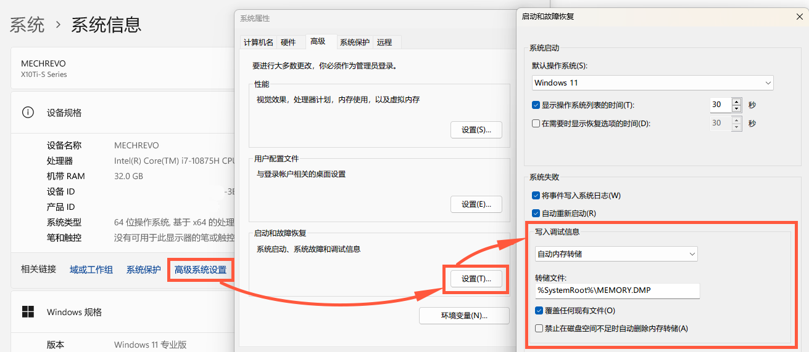
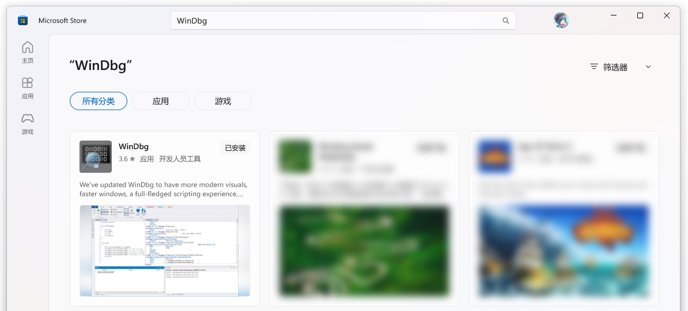
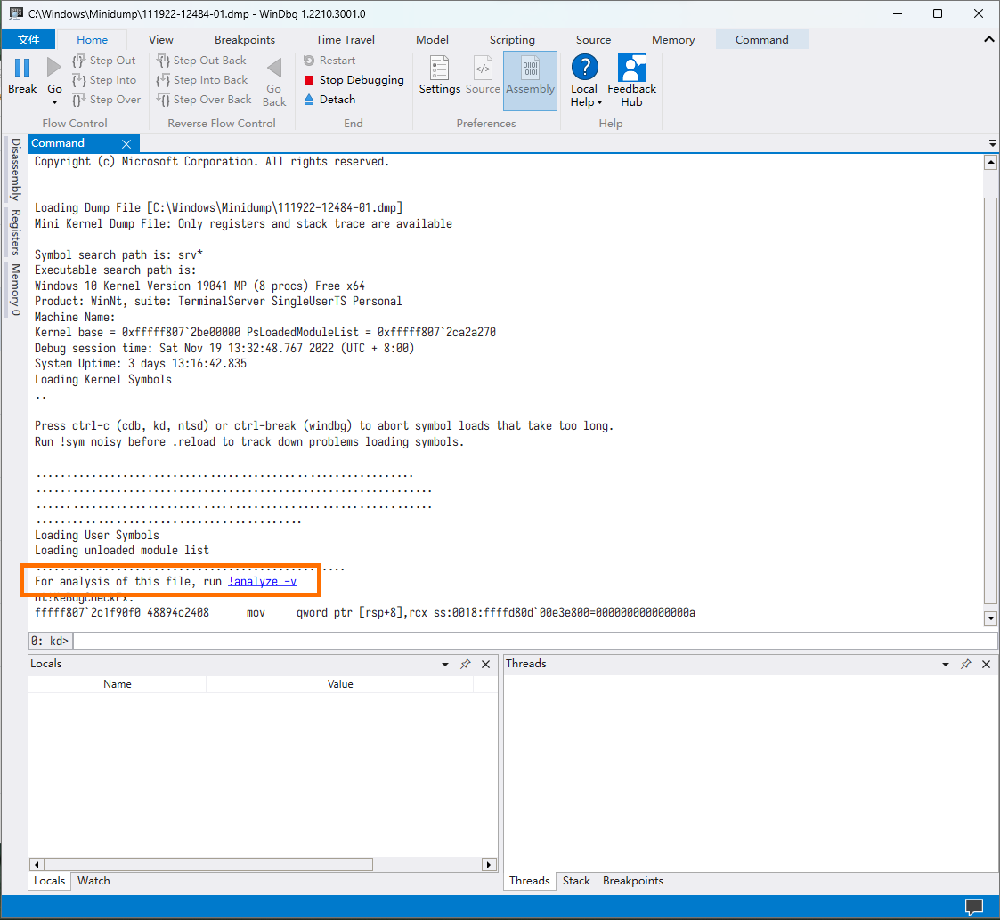
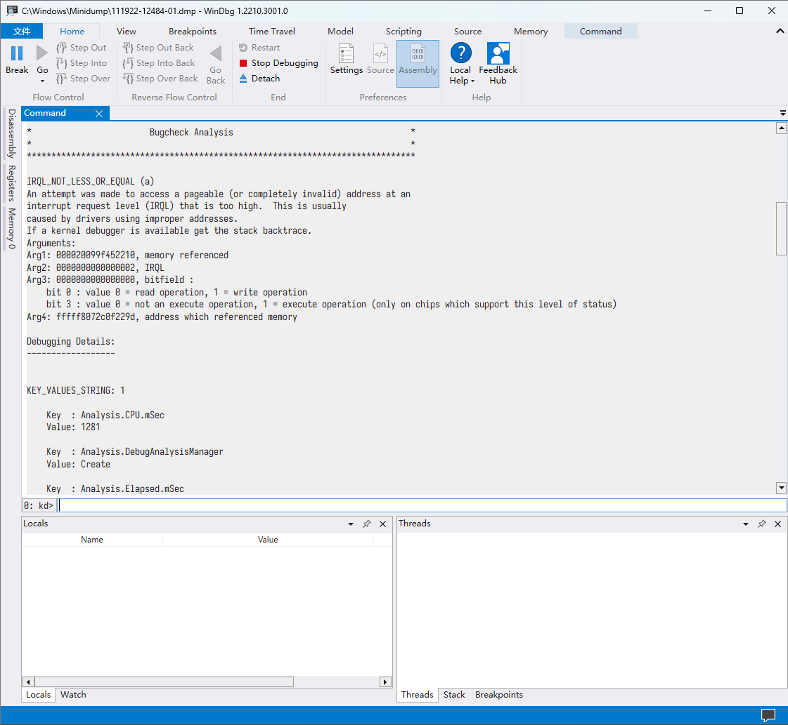
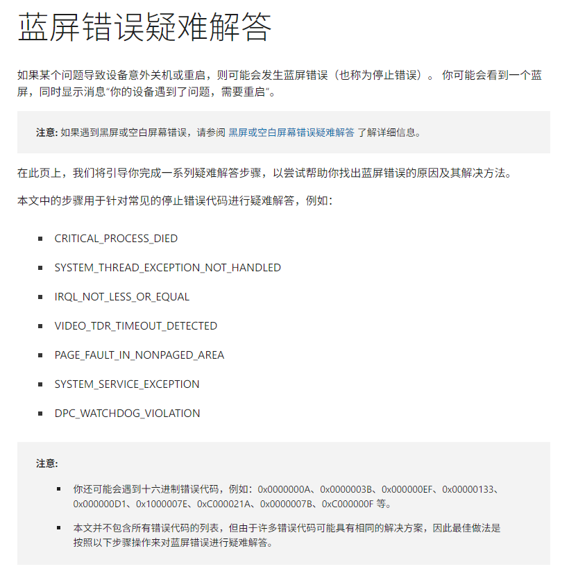

# 蓝屏与解决蓝屏


这一章，我们将介绍令大多数人都头痛的问题——蓝屏死机，以及解决蓝屏问题的方法。读完本章，你应该可以找到下面这些问题的答案：

- 为什么我的电脑会蓝屏？
- 为什么我现在看到的蓝屏和以前的好像不一样？
- 蓝屏画面上的东西是什么，有什么用？
- 我怎么才能解决电脑的蓝屏问题？



我们在日常使用电脑的过程中，总不可能避免遇到各种各样的问题，其中最为出名的要数「蓝屏死机」了。蓝屏令人恼火，但更多的却是无可奈何，因为大多数人只能盯着那蓝蓝的界面，等着电脑自动重启，然后继续使用，祈祷着不会再一次出现同样的问题。但我们真的束手无策吗？在此，不妨来详细了解一下这蓝屏，顺便尝试着手清除它的隐患。

认识蓝屏，先来看看它是如何起源与发展的吧。

## :(

蓝屏死机，英文叫 BSoD（Blue Screen of Death，「死亡蓝屏」，很形象啊）。如今的 2023 年，大多数个人电脑上搭载的都是 Windows 10 或 Windows 11 操作系统，它们的蓝屏错误界面很有特色，大概长这样：


以一个大大的文字表情「 :( 」开头，代表了人们遇到这个界面时的心声，接下来是一些说明性文字，看起来很简洁。略览这些文字，我们不难推测，**蓝屏死机一般是操作系统遭受某种不可抗错误而被迫终止运行造就的结果**。但最初的蓝色错误界面（事实上是如今蓝屏错误的前身）与这可有天壤之别。

### DOS 时代

第一个名叫「Windows」的操作系统是微软在 1985 年 11 月发布的 Windows 1.0，它是一个基于 DOS（Disk Operating System，磁盘操作系统）的操作系统。但作为发布的第一个版本，Windows 1.01 有着神奇的缺陷——它只能在特定 DOS 版本下运行，高了就出错。这一错，造就了历史上最早的「蓝色错误界面」（谁让 Windows 1.0 的启动界面就是蓝底白字呢）：


在这个错误界面上，最上方可见一些微软的版权信息，紧接着就是一句「不正确的 DOS 版本」昭示错误，随后便是满屏的乱码。但这些乱码的由来与如今的蓝屏不一样，它们是来自错误 DOS 版本导致的 Windows 徽标那张图所在内存错误，又因为当时的 Windows 缺乏内存保护，于是溢出到显存之上，并不是由于系统崩溃而生。之后的 Windows 1.02 版本似乎修复了这个问题，但 Windows 2.03 版本也有同样的 bug，呈现形式也是这样 ~~，所以微软你到底是修了还是没修呢~~。

1990 年，微软发布了 Windows 3.0 操作系统，这个版本获得了巨大成功，发布的半年内就卖了 200 万份。它仍然基于 DOS，但带来了更好的性能……与更新的报错界面。值得注意的一点是，在这个版本的 Windows 中，用户可以按下 `Ctrl` + `Alt` + `Delete` 来手动触发错误 ~~（随时随地蓝屏）~~。之后发布于 1994 年的 Windows 3.2 则是第一个得到广泛使用的中文版 Windows 系统（还可以玩扫雷哦），于是我们可以看到这样带中文的蓝色错误界面：


不过仍然与之前一样，这并不是系统崩溃，真正崩溃的话，计算机早就退回那黑黑的 DOS 界面了，更不会提供回到 Windows 的机会。但与之前不同的是，这个错误界面会提示用户系统出错的原因，更有了现代蓝屏的味道。

次年，微软又发布了新一代 Windows，这次微软开始以两位数年份命名产品，叫作 Windows 95（著名的 IE 浏览器就是在这个系统中首次亮相的）。三年后，微软又发布了 Windows 98；到了 2000 年，微软~~发现把新系统命名为 00 不太合适，~~ 将新发布的系统命名为 Windows Me，这个「Me」不是英文的「我」，而是代表「千禧年版（Millennium Edition）」。这三个系统后来统一被大家称呼为「Windows 9x」（虽说最后一个似乎不太一样），想必它们的蓝屏界面也差不多。


嗯……看来不仅是 Windows 9x 之间差不多，它们与 Windows 3.x 也差不多，但与之前的相比增加了错误代码与错误发生的内存地址，帮助用户排查错误。然而，即便是中文版的 Windows 9x，蓝屏界面语言也依然是英文，微软似乎去掉了蓝屏界面的本地化。~~（开倒车？）~~

事实上在 Windows Me 发布的前几个月，微软已经发布了 Windows 2000（详见下一节），它的出现标志着基于 DOS 的 Windows 正江河日下。而两年后，负有盛名的 Windows XP 发布，标志着微软已经将重心完全脱离 DOS。再之后，这些基于 DOS 的老旧 Windows 一个接一个走向了时间的坟墓里，湮没在历史的沙海下。但即便以 Windows Me 停止支持为终结的 DOS 时代在 2004 年结束，这并不意味着另一个时代是在此时开始的，早在 DOS 时代开始没多久，另一个时代正悄然诞生……

### 早期 NT 时代

自 1985 年起的几年，微软除了开发自家的 Windows 之外，还在与 IBM 合作开发一款名叫「OS/2」的操作系统，这个系统不是很出名，毕竟它的目标是 IBM 自家的计算机。到了 1988 年 11 月，微软的一个开发团队准备改进当时的 OS/2，使之成为一个兼容 POSIX（可移植操作系统接口）的多用户操作系统，起名「NT OS/2」[^1]。

之前提到过，Windows 3.0 非常畅销，于是~~微软飘了~~，开发团队开始用 Win32 接口代替 OS/2 的那些接口。这 Win32 是现有的那些基于 DOS 的 Windows API 的 32 位扩展版，使得现有的 Windows 程序能很轻松地移植到 NT 平台。微软觉得很棒，但 IBM 很不爽，随后在 1990 年终止了与微软的合作，微软开发的东西也变成了「Windows NT」，而这也是现今 Windows 系统的内核。

Windows NT 的第一个大版本系列是 Windows NT 3.x，它包括 1993 年发布的 3.1、1994 年发布的 3.4 与 1995 年发布的 3.51。从这个系列起，Windows 蓝屏可以真正地叫做蓝屏了，因为它来自系统运行时的崩溃，一崩溃就只能重启。


这是一张 Windows NT 3.51 的蓝屏截图，可以看到上面包含了许多复杂的信息，大概分为四个部分：
- 第一行是由一个十六进制数代表的蓝屏错误代码（指示错误类型）、四个十六进制数代表的错误参数，第二行是错误的名称以及发生的内存地址；
- 接下来一大段展示电脑刚才已经加载的各种驱动；
- 第三部分则是出错时的内存堆栈状况；
- 第四部分则告诉用户一些建议的操作，例如重启、设置恢复选项、寻求帮助什么的。

1996年，Windows NT 4.0 发布。这个系统看起来与 Windows NT 3.x 大同小异，当然蓝屏界面与 Windows NT 3.x 也几乎一致，没什么好看的。

这样的蓝屏虽然看起来很吓人，满屏幕密密麻麻看不懂的东西，却方便了用户在后续寻求帮助时，让专业人士来分析问题，因为它包含了排查错误所需的许多信息。不过有些时候蓝屏显示的信息不是很多，或许是这时的错误没有那么多信息来给系统显示。

2000 年，微软发布了 Windows 2000 操作系统（又称 Windows 2K），即便它属于 NT 系列，却使用了与此前 DOS 系列类似的「年份命名法」，或许在千禧年发布的东西总要沾点它的光呢。在这个系统中，微软将曾经 Windows 95 与 98 里的许多特性都引入进来，让 NT 系列成为开发的主赛道。不过 Windows 2000 的蓝屏界面没有之前 NT 系列那么眼花缭乱，东西比较少，但这之中基本的东西，诸如蓝屏代码、参数，内存地址，蓝屏转储，建议话语之类还是有的，像这样：


Windows 2000 的后继者便是大名鼎鼎的 Windows XP，在前者发布的次年便很快发布，名字中的「XP」代表「eXPerience（体验）」。正如其名，Windows XP 为用户带来了不同于以往 NT 系列的体验，包括令人耳目一新的用户界面与大量性能改进。这个系统实在过于经典，以至于大概二十年后的现在，仍有一些重要设备在运行它。

Windows XP 的蓝屏界面长这样：


可以看到蓝屏界面的开头多了一句话：

```
A problem has been detected and Windows has been shut down to prevent damage
to your computer.
```

什么意思呢？

```
检测到了一个问题，Windows 已停止运行从而避免损害您的电脑。
```

~~多贴心啊！~~ 这比以前直接一个「STOP」糊脸似乎温和得多，但仍然改变不了它是个蓝屏界面的事实。不过接下来的大段文字，几乎都是在向用户提供建议，例如重启、检查安装的新硬件及其驱动等等，不得不说确实「人性化」许多。当然，放在最后的还是必不可少的蓝屏代码、错误参数以及进程信息。

Windows XP 的后继者是 Windows Vista，它于 2007 年正式发布，但似乎是一个名不见经传的系统。确实，比起它的前任与后继者，它似乎逊色许多。而它的后继者就是同样大名鼎鼎的 Windows 7。看起来微软的命名是自由的，我们没法知道这个「7」为什么是「7」，只需要知道它是「7」就好了。Windows 7 于 2009 年发布，带来了好看的界面与至今津津乐道的体验。不过从 Windows XP 到 7，蓝屏界面一直没有发生变化，而下一次的变化，就大到要进入下个时代了。

### 「简洁」时代

在 2010 年左右这段时间，微软想进军移动市场，顺便来一个移动桌面平台「大一统」（虽然目前来看，结果不怎么样）。在此理念影响下，微软在 2012 年发布的 Windows 8 更像是一个平板电脑操作系统，操作逻辑与之前的 Windows 相去甚远，甚至连开始按钮都惨遭舍弃。用户当然不买账：「跟了我们这么久的开始按钮怎么能说丢就丢呢？」于是微软在随后的 Windows 8.1 把开始按钮加了回来，但也仅此而已，未能改变它「看起来像给平板用的系统」的本质，愿意用 Windows 8 系列的用户也还是不多。

至于蓝屏界面，自 Windows 8 开始，它就从曾经的类似命令行上一大堆信息的画面变成了现在标志性的「 :( 」画面。 ~~（那是不是说「简洁」时代其实应该叫「 :( 」时代呢？）~~


啊，时隔多年，我们再一次在蓝屏界面上看到了中文，真是可喜可贺、可歌可泣啊。但这提供的信息量相比之前的 Windows XP 到 7 的蓝屏界面少了许多，这里只告诉你「你的电脑有问题，得重启」，反倒没有了之前所看到的那一大段具体建议。此外，蓝屏代码由之前的十六进制数字变成了一串英文[^2]。比起之前那不明所以的数字，这样的错误代码倒是显得更直观，但还是很笼统。至于技术层面的错误信息，除了这个蓝屏代码就没有其他的了，甚至没有与之相关的进程信息，这导致普通用户只能根据这个蓝屏代码来搜索解决方案，增大了排查难度。 ~~（看来微软这倒车是越开越远了啊。）~~

Windows 8.1 的下一代是 2014 年发布的 Windows 10 ~~（9 呢？记住，微软是自由的。）~~，是如今广泛使用的操作系统。这次微软倒是长记性了，把开始菜单弄回来了，不过变成了「磁贴式」，倒也方便许多。Windows 10 的蓝屏界面在本节开头已经看到过了，与上一代不同的地方在于：它多了一个指向其旁边[蓝屏错误疑难解答](https://www.windows.com/stopcode)链接的二维码，似乎能帮助用户解决问题。（但真的有用吗？请看后文。）

Windows 10 的下一代是 2021 年发布的 Windows 11，正式版的蓝屏界面与 Windows 10 的一模一样，但值得一提的是，在某个时段的预览版中，蓝屏界面变成了黑色，就像这样：


嗯……怎么说呢，看起来死气沉沉的。

到这里，我们就把所有 Windows 系统不同的蓝屏全看了一遍。蓝屏作为一个系统崩溃错误界面，承担的职责应当是显示错误信息，便于用户或技术人员排查。不难发现，早期的蓝屏虽然不太好看，但尽到了自己的职责，但如今的蓝屏更多的是发扬「简洁即美」的思想，却似乎把自己的职责抛开不顾了……不愧是你，微软。

## 搞定蓝屏

### 设置内存转储

如今 Windows 10/11 的蓝屏界面只提供了错误代码，如果你尝试过去网上搜索它，一般得到的都是非常笼统的说辞，诸如「使用安全模式启动」「尝试更新驱动」「尝试检查磁盘错误」「尝试系统还原」甚至「尝试重装系统」。这也难怪，毕竟蓝屏代码就那么几个，但引起蓝屏的因素却如同恒河沙数，自然只能把想到的全试一遍。虽说重装系统能解决 99% 的问题，但不建议如此大动干戈，毕竟数据无价。而事实上其他方案则都是「碰运气」，能搞定算我们运气好。我们真正需要的，是「对症下药」——找出问题的根源，着手消除它。

你如果仔细观察过之前「早期 NT 时代」的各种蓝屏界面的话，可能会发现最后一段有一句话：

```
Beginning dump of physical memory.
```

这就要说到 Windows 会在蓝屏时做些什么「幕后工作」了。在蓝屏发生之时，系统会收集发生错误的进程所在的内存与堆栈内容，并将它们放入一个「蓝屏内存转储文件」中。如今的蓝屏上「我们只收集某些错误信息」说的就是这个事。也就是说，即便蓝屏界面上没有了相关的技术信息，我们也可以通过分析内存转储文件的方式查找真正的蓝屏原因。

默认情形下，Windows 系统会自动收集内存信息并形成内存转储文件，但你如果发现你的电脑在蓝屏的时候什么也没干，或者想自定义收集选项、查看或设置转储文件的保存位置，那就要前去调整设置。与内存转储相关的设置藏得有点深，找到它的操作步骤是这样的：
1. 按下 `Windows` + `Pause` 或 `Windows` + `Break`，或者右击【此电脑】→【属性】来打开「系统信息」页面；
2. 点击【高级系统设置】，弹出「系统属性」窗口；
3. 在「系统属性」窗口中点击【高级】→「启动和故障恢复」下的【设置】，就可以看到「写入调试信息」部分有内存转储的相关设置。



可见，内存转储的类型有五种，除去「小内存转储」默认保存在 `%SystemRoot%\Minidump` 文件夹下以外，其余选项默认均会生成一个路径为 `%SystemRoot%\MEMORY.DMP` 的文件。这些路径中的「`%SystemRoot%`」指的是电脑上 Windows 系统所在的目录，一般而言是 `C:\Windows`（应该不会有人大动干戈把系统移到别处去吧）。五种内存转储类型的特征大致是这样的：
- 小内存转储：大小仅有 64 KB 到 256 KB，包含了最基本的崩溃进程、线程、内核堆栈数据与已加载的驱动程序列表，提供最基础的崩溃信息。它的文件名以 `MMDDYY-NNNNN-XX.dmp` 为格式，`MMDDYY` 是「月日年」格式的日期，`XX` 是两位数的文件编号。
- 核心内存转储：包含崩溃时 Windows 内核、硬件、驱动程序使用的所有内存，但不包含由用户启动的程序所使用的内存。一般而言这些内存已经足够技术人员来确定崩溃的源头了。
- 完整内存转储：包含崩溃时 Windows 使用的所有内存。这种转储模式能够收集最完全的信息，但会占用大量空间，要求系统盘中的分页文件（pagefile）要有电脑上所有内存那么大。
- 自动内存转储：在分页文件大小由系统自动管理的条件下，系统会自动确保分页文件的大小能尽量完成核心内存转储，当不够用时，分页文件会自动增大并保持大约两星期，之后会恢复原来的大小。
- 活动内存转储：类似于「完整内存转储」，但系统自动筛除了与排查主机问题无关的部分，所以通常而言大小会小于完整内存转储，且能提供内存中的绝大部分有用信息。

若想修改内存转储文件的存储路径，请为「小内存转储」提供一个文件夹目录，为其他类型提供一个 DMP 文件路径。

**默认情形下，Windows 会启用「自动内存转储」**，这样能平衡存储空间消耗与崩溃信息收集效率，**这也是大多数情形下的推荐选项**。如果**存储空间吃紧，建议启用「小内存转储」**，让 Windows 至少收集最低限度的崩溃信息。不建议启用「完整内存转储」，它在占用大量空间的同时，收集信息的收益并没有比「核心内存转储」高出多少。「活动内存转储」适用于大量运行虚拟机时的情形，它会筛去虚拟机使用的内存，只关注物理主机。

### 分析转储文件

现在，我们的电脑已经会自动在蓝屏发生时收集内存信息并形成内存转储文件了。而想要分析这些内存转储文件，我们需要特殊的工具——WinDbg（Windows 调试器）。

打开 Microsoft Store，也就是微软应用商店，在上面搜索「WinDbg」，跳出来的第一个应用就会是它，点击【获取】，等待一会，就安装好了。如果不想在 Microsoft Store 安装，也可以去微软提供的 [WinDbg 官方页面](https://learn.microsoft.com/zh-cn/windows-hardware/drivers/debugger/)下载。



安装好之后，电脑上的蓝屏内存转储文件就能直接双击打开了。转到之前设置转储选项时看到的内存转储路径中，打开最近一次蓝屏的转储文件，你大概会看到这样的界面：



其中偏下方的位置有用醒目的蓝色写出的 `!analyze -v`，结合它旁边的说明就能知道，**运行这个命令就可以分析转储文件**。WinDbg 也很方便，**点击这里的蓝色文字就可以运行命令**。在命令执行过程中，左侧中下部的状态会显示 `*BUSY*`，同时最下方会显示正在从服务器下载哪些所需的文件。这时可以喝杯茶，等待分析过程完成。不过如果你发现下载过程实在太慢了，可以考虑[通过合法渠道进行国际互联网连接](https://www.12377.cn/xzfg/2020/7f441527_web.html)来加快下载速度。


分析完毕之后，你会发现出来了一大堆令人眼花缭乱头晕目眩的分析结果，这些结果都是以灰色背景显示的。



但是不要紧张，在里面**找到以 `PROCESS_NAME`、`MODULE_NAME` 与 `IMAGE_NAME` 开头的几行**。这几行正是与此次蓝屏相关的进程。在这个例子中，这几行分别是

```
PROCESS_NAME:  QQ.exe

MODULE_NAME: nt

IMAGE_NAME:  ntkrnlmp.exe
```

此前我们提到过 NT 是如今 Windows 系统内核的名字，查找资料可以发现，这 `ntkrnlmp.exe` 是系统与硬件交互的程序，看来引起蓝屏的罪魁祸首似乎是 QQ，于是你可以将 QQ 完全卸载重装，然后跟此次蓝屏说再见。

事实上在「分析结果」的那张图片中，程序指出此次蓝屏的蓝屏代码是 IRQL_NOT_LESS_OR_EQUAL，若你去网上搜索相关信息的话，看到的大概率是什么「硬件问题」「驱动问题」之类的说法。的确，这种蓝屏与硬件有关，但是什么引起了错误，就只有真正分析才能得到了，这也是为什么需要「对症下药」的缘由。

总结下来，解决蓝屏的一般步骤是：
1. 使用 WinDbg 打开最近一次的蓝屏转储文件；
2. 使用 `!analyze -v` 命令分析文件；
3. 找到以 `PROCESS_NAME`、`MODULE_NAME` 与 `IMAGE_NAME` 开头的几行，查看「罪魁祸首」（不熟悉的进程名字可以去网上搜索）；
4. 根据进程情况「对症下药」。

## 微软教你「搞定」蓝屏

**注意：不推荐使用本节的方法排查错误，此处只是为了展示「遵从提示」的情况。**

再次审视 Windows 10/11 的蓝屏界面：


这上面说：

- 有关此问题的详细信息和可能的解决办法，请访问 [https://www.windows.com/stopcode](https://www.windows.com/stopcode)

好咯，那我们就去看看。用还能联网的设备打开这个页面，映入眼帘的是这样的说明：



嗯……它说：

- 本文并不包含所有错误代码的列表，但由于许多错误代码可能具有相同的解决方案，因此最佳做法是按照以下步骤操作来对蓝屏错误进行疑难解答。

翻译一下就是：我们估计以下方案可能能够搞定蓝屏，推荐你试试，但搞不定我们也没办法。

再往下翻，根据提示行事，你会发现微软列出的解决方案包括「卸载第三方软件」「回退、禁用或卸载驱动程序」「移除外接硬件」等，事实上……也没错，解决蓝屏确实要除掉点什么东西，但问题在于这「解决方案」只告诉我们类似「如何卸载软件」的方法论，却不告诉我们「应该卸载什么软件」之类的具体措施。归根结底还是造成蓝屏的原因千变万化，不能简单一概而论。所以微软也在教你如何「碰运气」……不愧是你，微软。

## 练习

1. 你还见过什么样类似「蓝屏」性质的系统错误界面，它们与「蓝屏」有何异同？
2. 尝试自己分析一个蓝屏转储文件，如果自己电脑里没有可以找找朋友的电脑（但不必为了这个就把自己的电脑弄蓝屏）。


[^1]: 那时 NT 代表「New Technology」，但后来却失去了含义，变成了单纯的代号。
[^2]: 事实上早期 NT 时代中也出现过这些英文，不过它们并没有「蓝屏代码」的地位。而「简洁」时代的蓝屏代码也不全是英文，偶尔会有数字出现。