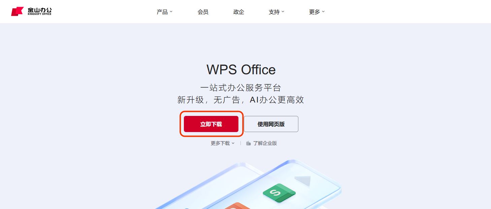

# 软件的寻找与安装


软件的下载安装一直以来是困扰许多「电脑小白」的大问题——从哪里下？怎么下？下完怎么装？装完怎么办？什么，软件要收费？破解是什么？……这一章将对国内互联网环境下 Windows 软件的下载、安装和配置做一个简单的介绍。看完这一部分，你或许可以找到下面这些问题的答案，并慢慢对「怎么寻找软件」有一个初步的了解。

- 我想下载 xxx 软件，我应该去哪里找这软件？
- 网上全是病毒和垃圾软件，我应该怎么样最大程度保证自己电脑的安全？
- 为什么软件下到手还要安装？有的还要破解？为什么这么麻烦？
- 电脑里不是有个「Microsoft Store」吗？为什么那里面大多数软件都找不到？



直到今天，Windows 系统下依然没有一个广泛使用的集中化「应用商店」。与我们使用手机不同，在电脑上，我们若想安装某个软件，多数情况下需要到互联网上寻找软件的「安装包」，再自行将软件「安装」到电脑上来使用。

这部分，我们将具体介绍软件为什么要「安装」，如何从网上的万千垃圾软件中下载我们需要的软件，以及软件安装和配置的一些技巧和注意事项。

## 安装与安装包

在 Windows 系统上，应用是通过「安装包」来安装到系统上的。如果把 app 比作是一株植物，那安装包就是这棵植物生长之前的「种子」。我们要安装某个 app，就需要获取这个 app 的安装包，然后通过安装包将 app「安装」在电脑上。

为什么需要「安装包」而不直接分发应用本身呢？我们有必要稍微了解一下 app 在我们的电脑上「安装」的过程。

在上一章 [文件与文件管理]() 中我们看到，一款 app 除了主程序（一个 `exe` 文件）外，还包含一大堆不可或缺的依赖文件和子文件夹，如右下图所示：


安装包的作用之一，便是把上面这一大堆文件按照它们能够工作的结构「释放」到我们的电脑中的指定位置。而除了「释放 app 的文件」之外，安装包还会做一些其他事情，例如设置一些文件的打开方式（上一章中提到的那张「表」）、调整一些系统内部的参数等。可以说，软件安装的过程，不仅仅是将一大堆文件「释放」或者说「提取」到系统中的某一个位置的过程，它还会对系统进行或多或少的调教与更改。这就是「安装包」存在的意义——它帮助我们完成了这复杂的「安装」过程。

## 如何上网寻找软件的安装包

下面我们来探讨如何上网寻找我们需要的软件的安装包。

### 优先考虑：官方网站

当要获取一款 app 时，我们首先应该考虑的是 app 开发者的官方网站，即「官网」。比起在其他地方下载软件，从官网下载软件能最大限度地保证你所下载的东西是干净的。

然而，**搜索引擎中存在大量广告，且为了吸引点击量而常常放在前面，所以搜索结果中靠前的结果并不一定是官网**。例如，我们想要下载「WPS」，直接在某搜索引擎上搜索「WPS 下载」，我们会得到这样的搜索结果：


如上图，我们搜索「WPS 下载」，结果中：

- 第一条是重庆某公司提供的广告。该公司是一个第三方的软件下载平台，我们无法确保自己能在该网站上下载到原版的「WPS」。
- 第二条是某国内公司提供的广告。首先它提供的产品并非「WPS」而是「Office」，其次该平台出售的「Office」软件是否取得微软的官方正版授权也值得商榷。
- 第三条是莆田某公司提供的广告。与第一条一样，我们无法确保其能够提供原版的软件，也难以确保其不会捆绑安装我们不需要的 app。
- 第四条才是 WPS 的官网。注意看它的网址以 `.wps.cn` 结尾，这是 WPS 的官方网站。

鉴别一个网站到底是不是官网，我们主要可以观察这么几个地方：

- 看网址，我们主要关注网址结尾的那一部分（称为「域名」），它一般都是企业或者软件的名字。例如：
    - WPS 的官网是 `.wps.cn`。
    - QQ 和微信的官网是 `.qq.com`。
    - 网易云音乐的官网是 `.163.com`。
    - Steam 的官网是 `.steampowered.com`。[^steam]
    - ……
- 排除法。没有哪个软件厂商的名字是叫做「xx 软件站」「xx 下载站」「xx 软件园」的。带有这些名字的**全部**是第三方下载站。
- 语义判断。一般广告网站的标题都与搜索关键词没有任何实质上的联系。我们不妨再看上面的搜索结果中的前几条广告，会发现它们要么「添油加醋」（如第一条的「W-P-S」和第三条的「W·P·S」），要么「名不副实」（如第二条在整个条目中，都没有提到「WPS」）。

[^steam]: 如果你想快速去到 Steam 的官网，可以直接访问 [s.team](https://s.team)。

进入软件的官方网站之后，我们搜索「全部产品」「软件下载」之类的选项，就可以找到我们所需要的软件的安装包。例如从 WPS 的官网上下载 WPS 软件：



当我们下载的软件是不那么常见的国外软件时，这一问题会变得更加严重。我们在相同的平台上搜索「OBS 下载」（OBS Studio 是一款开源的屏幕录制与直播软件），会得到这样的搜索结果：


作为一款国外软件，图中 ➊ 至 ➍ 的由国内公司提供的内容显然都不可能是官网。而对于 ➎，虽然它看起来好像是 OBS 官方的，但请注意其域名以「.cn」结尾，这是我国的顶级域名。自然，一个国外的开源软件项目，正常来说亦不会使用我国的顶级域作为官网网址。事实上，➏ 所对应的 `obsproject.com` 网址，才是 OBS 真正的官网。

### 直面深渊：第三方软件站

> [2022 年央视「3·15 晚会」对一些软件下载站的「捆绑下载」行为进行了曝光](https://www.bilibili.com/video/BV1JZ4y167m8)。在被曝光之后，各大下载站均紧急撤下了「高速下载」这样的诱导性下载按钮，但我们仍然要小心这些网站在「风头」过后死灰复燃。
>
> 2024 年 11 月 16 日更新：目前，在这些第三方下载站上，带有诱导性质的「安全下载」按钮已经会标明「需通过 xxx」，不过仍然存在。
> 

在某些时候，我们确实找不到一个软件的官网，或者因为这样那样的原因不能去官网下载某个软件。这时，我们将不得不直面深渊，进入各种各样的第三方下载站下载软件。

实际上，在这些网站上，我们一般是可以下载到想要的东西的——前提是，你足够小心，不点到那些所谓「高速下载器」「P2P 下载器」的虚假链接，也不点击到任何诱导下载的广告。下面我们会手把手实操这个过程。

假设我们要下载「OBS Studio」这款软件。我们在网上搜索「OBS 下载」，并主动避开那些广告，找到了这个名为「某某之家」的第三方软件站：


重点来了：进入这个网站后，**请避开所有【高速下载】【极速下载】【安全下载】【P2P 下载】这样的按钮**，并且不要点击任何广告。相反地，我们选择【普通下载】【本地下载】这样的按钮：


点击之后我们会跳转到这样一个「下载地址」的页面。同样地，我们不要点击「优先使用 xxx 管家下载」之下的所有链接，而要点击「普通下载地址」下方的【通用网络下载】等链接：


我们使用下方【通用网络下载】得到的文件是一个体积约 133 MB 的压缩包，符合这个软件的体量。将这个压缩包解压，我们就能得到 OBS Studio 的安装包。


而使用上方所谓「高速下载」下载到的文件是：


体积只有 20.3 MB，而且是一个不明的「可执行文件」（`exe` 文件）。与前面相比，这个文件就显得很可疑了。事实上，它不是 OBS Studio 的安装包，而是一个名不见经传的「xxx 管家」的安装包。这个「xxx 管家」软件可能会恶意地给我们的电脑安装许多来历不明的软件，在本章的最后我们会进行演示。

### 另辟蹊径：软件公众号及其他小众渠道

另一种「另辟蹊径」的方法，是通过一些「小众渠道」，例如一些分享软件的微信公众号来下载软件。这不失为一种好方法——那些人们口口相传的优质公众号一般会把常用软件的「干净」安装包分门别类地整理分享，与「xx 下载站」相比，免去了「高速下载器」的烦恼。

但是，这种公众号一般软件不是特别多——你总有一天没法从它们那里找到想要的软件。此外，这些公众号一般使用各种网盘平台来分享文件，而这些网盘平台通常会对非会员用户限速的，这必然对使用体验有一定影响。不过总的来说，这依然是一种值得推荐的方法。

> 对于这类公众号，我们并没有做太多的收集，因此无法在此推荐。大家可以在 B 站、贴吧、微博等地方自行寻路。
> 

### 他山之石：第三方的「软件管家」

除了手动在网上——无论是在官网，从第三方下载站，还是从那些整理网站的公众号上——下载软件的安装包之外，有一些第三方的「软件管家」也能帮助我们找到所需要的软件。这些软件管家有的是电脑厂商所维护的，例如「联想软件管家」「华为软件管家」；有的是一些公司所维护的，比如「360 软件管家」「腾讯软件管家」等（名字不一定是这样，可以类比）。

一般来说，那些由电脑厂商所维护的「软件管家」，往往相对干净、不带「全家桶」式的捆绑；而那些第三方企业维护的「软件管家」，一般都会或多或少地提示用户安装它们的「全家桶」。比如，如果你使用「360 软件管家」，那它可能就用某些手段提示用户去安装「360 安全卫士」以及一系列其他软件。因此，你可以根据自身机器的实际情况，按需选择这样的「软件管家」类 app。

## 安装软件

假设经过与「神奇」网站的「斗智斗勇」，你成功地下载到了某款软件的安装包。取决于软件，你下载到的可能是下面三种文件中的某一种：

- 一个光秃秃的 `exe` 文件或者 `msi` 文件。我们直接双击这个文件就能启动安装进程。
    
- 一个压缩包，例如 `zip` 或 `rar` 文件。我们需要解压缩这个压缩包到某处，然后在解压出来的文件中找到「`setup.exe`」「`install.exe`」等名字的程序双击打开。
    
- 一个扩展名是 `iso` 的文件。我们右击这个 `iso` 文件，选择【打开方式】→【文件资源管理器】，然后在弹出的新窗口中找到「`setup.exe`」「`install.exe`」等名字的程序双击打开[^1]。
    

> 还有一种软件，称「绿色版」或「便携版」（portable）软件，没有「安装」这一过程。要么是单单一个 `exe` 文件，点开就能用；要么以压缩包形式出现，但是「开箱即用」——解压后直接运行主程序就可以用，就像下面这样。
> 

启动安装器后，我们一般按提示【下一步】操作即可完成安装。但是此过程中也要留心！跨过了「高速下载器」的坎，可不要又掉进了捆绑软件的坑。**有一些软件在安装程序中也会像「高速下载器」一样勾选了一些捆绑软件、浏览器主页劫持什么的，这些选项可能出现在安装过程中的任何阶段，一定要注意取消勾选再进行下一步。**

在安装过程中还需要特别注意的一件事，便是「软件安装位置」，即安装包「释放」软件自身各种文件的位置。

在上一章中我们提到过，如果 C 盘空间有限，就不要把大量的数据放在 C 盘。对于软件来说，同样有类似的情况：如果你的 C 盘空间本身并不大（例如，小于 300 GB），将大量的软件放在 C 盘，会使得 C 盘的空间压力随着使用时间的增长而显著增大。在这种情况下，安装到 D 盘或其他磁盘分区是更好的选择。不过，如果你的电脑总共只有一个分区（C 盘），那么直接选择安装在其中即可。

> 在 [认识你的电脑]() 一章介绍「硬盘」时，我们说有些电脑会混合使用固态硬盘和机械硬盘。一般这种情况下，C 盘位于固态硬盘上，而后续的分区有可能位于机械硬盘上，你可以在任务管理器中查看分区和硬盘的对应关系。在这种情况下，我们建议将常用软件安装在 C 盘或者固态硬盘的分区上。

一般来说，软件默认会把自己「释放」在以下两个路径之一，它们分别是「64 位」和「32 位」软件[^softarch]的默认安装位置（也可能没有 `<厂商名字>` 一层）。

[^softarch]: 什么是「32 位」和「64 位」呢？你可以在超越篇的 [「程序」是怎样炼成的]() 一章中找到答案。

```
C:\Program Files\<厂商名字>\<软件名字>\
C:\Program Files (x86)\<厂商名字>\<软件名字>\
```

在上一章中我们提到了「快捷方式」，在你的电脑桌面上就有许多软件可执行文件的快捷方式。右键它们选择【属性】，你就能看到这些已经安装的软件的位置。看看它们中的一些是不是在 `C:\Program Files\` 或者 `C:\Program Files (x86)\` 下？

> 然而，往上面两个位于 C 盘的路径放东西是需要管理员权限的（见 [基本维护和安全防护]()）。而有些软件会默认把自己安装到你用户文件夹下的 `AppData` 文件夹，这个文件夹默认是隐藏的，但往里面放东西不需要管理员权限。这种策略给我们管理软件安装位置带来了一些麻烦。

`Program Files` 和 `Program Files (x86)` 这两个文件夹，即系统预置的两个用来安装 app 的文件夹，都位于 C 盘根目录下。如果你希望把软件安装到 D 盘。这里推荐一个简单好用的方法：**直接将默认路径中的 `C:` 改成 `D:`。** 例如：

```
D:\Program Files (x86)\Tencent\QQ\
```

这就是在 D 盘安装 QQ 软件的一个很合适的路径。这样做能保持一个比较干净的目录结构。你的 D 盘下会因此多出 `Program Files` 和 `Program Files (x86)` 这样的两个文件夹，用来专门在 D 盘安装软件。


如上图所示，一般把这个 `C` 改成 `D` ，就能得到一个不错的 D 盘安装软件的路径。


如上图所示，有一些软件的安装包不是「下一步」型的，而只有一个「立即安装」的按钮。一般这种情况，可以展开「自定义安装」之类的选项，然后更改软件的安装位置。

## 软件收费、破解和自由软件

很多软件是需要购买的，包括 Windows 系统本身（一般你购买电脑时，电脑厂商已经帮你出了买 Windows 这部分钱）。常见的专业软件，从平面设计领域的 Adobe 家族的 Photoshop、Premiere Pro，工程领域的 Autodesk 家族的 AutoCAD、3ds MAX，到开发领域的 JetBrains 家族的 IDEA、PyCharm，甚至于我们每天都在用的 Word 和 PowerPoint，这些软件全部都需要付费购买。下图是购买正版 Photoshop（俗称的 PS）软件的页面——定价 888 元一年。


而由于这样或那样的原因，我们在实际生活中，或多或少都在「没有付费而白嫖这些软件」。这是因为我们使用的这些软件被「破解」了。破解之后，软件的计费功能失效，原本收费的软件通过某种方式变成了可以免费永久使用的软件。大体上，网上流传的破解软件一般有这么两种形式：

- 一种是已经完全破解了的收费软件。这种软件已经经过修改，安装包往往也是民间自行制作的，可以直接走正常流程安装，安装后打开就可以无限制地使用。例如一些「破解版」的 Adobe 软件套装。
- 另一种是使用收费软件的试用版本安装软件，再外加「破解补丁」。这种软件的安装包依然是使用官方原版的安装包，安装完成之后，通过某种「打补丁」的方式来外挂「欺骗」这官方原版的软件，让原版软件以为用户已经购买，从而解锁全部的功能并让用户无限制使用。常见的 Office 软件的破解、Autodesk 软件的破解都属于此类。

使用破解软件终究是一件「上不得台面」的事情。一般来说，如果你使用破解软件作为私下的个人使用、学习，软件厂商可能不会进行追究。**但是，如果你将破解软件（或者说，盗版软件）用于商业用途，那必然迟早会受到追究**。尽管实际生活中软件厂商维权的积极程度各有差异，尽管大家会因为各种各样的原因不得不去使用盗版和破解，但我们仍然呼吁大家支持正版软件，万不得已使用盗版、破解软件时，仅作为非商业的个人和学习用途。

与那些用来盈利的商业软件不同，「自由软件」（free software）不仅是「免费」（Free as in ‘free beer’）的，而且是「自由」（Free as in ‘free speech’）的。对于自由软件，人们不仅可以无偿使用，还能自由地复制、分发，甚至是在一定条款之下修改它们。自由软件的原始代码是公开的，下载使用是免费的，开发者是多元包容的。近些年来，自由软件作为一种新浪潮在互联网上的发展不断壮大，自由软件在越来越多的领域开始出现。

在今天，一些自由软件已经开始动摇过去一些不可或缺的商业软件的地位。我们鼓励大家在实际使用电脑的过程中，多多尝试、使用一些优质自由软件。在本教程的后续章节中，我们会推荐一批各个领域的优质软件，其中就有许多自由软件的身影。

## UWP 应用和 Microsoft Store *

作为 Windows 亲爹的微软早在数年前就意识到，Windows 系统下一直缺少一个官方维护的、像 Apple 的 App Store 那样的「集中化」的软件中心，用户下载软件只能像上文那样上网去苦苦找寻。彼时的微软公司正打算进军手机行业，想要和安卓与 iOS 形成「三足鼎立」之势，微软于是心想：不如弄一种新的 app 格式，这种新的 app 不仅能在我们的 Windows 电脑上运行，还可以在手机上运行；然后我们再顺带弄一个全是这种新格式 app 的应用商店，可谓一举两得。于是微软就这么干了：这种新的 app 格式叫做「通用 Windows 平台应用」（Universal Windows Platform，简称「UWP 应用」），这个应用商店就是我们电脑里的「Microsoft Store」：


可是，时过境迁：微软终究没有能在手机市场打下一片江山，微软做的手机系统最终在近两年宣布「谢幕」。可是微软心想，这「UWP 应用」的先进构想和 Microsoft Store 不能开了头就没了尾，因此它们直到今天依然被保留在 Windows 系统之中。

如果你有打开过「Microsoft Store」，你会发现，其中有一些应用是我们日常生活中的常用应用，而另外的大多数应用，我们都从来没有听说过。而事实上，如果你去仔细查看那里面的常用应用，会发现它们往往更新得没有官网勤快，有些甚至已经停止了更新。


事实上，这就是 Microsoft Store 的现状：作为推广「UWP 应用」的第一线，它没有什么很拿得出手的「杀手锏」；作为一个「xxx 软件中心」的替代品，它的应用相当不全。微软在 Microsoft Store 和 UWP 应用上充满了雄心壮志，却最终落得今天的结局。

## 演示：【安全下载】到底下载了什么



**警告：请不要在自己电脑上尝试运行这种来路不明的「下载器」！**



在上文中我们演示下载「OBS Studio」时，如果点选了【安全下载】，会得到这样一个只有 20 MB 的可执行文件：


若是双击运行这个文件，Windows 会弹出一个这样一个窗口，询问【你要允许此应用对你的设备进行更改吗？】这个窗口称为「UAC 弹窗」，在下一章 [基本维护与安全防护]() 我们会详细地介绍它。假设我们以为这个可执行文件就是 OBS Studio 的安装器，自然就放心地选择了【是】。这时，眼前出现了这样的窗口，看似正在为我们安装 OBS Studio：


然而，这个窗口的左下角提示着我们事情并不简单。这个程序并没有为我们安装 OBS Studio；相反地，它安装的是「xxx 软件管家」，同时还会更改我们浏览器的主页为「安全导航」。在安装进程结束后，我们的桌面上多了两样东西：一是我们通过【通用网络下载】得到的那个 133 MB 的「真正的」OBS Studio，另一个，则是一款 ~~图标和 Microsoft Store 神似的~~「xxx 软件管家」：


显然，这「xxx 软件管家」并不是我们需要的东西，而那个 OBS Studio 真正的安装包，我们原本只需在网页上就能直接下载，经由这么折腾一通，如同「脱裤子放屁」。

比起「脱裤子放屁」，更危险的事情是：我们并不知道那些「捆绑安装」而来的软件，是否会继续静默地在我们不知情的情况下，继续安装更多我们不想要的软件。碰巧的是，早在 2022 年 3 月「3·15」晚会整治乱象之前，我们就记录下了一款与这个【安全下载】类似的「光速下载器」的行为。在它的界面上，我们可以可以看到右方有四个捆绑软件的复选框被默认勾选：


如果我们没有取消上面的这些勾选，那会是什么结局呢？我们在当时也作了记录。



**警告：请勿模仿！**




可以看到电脑已经被乱七八糟的软件占领。

虽然在那场「3·15」晚会过后，诸多软件站的行为已经变得收敛许多，在上面的例子中所展示的【安全下载】，看似也仅仅是捆绑安装了一款「xxx 软件管家」。不过，这并不代表着我们就可以放松警惕——在互联网的世界中，我们永远是自己的第一安全责任人。


## 练习

1. 下面画面中，点击哪个按钮最可能不会下载到垃圾？
    
    
    
2. 下面画面中，点击哪个按钮最可能不会下载到垃圾？
    
    
    
3. 下面画面中，怎样操作最可能不会下载到垃圾？
    
    
    
4. 下面界面中有几个捆绑勾选？
    
    
    
5. 下载「微信电脑版」，下面三个文件体积中哪一个最可能不是垃圾软件？
    1. 640 KB
    2. 1.1 MB
    3. 150 MB
    {.alph}
6. 下面四个软件安装路径，谁最合适？其他的不合适在哪里？
    1. 安装 Steam：`C:\Program Files\steam`
    2. 安装微信电脑版：`D:\Program Files (x86)\Tencent\Wechat`
    3. 安装 Vivado：`D:\软件\Xilinx\Vivado`
    4. 安装网易云音乐：`桌面\我的软件\Cloudmusic`
    {.alph}
7. 假设某个软件已经被安装在了一个地方，我现在想把这个软件放到另一个地方，可以直接剪切移动整个软件的目录到另一个地方吗？
8. 查看自己电脑上 5 个不同软件的安装位置，并打开它们的安装目录，看一看里面的结构。


[^1]: 当你这样打开 `iso` 文件后，这个文件会临时被「映射」成电脑里的一个新「分区」，打开【此电脑】就能发现它。在你安装完成后，可以打开【此电脑】，右键这个分区选择【弹出】来让这个分区消失。