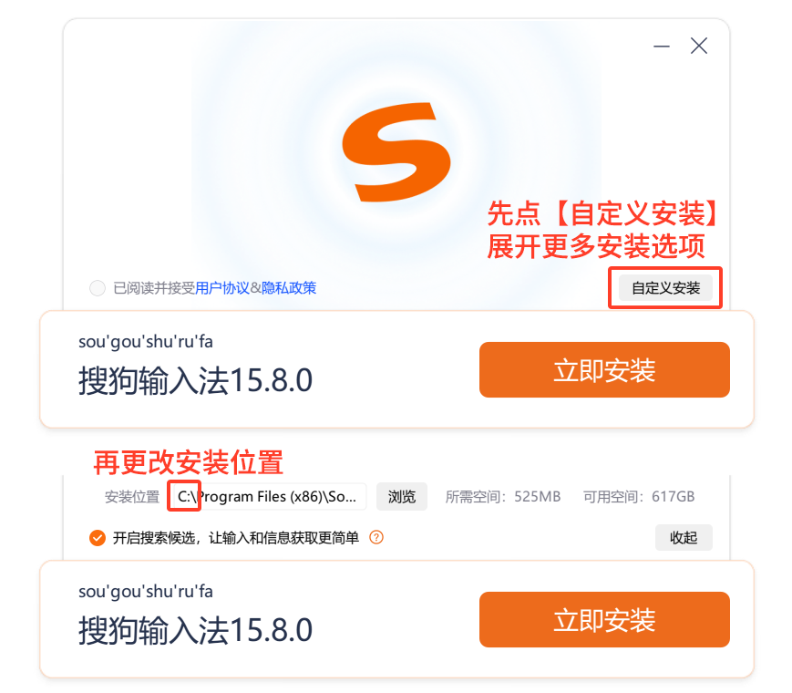

# 软件的寻找与安装


都说电脑离不开软件，可是软件的寻找和安装并非易事——从哪里下？怎么下？下完怎么装？装完怎么办？什么，软件要收费？破解是什么？……这一章将对国内互联网环境下 Windows 软件的下载、安装和配置做一个简单的介绍。看完本章，你或许可以找到下面这些问题的答案，并慢慢对「怎么寻找软件」有一个初步的了解。

- 我想下载某款软件，我应该去哪里找这软件？
- 网上全是病毒和垃圾软件，我应该怎么样最大程度保证自己电脑的安全？
- 为什么软件下到手还要安装？有的还要破解？为什么这么麻烦？
- 电脑里不是有个「Microsoft Store」吗？为什么那里面大多数软件都找不到？



直到今天，Windows 系统下依然没有一个广泛使用的集中化「应用商店」。与我们使用手机不同，在电脑上，我们若想安装某个软件，多数情况下需要到互联网上寻找软件的「安装包」，再自行将软件安装到电脑上来使用。

这一章，我们将具体介绍如何从网上的万千垃圾软件中下载我们需要的软件，以及软件安装和配置的一些技巧和注意事项。

## 安装与安装包

在 Windows 系统上，软件是通过「安装包」来安装到系统上的。如果把软件比作一棵树，那安装包就是这棵树的种子，我们需要借助安装包将软件「种」到电脑上，这个过程就是「安装」。为什么需要安装包，而不直接分发应用本身呢？解答这个问题，就有必要稍微了解一下软件在我们的电脑上的安装过程。

在上一章 [文件与文件管理]() 中我们看到，一款软件除了主程序（一个 `exe` 文件）外，还包含一大堆不可或缺的依赖文件和子文件夹，如右下图所示：


安装包的作用之一，便是把上面这一大堆文件按照它们能够工作的结构释放到我们的电脑中的指定位置。而除了「释放文件」之外，安装包还会设置一些文件的打开方式（上一章中提到的那张「表」），并调整一些系统内部的参数。可以说，软件安装的过程，不仅仅是将一大堆文件释放或者说「提取」到系统中的某一个位置的过程，它还会对系统进行或多或少的调教与更改。这就是安装包存在的意义——它帮助我们完成了这复杂的安装过程。

## 如何上网寻找软件的安装包

下面我们来探讨如何上网寻找我们需要的软件的安装包。

### 优先考虑：官方网站

当要获取一款软件时，我们首先应该考虑的是它的官方网站，即「官网」。比起在其他地方下载软件，从官网下载软件能最大限度地保证你所下载的东西是干净的。

然而，**搜索引擎中存在大量广告，且为了吸引点击量而常常放在前面，所以搜索结果中靠前的结果并不一定是官网**。同时，**还有很多网站会提供图标、名称与原版软件极为相似的「高仿软件」，稍不留意，我们就会误入它们的圈套**。例如，我们想要下载办公软件 WPS Office（简称 WPS），直接在某搜索引擎上搜索「WPS 下载」，我们会得到这样的搜索结果：


如上图，我们搜索「WPS 下载」，结果中：

- ➊ 是重庆某公司提供的广告。该公司是一个第三方的软件下载平台，我们无法确保自己能在该网站上下载到原版的 WPS。
- ➋ 和 ➎ 是「软件中心」「下载站」类网站。与第一条一样，我们无法确保其能够提供原版软件，也难以确保其不会捆绑安装我们不需要的软件。
- ➌ 是成都某公司提供的广告。首先它提供的产品并非 WPS 而是「Office」，其次该平台出售的 Office 软件是否取得微软官方的正版授权也值得商榷。
- ➍ 才是 WPS 的官网。注意看它的网址以 `.wps.cn` 结尾，这是 WPS 的官方网站。

鉴别一个网站到底是不是官网，我们主要可以观察这么几个地方：

- 看网址。我们主要关注网址结尾的那一部分（称为「域名」），它一般都是企业或者软件的名字。例如：
    - WPS 的官网是 `wps.cn`。
    - QQ 和微信的官网是 `qq.com`。
    - 网易云音乐的官网是 `163.com`。
    - Steam 的官网是 `steampowered.com`[^steam]。
    - ……
- 排除法。没有哪个软件厂商的名字是叫做「✕✕软件站」「✕✕下载站」「✕✕软件园」的。带有这些名字的**全部**是第三方下载站。
- 语义判断。那些提供广告软件的网站，为了规避法律风险，标题通常与我们搜索的关键词没有任何实质上的联系——我们不妨再看上面的搜索结果中的前几条广告，会发现它们通常名不副实，如「办公软件」「Office」，而非我们要找的「WPS」。**此外，一些提供「高仿软件」的网站会在原版软件名称前后加上一些修饰词，比如「Steam <u>管家</u>」「Bandizip <u>安装助手</u>」等，以此混淆视听**。

[^steam]: 如果你想快速去到 Steam 的官网，可以直接访问 [s.team](https://s.team)。

当我们下载的软件是国外软件时，这一问题会变得更加严重。假设我们想下载国外著名游戏平台 Steam 的客户端，我们在搜索引擎上搜索「Steam 下载」，得到的结果如下：


作为一款国外平台，图中 ➊、➋、➍ 和 ➐ 的由国内公司提供的内容显然都不可能是官网。而对于 ➌ 和 ➎，虽然它们看起来好像是 Steam 官方网站，但请注意它们的介绍中都含有「手机版」字样，而 Steam 是用来购买电脑游戏的平台（不过 Steam 确实有手机版，用于在手机上浏览和购买游戏等），同时这两个结果的域名也并非 Steam 官方的 `steampowered.com`。事实上，只有 ➏ 所对应的 `store.steampowered.com` 网址，才是 Steam 真正的官网。

再以著名的开源录屏与直播软件 OBS Studio（简称 OBS）为例。我们搜索「OBS 下载」，会得到下面的搜索结果：


根据内容提供方的名称，我们很容易可以排除 ➊、➋、➌、➍ 和 ➐ 这些国内公司提供的广告。至于 ➑，注意它的域名以 `.cn` 结尾——这是我国的顶级域名，自然不会被 OBS 这样一个国外开源软件的官网所用。➒ 的网站名称为「✕✕下载」，说明该网站是一个「下载站」而不是软件的官网。实际上，OBS 的官网域名是 `obsproject.com`，搜索结果中 ➎ 和 ➏ 两项为官网。

进入软件的官方网站之后，我们搜索「全部产品」「软件下载」之类的选项，就可以找到我们所需要的软件的安装包。对于那些支持多种不同操作系统的软件，**我们需要选择包含「Windows」或「Win」字样，或扩展名为 `exe` 的选项**。如果软件还有「32 位」「64 位」，或者「32-bit」「64-bit」以及「x86」「x64」之分，我们还需要查看自己操作系统的类型。打开系统设置，选择【系统】→【系统信息】（Windows 10 则是【关于】），在【设备规格】下找到【系统类型】一栏，然后根据下表选择合适的下载项。

| 系统类型                           | 建议选择                                 | 备注                                                                                                               |
| ---------------------------------- | ---------------------------------------- | ------------------------------------------------------------------------------------------------------------------ |
| 32 位操作系统, 基于 x86 的处理器   | 32 位软件（32-bit、x86、i386、win32）          | 只能下载 32 位软件                                                                                                 |
| 32 位操作系统, 基于 x64 的处理器   | 32 位软件（32-bit、x86、i386、win32）          | 只能下载 32 位软件                                                                                                 |
| 64 位操作系统, 基于 x64 的处理器   | 64 位软件（64-bit、x64、x86-64、amd64、win64） | 优先下载 64 位软件，但 32 位软件亦可使用                                                                           |
| 64 位操作系统, 基于 ARM64 的处理器 | ARM 64 位软件（arm64、aarch64）                 | 此类 CPU 比较特殊[^arch]，优先下载含有 ARM 字样的软件，若无，则尝试使用 64 位软件，若无法使用则再尝试 32 位软件 |

[^arch]: 有关这些的具体细节，请参见本书超越篇的 [「程序」是怎样炼成的]() 一章。

> 一些软件可能有「安装版」和「便携版」之分——前者像普通软件一样，需要安装使用，而后者不必安装，下载后可以直接运行（可能需要解压）。一般来说，安装版文件名含有「setup」字样，而便携版可能有「portable」字样。一般我们建议下载安装版。

例如，在 WPS 官网下载 WPS 软件：


或是在 OBS Studio 官网下载 OBS Studio 软件：


### 直面深渊：第三方软件站

> [2022 年央视「3·15 晚会」对一些软件下载站的捆绑下载行为进行了曝光](https://www.bilibili.com/video/BV1JZ4y167m8)。在被曝光之后，各大下载站均紧急撤下了「高速下载」这样的诱导性下载按钮。目前，在这些第三方下载站上，带有诱导性质的「安全下载」按钮仍然存在，不过会标明「需通过✕✕下载」。
> 

在某些时候，我们确实找不到一个软件的官网，或者因为这样那样的原因不能去官网下载某个软件。这时，我们将不得不直面深渊，进入各种各样的第三方下载站下载软件。

实际上，在这些网站上，我们一般是可以下载到想要的东西的——前提是，你足够小心，不点到那些所谓「高速下载器」「P2P 下载器」的虚假链接，也不点击到任何诱导下载的广告。下面我们会手把手实操这个过程。

假设我们要下载「OBS Studio」这款软件。我们在网上搜索「OBS 下载」，并主动避开那些广告，找到了这个名为「✕✕之家」的第三方软件站：


重点来了：进入这个网站后，**请避开所有【高速下载】【极速下载】【安全下载】【P2P 下载】这样的按钮**，并且不要点击任何广告。相反地，我们选择【普通下载】【本地下载】这样的按钮：


点击之后我们会跳转到这样一个「下载地址」的页面。同样地，我们不要点击「优先使用✕✕管家下载」之下的所有链接，而要点击「普通下载地址」下方的【通用网络下载】等链接：


我们使用下方【通用网络下载】得到的文件是一个体积约 133 MB 的压缩包，符合这个软件的体量。将这个压缩包解压，我们就能得到 OBS Studio 的安装包。


而使用上方所谓【安全下载】下载到的文件是：


体积只有 20.3 MB，而且是一个不明的「可执行文件」（`exe` 文件）。与前面相比，这个文件就显得很可疑了。事实上，它不是 OBS Studio 的安装包，而是一个名不见经传的「✕✕管家」的安装包。这个「管家」可能会恶意地给我们的电脑安装许多来历不明的软件。我们用杀毒软件卡巴斯基扫描它，结果如下：


而卡巴斯基提供的网页版说明，则对这种威胁有更详细的解释：


在本章的最后，我们会向你展示这个使用【安全下载】得到的可疑文件究竟是什么。

### 另辟蹊径：软件公众号及其他小众渠道

另一种「另辟蹊径」的方法，是通过一些「小众渠道」，例如一些分享软件的微信公众号来下载软件。这不失为一种好方法——那些人们口口相传的优质公众号一般会把常用软件的干净安装包分门别类地整理分享。与各种「下载站」相比，它们帮我们免去了下载到恶意软件的烦恼。

但是，这种公众号一般软件不是特别多——你总有一天没法从它们那里找到想要的软件。此外，这些公众号一般使用各种网盘平台来分享文件，而这些网盘平台通常会对非会员用户限速，这必然对使用体验有一定影响。不过总的来说，这依然是一种值得推荐的方法。

> 对于这类公众号，我们并没有做太多的收集，因此无法在此推荐。你可以在哔哩哔哩、贴吧、微博等网站自行寻路。
> 

### 他山之石：第三方的「软件管家」

除了手动在网上——无论是在官网，从第三方下载站，还是从那些整理网站的公众号上——下载软件的安装包之外，有一些第三方的「软件管家」也能帮助我们找到所需要的软件。这些软件管家有的是电脑厂商所维护的，例如「联想软件管家」「华为软件管家」；有的是一些第三方企业所维护的，比如「360 软件管家」「腾讯软件中心」等。

一般来说，那些由电脑厂商所维护的软件管家，往往相对干净、不带「全家桶」式的捆绑；而那些第三方企业维护的软件管家，一般都会或多或少地提示用户安装它们的配套软件。比如，如果你使用 360 软件管家，那它可能就用某些手段提示用户去安装 360 安全卫士以及一系列其他软件。因此，你可以根据自身机器的实际情况，按需选择这样的软件管家类工具。

此外，在这些「软件管家」类工具中，我们也会遇到上文所提的广告和「冒牌货」现象。例如，下图是在某软件管家中搜索「Bandizip」（一款压缩工具，详见 [压缩文件与压缩工具]()）时的结果，其中前四项均不是我们所需要的软件（甚至还标榜「无忧退」「金牌开发者」，而我们真正需要的却没有任何标注）。因此，在使用各种软件管家时，我们仍然必须擦亮双眼，谨防被骗。


## 安装软件

假设经过与各种网站的斗智斗勇，你成功地下载到了某款软件的安装包。取决于软件，你下载到的可能是下面三种文件中的某一种：

- 一个光秃秃的 `exe` 文件或者 `msi` 文件。我们直接双击这个文件就能启动安装进程。

    

- 一个压缩包，例如 `zip` 或 `rar` 文件。我们需要解压缩这个压缩包到某处，然后在解压出来的文件中找到「`setup.exe`」「`install.exe`」等名字的程序双击打开。
  
    

- 一个扩展名是 `iso` 的文件。我们右击这个 `iso` 文件，选择【打开方式】→【文件资源管理器】，然后在弹出的新窗口中找到「`setup.exe`」「`install.exe`」等名字的程序双击打开[^1]。
  
    


> 至于那些「绿色版」或「便携版」软件，它们没有「安装」这一过程。要么是单单一个 `exe` 文件，点开就能用；要么以压缩包形式出现，但是「开箱即用」——解压后直接运行主程序就可以用，就像下面这样。
> 
> 

启动安装器后，我们一般按提示【下一步】操作即可完成安装。但是此过程中也要留心！跨过了「高速下载器」的坎，可不要又掉进了捆绑软件的坑。**有一些软件在安装程序中也会像「高速下载器」一样勾选了一些捆绑软件、浏览器主页等选项**，这些选项可能出现在安装过程中的**任何阶段**，一定要注意取消勾选再进行下一步。

在安装过程中还需要特别注意的一件事，便是「软件安装位置」，即安装包释放软件自身各种文件的位置。

在上一章中我们提到过，如果 C 盘空间有限，就不要把大量的数据放在 C 盘。对于软件来说，同样有类似的情况：如果你的 C 盘空间本身并不大（例如，小于 300 GB），将大量的软件放在 C 盘，会使得 C 盘的空间压力随着使用时间的增长而显著增大。在这种情况下，安装到 D 盘或其他磁盘分区是更好的选择。不过，如果你的电脑总共只有一个分区（C 盘），那就不必考虑这个问题。

> 在 [认识你的电脑]() 一章介绍硬盘时，我们说有些电脑会混合使用固态硬盘和机械硬盘。一般这种情况下，C 盘位于固态硬盘上，而后续的分区有可能位于机械硬盘上，你可以在任务管理器中查看分区和硬盘的对应关系。在这种情况下，我们建议将常用软件安装在 C 盘或者固态硬盘的分区上。

一般来说，软件默认会把自己释放在以下两个路径之一，它们分别是「64 位」和「32 位」软件的默认安装位置（也可能没有 `<厂商名字>` 一层）。

```
C:\Program Files\<厂商名字>\<软件名字>\
C:\Program Files (x86)\<厂商名字>\<软件名字>\
```

在上一章中我们提到了「快捷方式」，在你的电脑桌面上就有许多软件可执行文件的快捷方式。右键它们选择【属性】，你就能看到这些已经安装的软件的位置。看看它们中的一些是不是在 `C:\Program Files\` 或者 `C:\Program Files (x86)\` 下？

> 往上面两个位于 C 盘的路径放东西是需要管理员权限的（见 [基本维护和安全防护]()）。为了避免提权，有些软件会默认安装到你用户文件夹下的 `AppData` 文件夹，即
>
> ```
> C:\用户\<你的用户文件夹名>\AppData
> ```
> 
> 相比于前面的位置，在 `AppData` 中放东西不需要管理员权限。但是，`AppData` 文件夹默认是隐藏的，并不好找，这可能给我们管理软件安装位置带来一些麻烦。

`Program Files` 和 `Program Files (x86)` 这两个文件夹，即系统预置的两个用来安装软件的文件夹，都位于 C 盘根目录下。如果你希望把软件安装到 D 盘来缓解 C 盘的空间压力，这里推荐一个简单好用的方法：直接将默认路径中的 `C:` 改成 `D:`。例如：

```
D:\Program Files (x86)\Tencent\QQ\
```

这就是在 D 盘安装 QQ 软件的一个很合适的路径，如下图所示。这样做能保持一个比较干净的目录结构。你的 D 盘下会因此多出 `Program Files` 和 `Program Files (x86)` 这样的两个文件夹，用来专门在 D 盘安装软件，也便于你自己管理。


有一些软件的安装包不是「下一步」型的，而是直接有一个【立即安装】的按钮，如下图。一般这种情况，可以展开「自定义安装」之类的选项，然后更改软件的安装位置。




注意：如果你想把软件安装到除 C 盘以外的地方，那么按上面的做即可；如果你想把软件安装到 C 盘，那么请不要动安装路径；如果你想把软件安装到 C 盘里面的其他地方，我劝你别。

当然，之前提到的装在 `AppData` 下的软件同样可以照猫画虎地「改 C 为别的」来安装到其他分区，但我们不推荐这样，因为会增加管理难度。



## 软件收费、破解，以及自由与开源软件

很多软件是需要购买的，包括 Windows 系统本身（一般你购买电脑时，电脑厂商已经帮你出了买 Windows 这部分钱）。常见的专业软件，从平面设计领域的 Adobe 家族的 Photoshop、Premiere Pro，工程领域的 Autodesk 家族的 AutoCAD、3ds MAX，到开发领域的 JetBrains 家族的 IDEA、PyCharm，甚至于我们每天都在用的 Word 和 PowerPoint，这些软件全部都需要付费购买。下图是购买正版 Photoshop（俗称的 PS）软件的页面——定价 888 元一年。


而由于这样或那样的原因，我们在实际生活中，或多或少都在「没有付费而『白嫖』这些软件」。这是因为我们使用的这些软件被「破解」了。破解之后，软件的计费功能失效，原本收费的软件通过某种方式变成了可以免费永久使用的软件。大体上，网上流传的破解软件一般有这么两种形式：

- 一种是已经完全破解了的收费软件。这种软件已经经过修改，安装包往往也是民间自行制作的，可以直接走正常流程安装，安装后打开就可以无限制地使用。例如一些破解版的 Adobe 软件套装。
- 另一种是使用收费软件的试用版本安装软件，再外加「破解补丁」。这种软件的安装包依然是使用官方原版的安装包，安装完成之后，通过某种「打补丁」的方式来外挂、欺骗这官方原版的软件，让原版软件以为用户已经购买，从而解锁全部的功能并让用户无限制使用。常见的 Office 软件的破解、Autodesk 软件的破解都属于此类。

使用破解软件终究是一件上不得台面的事情。一般来说，如果你使用破解软件作为私下的个人使用、学习，软件厂商有可能不会进行追究。**但是，如果你将破解软件（或者说，盗版软件）用于商业用途，那必然迟早会受到追究**。尽管实际生活中软件厂商维权的积极程度各有差异，尽管我们可能会因为各种各样的原因不得不去使用破解软件，但我们仍然呼吁大家支持正版软件，万不得已使用盗版、破解软件时，仅作为非商业的个人和学习用途。

与那些用来盈利的商业软件不同，「自由与开源软件」（Free and Open Source Software，简称 FOSS）不仅是免费的，而且还允许用户在一定条款之下自由地共享、分发，甚至是修改它们的源代码，来基于它们创造出新的软件。这使得自由和开源软件能够集思广益，实现「众人拾材火焰高」：软件的发展离不开社区的贡献，而社区又随着软件的发展而更加壮大。近些年来，自由和开源软件作为一种新浪潮，在越来越多的领域开始出现，并开始动摇过去一些不可或缺的商业软件的地位。

**《你缺失的那门计算机课》相信自由与开源软件的力量，始终支持它们的发展**。在本书的创作过程中，我们就使用了大量的自由与开源软件来进行内容创作，如使用 [Inkscape](https://inkscape.org/) 绘制所有示意图，以及使用 [GIMP](https://www.gimp.org/) 处理原始照片。我们鼓励大家在实际使用电脑的过程中，多多尝试、使用一些优质自由与开源软件。在本书的后续章节中，我们会推荐一批工具类软件，其中就有许多自由与开源软件的身影。

## UWP 应用和 Microsoft Store

微软早在多年前就意识到，Windows 系统下一直缺少一个官方维护的、像苹果的 App Store 那样集中化的软件中心，用户下载软件只能像上文那样上网去苦苦找寻。彼时的微软公司正打算进军手机行业，想要和安卓与 iOS 形成三足鼎立之势。微软于是心想：不如弄一种新的软件格式，让软件不仅能在我们的 Windows 电脑上运行，还可以在手机上运行；再顺带弄一个全是这种新格式软件的应用商店，可谓一举两得。于是微软就这么干了：这种新格式叫做「通用 Windows 平台应用」（Universal Windows Platform app，简称「UWP 应用」），而这个应用商店则是我们电脑里的「Microsoft Store」：


可是，时过境迁：微软终究没有能在手机市场打下一片江山，微软做的手机系统最终在 2020 年完全谢幕。或许是微软心想，这「UWP 应用」的先进构想和 Microsoft Store 不能开了头就没了尾，因此它们直到今天依然被保留在 Windows 系统之中。而到了今天，UWP 应用越来越少，Microsoft Store 也开始包装普通应用，向着更加通用的「应用商店」转型。

如果你有打开过 Microsoft Store，你会发现，尽管其中不乏我们日常生活中的常用应用，但亦有许多名不见经传甚至是「山寨」的应用，利用与知名应用相似的图标和名字来吸引点击和下载。


事实上，这就是 Microsoft Store 的现状：作为 Windows 上的官方「软件中心」或者「应用商店」，它收录的应用相当不全，应用质量也不理想。微软在 Microsoft Store 和 UWP 应用上充满了雄心壮志，却最终落得今天的结局。

## 演示：【安全下载】到底下载了什么



警告：请不要在自己电脑上尝试运行这种来路不明的可执行程序！



在上文中我们演示下载「OBS Studio」时，如果点选了【安全下载】，会得到这样一个只有 20 MB 的可执行文件：


若是双击运行这个文件，Windows 会弹出这样一个窗口，询问【你要允许此应用对你的设备进行更改吗？】这个窗口称为「UAC 弹窗」，在下一章 [基本维护和安全防护]() 我们会详细介绍它。假设我们以为这个可执行文件就是 OBS Studio 的安装器，自然就放心地选择了【是】。这时，眼前自动弹出了进度条，看似正在为我们安装 OBS Studio：


然而，窗口的左下角提示着我们事情并不简单。这个程序并没有为我们安装 OBS Studio；相反，它安装的是「✕✕管家」，同时还会更改我们浏览器的主页为「安全导航」。在安装进程结束后，我们的桌面上多了两样东西：一是我们通过【通用网络下载】就能得到的那个 133 MB 的真正 OBS Studio，另一个，就是刚刚安装的 ~~图标和 Microsoft Store 神似的~~「✕✕管家」：


显然，这「管家」并不是我们需要的东西，而那个 OBS Studio 真正的安装包，我们原本只需在网页上就能直接下载，经由这么折腾一通，如同「脱裤子放屁」。

比起脱裤子放屁，更危险的事情是：我们并不知道那些捆绑安装而来的软件，是否会继续静默地在我们不知情的情况下，继续安装更多我们不想要的软件。尽管这个「管家」经我们观测并没有在短时间内下载大量可疑软件，但在 2022 年 3 月「3·15 晚会」整治乱象之前，我们曾记录过一款在类似网站上下载到的「光速下载器」的行为。在它的界面上，我们可以看到右方有四个捆绑软件的复选框被默认勾选：


如果我们没有取消上面的这些勾选，那会是什么结局呢？我们在当时也作了记录。



警告：请勿模仿！




可以看到电脑已经被乱七八糟的软件占领。

虽然在那场「3·15 晚会」过后，诸多软件站的行为已经变得收敛许多，在上面的例子中所展示的【安全下载】，看似也仅仅是捆绑安装了一款「✕✕管家」。不过，这并不代表着我们就可以放松警惕——在互联网的世界中，我们永远是自己的第一安全责任人。

## 练习

1. 下面画面中，点击哪个按钮最可能不会下载到垃圾？
    
    
    
2. 下面画面中，点击哪个按钮最可能不会下载到垃圾？
    
    
    
3. 下面画面中，怎样操作最可能不会下载到垃圾？
    
    
    
4. 下面界面中有几个捆绑勾选？
    
    
    
5. 下载「微信电脑版」，下面三个文件体积中哪一个最可能不是垃圾软件？
    1. 640 KB
    2. 1.1 MB
    3. 150 MB
    {.alph}
6. 下面四个软件安装路径，谁最合适？其他的不合适在哪里？
    1. 安装 Steam：`C:\Program Files\steam`
    2. 安装微信电脑版：`D:\Program Files (x86)\Tencent\Wechat`
    3. 安装 Vivado：`D:\软件\Xilinx\Vivado`
    4. 安装网易云音乐：`桌面\我的软件\Cloudmusic`
    {.alph}
7. 假设某个软件已经被安装在了一个地方，我现在想把这个软件放到另一个地方，可以直接剪切移动整个软件的目录到另一个地方吗？
8. 查看自己电脑上 5 个不同软件的安装位置，并打开它们的安装目录，看一看里面的结构。


[^1]: 当你这样打开 `iso` 文件后，这个文件会临时被「映射」成电脑里的一个新「分区」，打开【此电脑】就能发现它。在你安装完成后，可以打开【此电脑】，右键这个分区选择【弹出】来让这个分区消失。