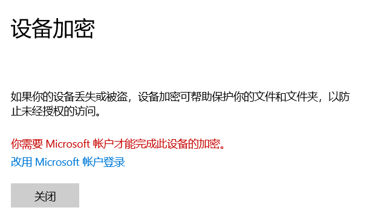

# 用户与微软账号


本章我们介绍 Windows 系统中的「用户」概念，以及微软账号的相关事项。看完这一部分，你或许可以找到这些问题的答案：

- 为什么我自己的电脑还有「用户」？
- 什么是微软账号（Microsoft 账户）？我为什么被要求注册 / 登录微软账号？
- 在 [基本维护和安全防护]() 中提到的「UAC 弹窗」和「以管理员身份运行」究竟是什么？
- 谁是「系统管理员」？
- 登录微软账号有什么好处？
- 要是我想改掉自己用户文件夹的名称该怎么做？



「用户」的概念是现代计算机操作系统的一个重要组成部分。尽管在今天，绝大多数电脑都仅为个人使用，「多用户」的理念似乎正渐渐模糊，但我们依然有必要了解这套机制的运作过程。[^1]

## 「用户」概念的产生

三十年前，「电脑」对于人们来说还是可望而不可得的「奢侈品」。在当时，只有在少数学校和科研院所，才能看到数量有限的电脑。在这样的情况下，自然免不了多人共用一台电脑来学习和工作。为了隔离每个人在电脑上保存的文件和偏好设置，「用户」这个概念便应运而生。

如同 QQ 之类的社交软件账号一样，在有「用户」概念的系统中，我们都可以在一台电脑上建立一个或者多个「用户」。在每次开机启动时，我们可以在用户列表中选择合适的身份身份来「登录」（下图左下角，图中选择的用户是「hans」）。


在这样的系统中，每个用户拥有自己独立的「用户名」和密码，每个用户在自己的用户文件夹（参见 [文件与文件管理]() 的「用户文件夹」相关章节）内保存的文件都对其他用户不可见，且每个用户设置的桌面壁纸、颜色风格等都互不影响。在多用户系统的加持下，人们成功地实现了「一台电脑，多人在不同时段共用」这一目标。

时过境迁，电脑逐渐普及，成为了每个人工作和生活的必需品，那种「多人不得不共用一台电脑」的日子也渐渐成为历史[^multiuser]。然而，「多用户」这一思想却一直流传下来，形成了今天电脑系统的标配。尽管今天的个人电脑大都真的只是「个人」电脑——由一个人使用，多用户系统依然在我们的系统中得以保留，并在权限控制等特殊方面起着非常重要的作用。

[^multiuser]: 不过，在学校、企业、科研机构等场所，「多人共用一台高性能电脑」的情况仍然非常普遍。这种高性能的电脑通常被称为「服务器」，一般保持 24 小时运行，人们通过「远程连接」的方式来使用它们。服务器既有运行 Windows 系统的，也有运行 Linux 系统的，视人们的需求而定。

## Windows 操作系统中的「用户」

在我们第一次启动 Windows 系统（参见 [笔记本新机「开荒」指南]() ）时，系统会要求我们新建一个用户，并设置它的用户名和密码，它将作为你自己所使用的用户[^2]。打开 `C:\用户\` 目录，你可以看到一个以它命名的文件夹，以及一个 `公用` 文件夹：


在那个以你的用户名为名的文件夹中，放置着你的用户文件和诸如「文档」「下载」等文件夹（如果你没有按照 [文件与文件管理]() 中介绍的过程去迁移它们的话）。可以想象，假如这台电脑上还有另外的几个用户，那么在 `C:\用户\` 将罗列着多个用户的文件夹。每个用户都只能打开属于自己的那个文件夹以及 `公用` 文件夹，从而实现了「多个用户资料的隔离」与「用户间资料的共享」。

在前文我们已经讲过，「文档」「下载」这样的文件夹是微软好心留给我们，帮助我们整理文件的。现在你应该能理解这样的「好心」了：Windows 本身就是一个为多用户设计的系统，从其他用户的角度考虑，用户的文件只有放在 `C:\用户\<用户名>\` 这里才比较安稳——至于什么「这里是 C 盘，不适合放文件」，那微软才不管呢。

## 用户与权限，以及 Administrator

上文有说，今天保留多用户机制的一个很重要的原因，就是它能够更好地实现系统权限的分离。还记得 [基本维护和安全防护]() 中提到的权限相关的知识吗？在这里，我们会更深入地探讨这个话题。

大多数时候，我们会接触到两层权限——「普通用户权限」和「管理员权限」，顾名思义，后者的权限肯定高出不少。普通用户权限这一层级，无法直接在 C 盘写入文件，不能往 C 盘的全局软件目录里安装、卸载软件，更不可更改系统关键设置……这些都是需要管理员权限才能做的事情。

在 Windows 中，我们自己创建的用户有两种——「普通用户」和「管理员」。显然，普通用户只有普通用户权限这一层级的权限，但与直觉上可能相悖的一点是：管理员可以在普通用户权限和管理员权限两层之间切换。不过，第一次开机时创建的那个用户，它一定是管理员，毕竟新机器没个管理员显然是不行的。然而，即便是管理员，在正常使用电脑时，也处在普通用户权限的层级下。而一个程序具有的权限等级，要看运行它的用户而定。我们直接打开一个程序时，由于处在普通用户权限的范围内，程序的权限也就相当有限。

但管理员若需要进行更高级的操作，该怎么办呢？Windows 为我们提供了一套「提升权限」的机制。既然要执行高级操作，那势必就需要管理员权限层级才能行动。在 [基本维护和安全防护]() 中，我们说「右击一个程序选择【以管理员身份运行】，就可以赋予程序提升的权限」，这一操作的实质，就是将自己的权限提升到管理员层级。那个「UAC 弹窗」的本质，就是某个程序试图让我们提升权限来执行它自己时，Windows 系统弹出的警告。一旦选择【是】，我们的权限就临时变更为管理员层级，而对应的程序则由此获得了管理员的权限。


有时，我们会遇到一些程序报错，提示【请联系你的管理员】【请联系 Windows 管理员】等信息。这种说法是多用户时代的遗留——彼时，为防止普通用户不小心破坏电脑的关键部分，供多人使用的电脑往往会禁止普通人「提权」，而能够提权的用户由专人管理。所以，那时的普通用户，若需要安装一些软件，或者需要调整系统的关键设置，就需要线下联系他们来进行。这就是程序提示「请联系管理员」的原因。今天，我们的个人电脑不再是「共享电脑」，而程序所称的「管理员」，就是我们自己。

到此为止，我们都在说「我们自己创建的用户」。但其实系统之中，除了我们自己创建的用户之外，还存有一个**隐藏**的「超级用户」——Administrator（直译是「管理员」）。这个用户和我们创建的管理员不同，它**只有一种权限层级——管理员权限**。所以，这个用户无论何时都有非常高的权限：更改系统关键设置、安装 / 卸载软件、创建新的用户、删除别的用户……甚至还可以「窥探」其他用户的文件。由于 Administrator 的权限太高、法术太强，Windows 系统便把它「封印」起来——它不可见、不可登录，甚至不可感知。而它的作用，一般是在我们自己的账户出现意料之外的故障时，用来救急。

> 在过去盗版、修改版系统横行的年代，许多国内盗版和修改版的 Windows 系统，会强行解除 Administrator 用户的「封印」，并把它作为系统的默认用户。尽管这样，我们将不再见到有些恼人的「UAC 弹窗」（因为此时我们总是以管理员权限运行程序），但这时，我们相当于头上悬着一把「**[达摩克利斯之剑](https://baike.baidu.com/item/%E8%BE%BE%E6%91%A9%E5%85%8B%E5%88%A9%E6%96%AF%E4%B9%8B%E5%89%91/231450)**」在系统中四处穿行，其危险性可想而知。

## 本地账户和微软账号

你用过手机上的「云服务」吗？近年来，诸如 iCloud、华为云服务、小米账号这样的云服务在一定程度上提升了我们使用手机的便利程度。事实上，微软在 Windows 系统上也有着类似的服务：我们可以将系统中的用户和在线的「微软账号」绑定，实现诸如同步等的各种附加功能。

为了和「已经绑定了微软账号的用户」区分，我们把原先的传统的「用户」称为「本地账户」。将本地账户链接到微软账号后，微软账号的登录密码就会变成我们开机使用的密码（除此之外还可以设置额外的数字密码），微软账号的用户名就变成了我们**显示在屏幕上**的用户名[^3]。如果你原本使用的是本地账户，打开【设置】→【帐户】，选择【改用 Microsoft 帐户登录】，按提示登录或者注册一个微软账号即可完成绑定。


我们建议读者在自己的电脑上以微软账号登录。将自己的本地账户绑定微软账号有着这些好处：

- 更多的用户相关功能，例如 Windows Hello 解锁。
- 电脑内的一系列微软自家 app，例如 Microsoft Store 和 Xbox 都将自动登录。
- 主题、壁纸和基本设置同步。这意味着，如果你有多台 Windows 电脑，那么设置会在这些设备中同步（可以手动关闭）。
- 跨设备剪切板。如果你有多台 Windows 电脑，那么在一台电脑上复制的东西（理论上）可以在另一台电脑粘贴。
- ~~你甚至可以为你的微软账号设置一个好看的头像，让电脑在开机时赏心悦目一点。~~
- ……

## 设备加密与微软账号


注意：打开【此电脑】，观察你的磁盘图标上是否有挂锁图案。若有，请务必阅读这部分内容。




如果在【此电脑中】，你看到了带挂锁图案的磁盘图标，说明你的电脑启用了「设备加密」。一些电脑在出厂的时候会启用这个功能。这功能启用后，硬盘上的所有数据都是加密存储的，而那用来解密的，**长达 48 位字符**的密钥，存储在电脑内部的一个安全芯片中。这个安全芯片会在电脑开机时检查系统安全情况——例如，开机过程中有无恶意软件作祟，电脑是否有被恶意开启并篡改过设置等。当这个芯片确认安全后，它就会向系统通报密钥并进行解密。整个过程中，用户看不到密钥。

在某些极端情况下，这个芯片可能产生「误判」。一旦它认为启动环境不安全，就会拦截启动过程，不再向系统通报密钥。这时你将会在开机时卡在这个画面：


可是，我们作为普通用户，从来没见过那长长的「密钥」的真面目啊。这时，如果你使用过微软账号来登录系统，那么你不必担心找不到这个密钥，微软会自动帮你把它备份到云端。你只需要打开 [https://account.microsoft.com/devices/recoverykey](https://account.microsoft.com/devices/recoverykey) 这个链接，按提示登录微软账号，即可找到自己设备的 48 字符长的密钥。~~虽然但是，谁愿意手打那么长的密钥啊。~~


如果你在新机配置时没有登录微软账号，电脑上的设备加密可能会处于「还差最后一块拼图」的状态，此时的磁盘图标会出现上图那样的黄色警告标志。而打开【设置】→【更新和安全】→【设备加密】，则会看到「你需要 Microsoft 帐户才能完成此设备的加密」的警告信息。



没错，这「最后一块拼图」就是将本地账户连接到微软账号。但此时，系统有可能已经完成了磁盘的加密工作，也就意味着电脑在使用时依然有概率陷入「输入恢复密钥」的尴尬场面。但因为你的账户不是微软账号，也就无从查找那「恢复密钥」，而设备加密采用的加密算法非常复杂，从理论上不可能被强行破解，这时我们就只能尝试多次重启、排查造成芯片认为不安全的因素来尝试进入系统了。因此，**如果你的电脑启用了设备加密，请务必将本地账户连接到微软账号**！

> 对「加密」与「安全」感兴趣？可以阅读本书超越篇的 [以密码之剑护网安之城]()

## 更改用户文件夹名 *

众……可能不所周知，部分软件（尤其是国外软件）无法正确处理带有中文等字符的路径，导致当账户名存在中文等字符时无法正常工作。或者，你想改掉当初直接登录微软账户留下来的难看用户文件夹名。但是，即便你在【控制面板】→【用户帐户】中改掉你的账户名称，也不会改变账户建立之初就确定下来的用户文件夹名，此时，我们需要额外的操作来更改用户文件夹名。


在着手操作之前。请**一定确保电脑上没有在运行或自动运行的任何云存储服务**（包括但不限于 OneDrive、iCloud、百度网盘等），如果有，请预先停止自动同步或关闭自动启动。

接下来，开始操作！

### 获取当前用户的 SID

SID，即「安全标识符」（security identifier），用于在操作系统中唯一地标识安全主体或安全组。所谓「安全主体」和「安全组」包括了用户、组和计算机账户，换言之，SID 就是操作系统给这台电脑上的所有用户派发的「身份证」，靠着这个「身份证」，操作系统才能识别用户、准许用户访问自己的资源。

既然我们想改变自己用户的信息，那么很显然记下当前用户的 SID 是非常有必要的。按下 `Windows` + `X`，选择【终端】或【PowerShell】，输入 `whoami /user`，回车，即可看到当前用户的 SID。SID 是随机生成的，所以要是看到和下图一样的，不妨去买张彩票？


### 新建一个管理员账户

转到设置 →【帐户】→【其他用户】，点击【添加帐户】，在弹出的窗口中依次点击【我没有这个人的登录信息】【同意并继续】【添加一个没有 Microsoft 帐户的用户】，然后输入你想要的用户名。


默认情形下，新建的用户会是「标准用户」，无法进行提权操作，所以接下来我们要把它改成管理员用户。点击用户列表中刚刚新建的用户，点击【更改帐户类型】，改成「管理员」即可。


### 在新管理员账户下操作原账户的文件夹

注销（事实上是登出）当前账户，切换到新的管理员账户登录。打开任务管理器，切换到【用户】选项卡，**确保那里面只显示当前登录的账户**，若原来的账户还在，则需要重新登回去，确保注销。


确定只有新账户后，打开资源管理器，转到 `C:\用户\` 下，更改原来的账户文件夹名称为你想要的名字。好，我们有了一大进步！


### 修改注册表以匹配新名字



警告：这一步需要非常细心的操作，一定不能出错！



按下 `Windows` + `R`，输入 `regedit`，确定，打开注册表编辑器，转到以下地址（你也可以把这一行复制粘贴到注册表编辑器的地址栏去）：

```
HKEY_LOCAL_MACHINE\SOFTWARE\Microsoft\Windows NT\CurrentVersion\ProfileList
```

接下来是当初记下的 SID 的用武之地了，在左侧 `ProfileList` 文件夹下找到第 1 步记下的 SID，点进去，可见右侧 `ProfileImagePath` 一项正是你原来的用户文件夹路径，**先记下来，下一步要用**。将它的尾部你原来用户文件夹名的部分改成新文件夹名即可。


### 建立新旧用户文件夹间的符号链接



警告：这一步也是重中之重，一定不能出错！



符号链接相当于通用的「快捷方式」，访问符号链接就相当于访问它指向的目标，欲了解更多，可以阅读 [成为空间管理大师]() 一章。所以，建立符号链接的目的就是让那些已有的软件在照旧访问原来的用户文件夹时能够访问到修改后的位置。

按下 `Windows + X`，点选【终端管理员】或【PowerShell（管理员）】等类似选项，用管理员权限来启动命令窗口。输入 `cmd` 进入命令提示符[^4]，输入
```
mklink /d <旧用户文件夹路径> <新用户文件夹路径>
```
譬如在本节插图中的情形下，就输入
```
mklink /d C:\Users\Windy C:\Users\Ventus
```
回车，你就可以在 `C:\用户\` 下看到符号链接了。如果它提示「已存在」，那肯定是你忘记重命名了。

### 尾声

至此，我们要做的工作已经尽数完成，可以继续使用原本的账户了。虽然可能有部分软件中仍然显示着曾经的用户文件夹路径，但不必担心，我们不是建立了符号链接吗？脑海中「翻译」一下就好啦。

不过，仍然有一些事情可能需要我们处理。如果你照 [文件与文件管理]() 中更改了用户文件夹的存储位置，那么，你可能会发现自己的文件不见了，这是因为系统没有为新的用户文件夹路径记录存储位置。虽说文件还在之前改过的存储位置那里放着，但还是需要重新操作一遍更改。

~~以及，你没法建立一个与原用户相同名称的新用户了。~~

## 练习

1. 查看自己的用户名，检查自己是以本地账户登录的还是以微软账号登录的。
2. 检查自己的设备是否有启用设备加密。一般来说，只有部分品牌系列的「商务本」才会默认启用这个功能。
3. 为什么说将 Administrator 作为主用户登录无异于悬着一把「达摩克利斯之剑」？


[^1]: 注意，由于微软的疏忽，Windows 中多用「帐户」一词，然而正确的写法应是「账户」，但本文引用系统中的原始文本时，为忠于原文，未作更改。
[^2]: 如果你在第一次开机时直接登录了微软账号，那么系统会先用你的微软账号的前 5 位作为用户名新建一个本地账户 ~~，然后你就会发现一个巨难看的本地用户名~~，然后迅速将它连接到你的微软账号（参见后文）。整个过程对你来说完全无感。
[^3]: 本地存储的用户名是不会因为绑定到微软账号而改变的。即，绑定前后，打开 `C:\用户\` 看到的文件夹名字是一样的。
[^4]: 为什么不直接用 Powershell 呢？详见 [成为空间管理大师]() 一章。