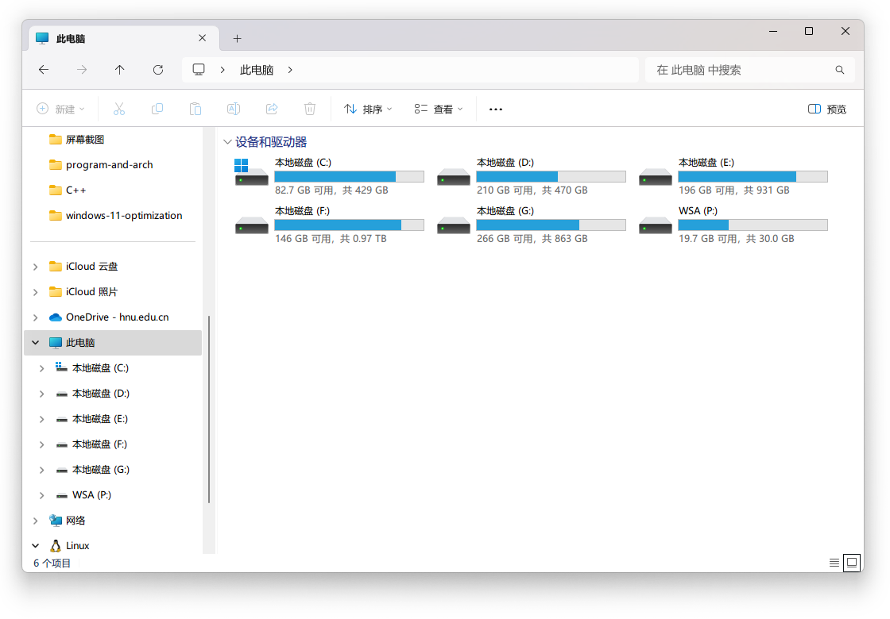
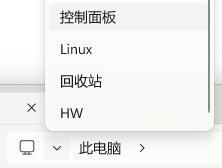
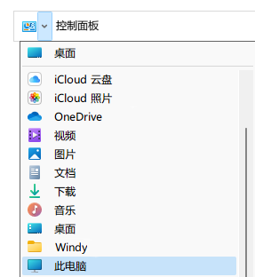
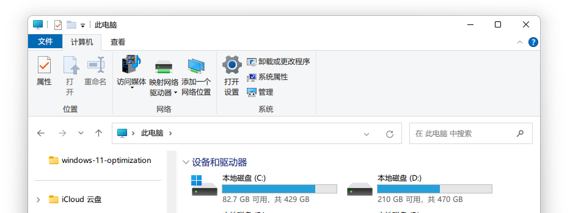

# Windows 11 修整指南


2021 年 10 月 5 日，微软发布了~~又新又好的~~ Windows 11。在那之后，许多品牌的笔记本电脑和台式机开始出厂即预装这款新系统，一些原本使用 Windows 10 的同学也~~在微软的蛊惑之下~~升级到了 Windows 11。

一方面，Windows 11 在外观和部分使用体验上有着不小进步；但另一方面，Windows 11 在很多地方都让人「火大」——性能损失、花式 bug、部分操作反人类……为了让现阶段的 Windows 11 变得更好用一些，我们总结了一些对 Windows 11 系统进行「修整」的方法和技巧，以供大家参考使用。





本章会持续更新，其中的内容会随着时间推移而有所增删。



**注意：由于 Windows 更新频繁，这部分介绍的各种技巧都可能随时失效。**



**警告：这部分介绍的技巧中，有不少都需要更改系统底层的一些选项，若操作不当可能造成意料之外的后果，因而操作前请三思。**


## 将任务栏按钮移到左下角

不同于以往的 Windows，Windows 11 的任务栏按钮默认在任务栏的正中间，就像这样：


如同 Windows 8 时候的操作一般，这一改动收获了不少批评。于是，微软迅速更新了能够调整这个设置的菜单。右键单击任务栏，点选【任务栏设置】，找到【任务栏行为】，点开它，第一项就是【任务栏对齐选项】的设置，将它改成靠左即可。

## 使用旧版右键菜单

Windows 11 在「文件资源管理器」（包括桌面）中引入了一套新的右键菜单：


这套新的右键菜单虽然相比旧式菜单略显美观，但在很多时候并不实用：先不说这个新式菜单的 bug（例如「属性」之下的选项在第一次唤出菜单时不见了），由于今天的大多数应用仍然没有接入这套新的菜单系统，很多时候我们不得不在右键后点选【显示更多选项】这一项来打开旧式菜单以找到我们需要的功能。

大约在 2022 年 9 月末，微软发布了 Windows 11 版本 22H2 更新，新功能之一便是：在按住 `Shift` 时点击右键，就能直接唤出旧式右键菜单。这显然比之前方便不少，但还是有些捉襟见肘。因此，在新式菜单完全成熟之前，我们可以通过下面的方法来始终使用旧式菜单。

设置的方法如下：

- 按 `Windows` + `X`，选择【Windows 终端（管理员）】，然后选择【是】。（部分机器上称「Windows Powershell（管理员）」）
- 输入这行命令，然后按一次回车。重启后即见效果。

```
reg add "HKCU\Software\Classes\CLSID\{86ca1aa0-34aa-4e8b-a509-50c905bae2a2}\InprocServer32" /f /ve
```

这样设置之后，在文件资源管理器（包括桌面）中右键，都将继续使用旧式菜单：


如果需要返回新版菜单，使用下面这行命令：

```
reg delete "HKCU\Software\Classes\CLSID\{86ca1aa0-34aa-4e8b-a509-50c905bae2a2}" /f
```

## 使用旧版资源管理器

在 Windows 11 21H2 版本更新后，资源管理器变成了这样：



曾经上方便捷的大按钮（或称「Ribbon 菜单」）已无影无踪，转而以 Windows 11 样式呈现。对已经习惯，甚至依赖旧式菜单那方便快捷操作的用户来说，这无疑是雪上加霜。不过，按照 Windows 一贯的兼容性，旧版资源管理器一定还在系统中。的确，不仅如此，甚至还有多种办法调出它。

### 临时调出旧版资源管理器

临时调出旧版资源管理器的方法有一种类似「曲线救国」的感觉：

- 打开资源管理器，点击地址栏第一个向右的箭头，选择【控制面板】；
  
  

- 再如法炮制，这次选择【此电脑】；
  
  

- 成了。
  
  

### 永久使用旧版资源管理器

不同于使用旧版右键菜单，永久切换旧版资源管理器的操作复杂一些。转到【设置】→【系统】→【系统信息】，查看「Windows 规格」下的「版本」，不同的系统版本需要采用不同的操作。

#### 21H2

若版本是 21H2，操作就像上文的「使用旧版右键菜单」一样，只是把执行的命令换成以下这行，重启即可见效。

```
reg add "HKLM\SOFTWARE\Microsoft\Windows\CurrentVersion\Shell Extensions\Blocked" /f /v "{e2bf9676-5f8f-435c-97eb-11607a5bedf7}"
```

如果想恢复新版资源管理器，执行下面这行命令，依然是重启见效。

```
reg delete "HKLM\SOFTWARE\Microsoft\Windows\CurrentVersion\Shell Extensions\Blocked" /f /v "{e2bf9676-5f8f-435c-97eb-11607a5bedf7}"
```

#### 22H2 及以上

适用于 22H2 及以上版本系统的方法不太一样：

- 找一个你喜欢的地方，新建一个文件，命名为 `ribbon.reg`（注意，此文件的扩展名是 `reg`，记得预先将「显示文件扩展名」打开）；
- 用记事本打开刚刚的文件，写入以下内容，保存：
  ```
  Windows Registry Editor Version 5.00

  [HKEY_CURRENT_USER\Software\Classes\CLSID\{2aa9162e-c906-4dd9-ad0b-3d24a8eef5a0}]
  @="CLSID_ItemsViewAdapter"

  [HKEY_CURRENT_USER\Software\Classes\CLSID\{2aa9162e-c906-4dd9-ad0b-3d24a8eef5a0}\InProcServer32]
  @="C:\\Windows\\System32\\Windows.UI.FileExplorer.dll_"
  "ThreadingModel"="Apartment"

  [HKEY_CURRENT_USER\Software\Classes\CLSID\{6480100b-5a83-4d1e-9f69-8ae5a88e9a33}]
  @="File Explorer Xaml Island View Adapter"

  [HKEY_CURRENT_USER\Software\Classes\CLSID\{6480100b-5a83-4d1e-9f69-8ae5a88e9a33}\InProcServer32]
  @="C:\\Windows\\System32\\Windows.UI.FileExplorer.dll_"
  "ThreadingModel"="Apartment"
  ```
- 关掉记事本，双击 `ribbon.reg`，点两下【是】，点【确定】；
- 用任务管理器重启文件资源管理器即可见效。

如果想回到新版的资源管理器，需要与之差不多的操作：

- 找一个你喜欢的地方，新建一个文件，命名为 `restore.reg`（注意，此文件的扩展名是 `reg`，记得预先将「显示文件扩展名」打开）；
- 用记事本打开刚刚的文件，写入以下内容，保存：
  ```
  Windows Registry Editor Version 5.00

  [-HKEY_CURRENT_USER\Software\Classes\CLSID\{2aa9162e-c906-4dd9-ad0b-3d24a8eef5a0}]

  [-HKEY_CURRENT_USER\Software\Classes\CLSID\{6480100b-5a83-4d1e-9f69-8ae5a88e9a33}]
  ```
- 关掉记事本，双击 `restore.reg`，点两下【是】，点【确定】；
- 用任务管理器重启文件资源管理器即可见效。

这两个文件可以一直留着，以备不时之需。

此外，若不喜欢繁琐的操作，更简单的方法是求助于第三方软件，例如 [ExplorerPatcher](https://github.com/valinet/ExplorerPatcher/)，不过它也附带了其他「回退到旧版」的功能，例如右键菜单或任务栏等，可以自行了解。